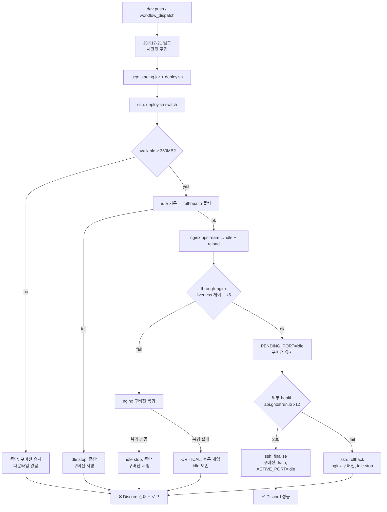

# GhostRunner 배포 (CI/CD) 런북

`dev` 브랜치 병합 → GitHub Actions가 빌드 후 EC2에 **Blue-Green 무중단 배포** → 외부 health 확인 → Discord 알림.

- 트리거: `.github/workflows/dev-cd.yml` (`push: dev` + 수동 `workflow_dispatch`)
- 테스트(PR): `.github/workflows/dev-ci.yml` (`pull_request: dev`)
- 서버 파일: `deploy/` (systemd 유닛, nginx upstream, `deploy.sh`, `setup.sh`)

---

## 아키텍처 요약

```
dev push → GitHub Actions
  ├─ JDK17/21 빌드 (application-prod.yml·firebase 시크릿 주입)
  ├─ scp: build/libs/*.jar → EC2:/home/ubuntu/ghostrunner/staging.jar
  ├─ ssh: deploy.sh switch  ── idle 기동 → full-health → nginx 전환 → through-nginx(liveness) 게이트
  │                            (구버전은 아직 살려둠, PENDING_PORT 기록)
  ├─ 외부 GET https://api.ghostrun.io/actuator/health  ── 진짜 게이트
  │     ├─ 통과 → ssh: deploy.sh finalize  (구버전 graceful drain + ACTIVE_PORT 확정)
  │     └─ 실패 → ssh: deploy.sh rollback  (nginx 구버전 복귀 + 신버전 정리, 무중단)
  └─ Discord 성공/실패(실패 시 서버 로그 tail) 알림

nginx(api.ghostrun.io, 443/Certbot) → upstream ghostrunner_backend → 127.0.0.1:<active port>
```

**2단계 배포**: `switch` 는 구버전을 **죽이지 않고** nginx만 신버전으로 넘긴다. **외부 health 가 통과해야만** `finalize`(구버전 정리)로 확정하고, 실패하면 `rollback`(구버전 복귀)한다 → 외부 검증 실패 시에도 **항상 살아있는 인스턴스**가 보장된다.

평상시 인스턴스 1개, 전환~finalize 사이에만 2개가 겹침. 외부 DB/Redis(RDS/ElastiCache)라 이 박스는 앱 전용.

### 배포 플로우차트 (mermaid)



---

## 1. GitHub Secrets (저장소 → Settings → Secrets and variables → Actions)

| Secret | 내용 |
|---|---|
| `APP_PROD_YML` | `application-prod.yml` **전체 실제값** (CI가 `src/main/resources/`에 write → jar 번들) |
| `FIREBASE_PRIVATE_KEY_JSON` | firebase 서비스 계정 JSON 전체 |
| `EC2_HOST` | 배포 대상 호스트 (예: `api.ghostrun.io` 또는 공인 IP) |
| `EC2_USER` | SSH 사용자 (예: `ubuntu`) |
| `EC2_SSH_KEY` | 배포용 SSH **개인키** (공개키는 서버 `~/.ssh/authorized_keys`에 등록되어 있어야 함) |
| `CICD_DISCORD_WEBHOOK_URL` | 파이프라인 알림용 Discord 웹훅 (앱 런타임 `discord.webhook.url`과 별개) |
| `SENTRY_AUTH_TOKEN` | Sentry Organization Auth Token (빌드 시 소스 컨텍스트 업로드) |

> `APP_PROD_YML`은 리포에 커밋하지 않음(`.gitignore`가 `application-prod.yml` 무시). 필드 변경 시 이 시크릿만 갱신.

---

## 2. 서버 1회성 셋업 (EC2에서, sudo 가능 사용자)

```bash
# 리포를 서버에 클론하거나 deploy/ 만 복사한 뒤
cd <repo>/deploy
bash setup.sh
```

`setup.sh`가 하는 일 (멱등, **downtime 없음** — nginx는 계속 8080=현재 nohup로 라우팅):
- `/home/ubuntu/ghostrunner` 생성
- `ghostrunner@.service` → `/etc/systemd/system/` 설치
- `nginx-ghostrunner.conf` → `/etc/nginx/conf.d/ghostrunner-upstream.conf` 설치
- `sites-available/default`의 `proxy_pass http://localhost:8080;` → `http://ghostrunner_backend;` (백업+`nginx -t`+reload)
- `ACTIVE_PORT=8080` 초기화

전제: 서버에 **JDK(현재 17, 추후 21) 설치**되어 `/usr/bin/java`로 접근 가능. `curl`, `ss`(iproute2), `jq` 불요(jq는 러너에서만 사용).

---

## 3. 최초 cutover (nohup → systemd) — 첫 배포로 수행

현재 앱은 `nohup java -jar ...`(포트 8080)로 떠 있습니다. 첫 배포가 이걸 systemd(8081)로 자연 전환합니다.

1. **첫 배포 실행**: GitHub → Actions → **dev 브랜치 CD** → **Run workflow**(`workflow_dispatch`).
   - `deploy.sh`가 active=8080(nohup) 기준으로 idle=**8081**에 systemd 인스턴스를 띄우고 nginx를 8081로 전환합니다.
   - `systemctl stop ghostrunner@8080`은 nohup에는 무효 → 배포 로그에 "포트 8080 리스너 남음" 경고가 뜹니다.
2. **기존 nohup 종료**(메모리 확보):
   ```bash
   pkill -f 'ghostrunner-.*SNAPSHOT.jar'   # 또는 ps aux | grep java 로 PID 확인 후 kill
   ```
3. 이후 두 번째 배포부터는 8080 ↔ 8081 정상 토글됩니다.

> ⚠️ 2번을 건너뛰면, 다음 배포가 8080을 타깃으로 잡을 때 **포트 충돌**로 기동 실패합니다. 첫 배포 직후 반드시 nohup을 종료하세요.

---

## 4. 첫 배포 시 메모리 실측 (Blue-Green 최종 확정)

RAM 2GB라 겹침 순간이 빡빡합니다. 첫 배포 중 **다른 터미널에서** 관찰:

```bash
watch -n 1 free -h                       # 겹침 때 available/swap 변화
ps -o pid,rss,cmd -C java                # 두 java 인스턴스 RSS
```

- swap을 잠깐 건드리는 정도면 정상(설계 범위).
- 심한 지연/스와핑이 지속되면 폴백:
  - **restart 모드**(수 초 다운타임, in-place 교체+.prev 백업 롤백)로 전환: 저장소 → Settings → Secrets and variables →
    **Variables** 탭에서 `DEPLOY_STRATEGY=restart` 설정(워크플로우가 `vars.DEPLOY_STRATEGY`를 읽음). 되돌리려면 `bluegreen` 또는 삭제.
  - 또는 인스턴스 증설(t3.small → medium).

---

## 5. 롤백 / 수동 조작

- **자동 롤백 (2단계)**: `switch` 단계에서 신규 health/게이트 실패 시, 그리고 **외부 health 실패 시**(`rollback`) 모두
  구버전을 죽이지 않은 채 자동 원복 → 다운타임 없음. `rollback`의 nginx 복귀가 실패하면 `CRITICAL` 로그와 함께 idle을 보존(수동 개입).
- **수동 롤백**(직전 배포로 되돌리기 — 아직 구버전 인스턴스가 살아있는 경우):
  ```bash
  cd ~/ghostrunner
  PREV=$( [ "$(cat ACTIVE_PORT)" = 8080 ] && echo 8081 || echo 8080 )
  sudo systemctl start ghostrunner@$PREV                     # 구버전 jar(app-$PREV.jar)가 남아있다면
  echo "upstream ghostrunner_backend { server 127.0.0.1:$PREV; }" | sudo tee /etc/nginx/conf.d/ghostrunner-upstream.conf
  sudo nginx -t && sudo systemctl reload nginx
  echo $PREV > ~/ghostrunner/ACTIVE_PORT
  ```
- **상태 확인**:
  ```bash
  cat ~/ghostrunner/ACTIVE_PORT ~/ghostrunner/PENDING_PORT 2>/dev/null   # PENDING 이 남아있으면 배포가 중간에 멈춘 것
  systemctl status ghostrunner@8080 ghostrunner@8081
  journalctl -u ghostrunner@8081 -f
  ```
- **멈춘 배포 정리**: `PENDING_PORT`가 남아있는데 확정도 롤백도 안 됐다면, 서버에서
  `~/ghostrunner/deploy.sh finalize`(신버전 확정) 또는 `~/ghostrunner/deploy.sh rollback`(구버전 복귀)로 수동 마감.

---

## 6. 테스트 방법 (dev에 섞지 않고)

1. 빌드/시크릿 주입만: 브랜치에서 워크플로우를 `workflow_dispatch`로 돌려 jar 생성까지 확인.
2. SSH 연결: `ssh ubuntu@<host> echo ok`.
3. `deploy.sh` 서버 수동 실행(스테이징 jar 올려두고) → Blue-Green 동작 확인.
4. Discord 성공/실패 경로 각각 확인.

---

## 주의

- 서버 JDK 버전은 jar 빌드 버전과 호환되어야 함(현재 17). `build.gradle` toolchain을 21로 올리면 **서버에도 JDK 21 설치** 필요.
- `deploy.sh`는 매 배포 시 CI가 최신본을 서버로 덮어씀(리포와 동기).
- 배포 동시 실행은 `concurrency`(GitHub 잡) + `deploy.sh`의 `flock`(서버 프로세스)으로 이중 차단됨.

### 필수 전제 / 견고성 동작
- **`APP_PROD_YML`(시크릿)의 `management.endpoints.web.exposure.include` 에 `health` 가 반드시 포함**되어야 함.
  전환 후 게이트가 `/actuator/health/liveness` 를 사용하며, 미노출(404) 시 자동으로 `/actuator/health` 로 폴백하지만, health 자체가 빠지면 게이트가 실패한다. (probe 활성화는 커밋된 `application.yml` 에 있음)
- **stale PENDING 자동 정리**: `switch` 후 CI가 finalize/rollback 전에 죽어도, 다음 배포의 `switch` 진입 시 **nginx 실제 라우팅을 진실로 삼아** 미완결 배포를 자동 정리한다(승격 또는 orphan 정리). 수동 개입 불필요.
- **수동 조작 주의**: CI 배포 진행 중 서버에서 `deploy.sh`/`finalize`/`rollback` 를 직접 돌리지 말 것(flock이 막지만 혼선 방지). 멈춘 배포 정리는 §5 참고.
- **bluegreen 수동 롤백 한계**: `switch` 가 idle 슬롯의 jar(`app-<idle>.jar`)를 신버전으로 덮어쓰므로, §5의 `systemctl start ghostrunner@$PREV` 는 **직전 배포 산출물**을 띄운다(그보다 과거로는 못 감). 자동 롤백은 구버전 프로세스를 죽이지 않으므로 무관.
- **CICD Discord 채널 접근 제한 권장**: 배포 실패 시 서버 로그 tail 을 전송한다(전송 전 password/token 류는 마스킹하지만 완전하지 않음). 웹훅 채널을 팀 내부로 제한할 것.
