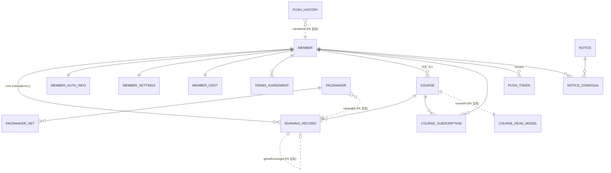

# 02. 도메인 모델 (JPA 엔티티)

패키지: `src/main/java/soma/ghostrunner/domain/{도메인}/domain`
공통: 대부분 `BaseTimeEntity`(createdAt/updatedAt, `@EnableJpaAuditing`) 상속.

## 엔티티 관계 개요

점선(..)은 FK 제약 없이 ID 값만 보유하는 참조.

## member

| 엔티티 | 테이블 | 핵심 필드 |
|---|---|---|
| `Member` | `member` | uuid(unique, 외부 노출 식별자), nickname(unique, ≤10자), `@Embedded MemberBioInfo`(gender/age/weight/height), profilePictureUrl, lastLoginAt, `RoleType{ADMIN,USER}`, deletedAt, `@OneToMany(cascade=ALL) List<Running> runs` |
| `MemberAuthInfo` | | externalAuthUid(unique, **Firebase UID**), `@OneToOne Member` |
| `MemberSettings` | | pushAlarmEnabled / vibrationEnabled / voiceGuidanceEnabled |
| `MemberVdot` | | vdot(Integer) — 러닝 종료 시 자동 갱신 |
| `TermsAgreement` | | 필수 약관 3종 boolean + agreedAt |

- 소프트삭제: `@SQLRestriction("deleted_at IS NULL")` + `@SQLDelete`
- ⚠️ `Member.toStringForPacemakerPrompt()` — 엔티티가 LLM 프롬프트 문자열을 직접 생성 (레이어 침범, 리팩토링 대상)

## running

| 엔티티 | 테이블 | 핵심 필드 |
|---|---|---|
| `Running` | **`running_record`** | runningName, `RunningMode{SOLO,GHOST}`, **ghostRunningId(Long, FK 아님)**, `@Embedded RunningRecord`, startedAt(epoch ms), isPublic, hasPaused, `@Embedded RunningDataUrls`, `@ManyToOne Member`, `@ManyToOne Course` |

- `RunningRecord`(@Embeddable): distance_km, elevation gain/loss/avg, 평균/최고/최저 페이스(`average_pace_min/km` — **컬럼명에 슬래시 포함**), duration_sec, 칼로리, 케이던스, bpm
- `RunningDataUrls`(@Embeddable): rawTelemetryUrl / interpolatedTelemetryUrl / screenShotUrl (S3)
- 경로 VO (`domain/path/`): `Telemetry`, `Coordinates`, `Checkpoint`, `SimplifiedPaths`, `PathSimplifier`(RDP/VW 경로 간소화 알고리즘), `TelemetryProcessor`, `RunningFileUploader`(인터페이스)
- 도메인 이벤트: `RunFinishedEvent`, `RunUpdatedEvent`, `CourseRunEvent` — 엔티티의 `createXxxEvent()` 팩토리로 생성
- 소프트삭제: Hibernate 6 **`@SoftDelete`**

## course

| 엔티티 | 테이블 | 핵심 필드 |
|---|---|---|
| `Course` | `course` | `@ManyToOne Member`(생성자), name, `@Embedded CourseProfile`(거리/고도), `@Embedded Coordinate`(start_latitude, **start_longtitude — 컬럼명 오타**), `CourseSource{USER,OFFICIAL,RECOMMENDED}`, isPublic, `@Embedded CourseDataUrls`(routeUrl/checkpointsUrl/thumbnailUrl) |
| `CourseSubscription` | `course_subscription` | course+member uk, `boolean deleted`(수동 소프트삭제) — 코스를 달리면 자동 구독 |
| `CourseReadModel` | `course_read_model` | **CQRS 읽기모델.** courseId(unique), 코스 요약 + **top1~top4 멤버ID/기록 8컬럼 역정규화**, runnersCount. `insertIfBetter()`/`shiftDown()` 증분 갱신 로직 내장. 379줄로 main 최대 파일 |

- 소프트삭제: `Course`는 `@SoftDelete`, `CourseSubscription`은 수동 boolean
- 정렬 enum: `CourseSortType{DISTANCE,POPULARITY}`, `GhostSortType`(정렬 필드 화이트리스트)

## pacemaker

| 엔티티 | 테이블 | 핵심 필드 |
|---|---|---|
| `Pacemaker` | `pacemaker` | `RunningType{E,M,T,I,R}`(잭 다니엘스 훈련 강도), `Norm{DISTANCE,TIME}`, summary(LONGTEXT), goalDistance, expectedTime, initialMessage, `Status{INIT,PROCEEDING,COMPLETED,FAILED}`(상태전이 검증 `canTransitionTo` 내장), hasRunWith, **runningId/courseId/memberUuid를 FK 없이 보유**, condition, temperature, lastRetryAt |
| `PacemakerSet` | `pacemaker_set` | setNum, message(LONGTEXT, LLM 생성 음성 가이드), startPoint/endPoint, `pace_min/km` |

- 도메인 서비스 (`domain/formula/`): `VdotCalculator`, `VdotPaceProvider`, `WorkoutProvider`, `RunningTipsProvider` — 정적 데이터는 `resources/static/`의 `vdot-pace-table.json`, `workouts/{E,M,T,I,R}_workouts.json`, `running-tips.jsonl`
- LLM (`domain/llm/`): `PacemakerLlmClient`(인터페이스), `PacemakerPromptGenerator`
- 소프트삭제: **deprecated `@Where` + `@SQLDelete`** 방식
- ⚠️ 상태 enum은 `FAILED`인데 코드/로그/주석은 "FALLBACK"으로 부름 (명칭 불일치)

## device

| 엔티티 | 테이블 | 핵심 필드 |
|---|---|---|
| `Device` | **`push_token`** | `@ManyToOne Member`, token(Expo `ExponentPushToken[...]` 형식 검증), uuid, `@Embedded SemanticVersion appVersion`(major/minor/patch 3컬럼), osName/osVersion/modelName, deletedAt |

- 소프트삭제: `@SQLRestriction` + `@SQLDelete`. 소프트삭제 때문에 token unique 제약을 못 걸어 중복 제거를 로직으로 수행
- 앱 버전은 푸시 대상 필터링·딥링크 분기에 사용 (`global/common/versioning/{SemanticVersion, VersionRange}`)

## notification

| 엔티티 | 테이블 | 핵심 필드 |
|---|---|---|
| `PushHistory` | `push_history` | uuid(unique), **memberId(Long, FK 아님)**, `NotificationStatus{CREATED,DELIVERED,FAILED}`, title, body, JSON `data` 컬럼(딥링크 등), readAt |

- `domain/deeplink/DeepLinkUrls` — 앱 버전별 딥링크 URL 매핑 (정적 유틸)

## notice

| 엔티티 | 테이블 | 핵심 필드 |
|---|---|---|
| `Notice` | `notice` | title, content(2048), `NoticeType{GENERAL,EVENT(deprecated),GENERAL_V2,EVENT_V2}`, imageUrl, priority, startAt/endAt(둘 다 null = 비활성). `activate()/deactivate()` 등 도메인 로직 보유 |
| `NoticeDismissal` | `notice_dismissal` | member+notice uk, dismissUntil("다시 보지 않기") |

- 이벤트: `NoticeActivatedEvent` (활성화 시 푸시 브로드캐스트 트리거)

## 소프트삭제 방식 4종 혼재 (통일 대상)

| 방식 | 사용처 |
|---|---|
| Hibernate 6 `@SoftDelete` | Running, Course |
| `@SQLRestriction` + `@SQLDelete` | Member, Device |
| deprecated `@Where` + `@SQLDelete` | Pacemaker, PacemakerSet |
| 수동 `boolean deleted` | CourseSubscription |
