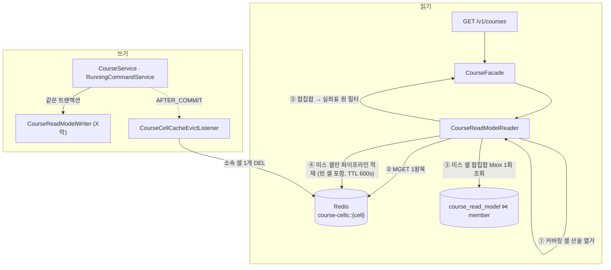

# 셀 버킷(geohash p6) 캐시 전환 — 최종 설계

> **상태: 설계 검증 통과, 구현 전.** 이 문서 하나로 TDD 구현이 가능하도록 클래스별 위치·시그니처·의사코드·설계 이유를 담는다.
>
> - 설계 근거·실측 리플레이: [`../refactoring/course-read-model/cache/07-cell-bucket-design.md`](../refactoring/course-read-model/cache/07-cell-bucket-design.md)
> - 구현 초안(이 문서가 수정·확정함): [`../refactoring/course-read-model/cache/08-cell-bucket-implementation.md`](../refactoring/course-read-model/cache/08-cell-bucket-implementation.md)
>
> **08 초안과 다른 지점은 이 문서가 확정이다.** 커버링을 샘플링에서 산술 열거로 교체, 셀 수 정정(25~30 → 35~48), `GeoDistance` 신설, `CellCacheLookup` 타입 도입, `CacheConfig` 완전 제거, 이벤트 발행 5경로가 그것이다.
>
> **리뷰 반영(R1~R4)**은 §3·§9에 `[R#]`로 표시했다. Architect 설계 원안에 실제 코드와 어긋나는 지점이 있어 검증 단계에서 교정한 항목이며, 12건 확정 의사결정·컴포넌트 분해·레이어 배치는 그대로 유지한다.

---

## 1. 요구사항·배경 요약

### 1-1. 왜 셀 버킷인가

리드모델 전환으로 지도 조회는 이미 빨라졌으나(P90 1.8s, DB CPU 27%) 매 조회가 DB까지 간다. 캐시키 전략 세 가지(좌표 반올림 · 지오해싱 · 셀 버킷)를 9.5개월 실사용 트래픽 18,634건으로 리플레이해 비교했고, **셀 버킷**을 채택했다 (07 §3-4·§4).

| | full-hit% | DB회피% | 생성 키 | 이빅트 DEL |
|---|---|---|---|---|
| 반올림/지오해싱 | 13.5 | 13.5 | 5,245 | 8,299 (팬아웃) |
| **셀 버킷** | **13.8** | **22.0** | 24,028 | **3,060 (단일)** |

트래픽 ×100 시나리오에서 DB 회피율은 93.8% vs 74.0%로 벌어진다. 핵심은 **해싱 대상을 사람이 아니라 코스로 바꾼 것**이다 — 코스의 복사본이 세상에 하나뿐이라 "저장된 곳 = 지울 곳"이 항상 1:1이 되고, 부분 히트가 성립한다.

### 1-2. 지켜야 하는 요구사항

- **반경** — 응답은 "내 주변 약 2km의 코스"다.
- **완주 직후 내 등수** — 완주하고 지도를 열면 TOP4에 든 내 기록이 즉시 보여야 한다. TTL만으로는 부족해 이빅트가 필요하고, 인스턴스별 사본 갭이 생기는 로컬 캐시가 아니라 Redis(글로벌 캐시)를 쓴다.
- **정확도** — 내가 있는 곳 기준의 결과여야 한다. 최종 판정을 매 요청 실좌표로 하므로 스냅 오차가 0이다.
- **외부 API 불변** — 배포된 FE가 호출 중이므로 `GET /v1/courses`의 method·path·request·response가 전부 그대로여야 한다.

### 1-3. 요구사항 분석에서 발견된 결함 (이 설계가 해소하는 것)

| # | 결함 | 해소 |
|---|---|---|
| M1 | `RunningCommandService.deleteRunnings`(:183)가 이벤트를 발행하지 않아 TOP4 변경에 이빅트가 없다 | 이벤트 경로 e (§4) |
| M2 | 코스 삭제는 리드모델 하드 삭제 → 커밋 후 courseId로 좌표 역산 불가 | 이벤트에 좌표 동봉 (§3-5) |
| M3 | 코스 공개 전환(`syncPublicity`)이 리드모델 생성의 **유일** 경로인데 트리거가 없어 신규 코스가 최대 10분 미노출 | 이벤트 경로 b~d (§4) |
| M4 | 샘플링 커버링은 경계 셀 누락 가능(조용한 코스 소실) | 산술 열거로 대체 (§3-1) |
| M5 | 08 문서의 "셀 25~30개"는 오기 | 실측 정정 — r=2000 → 35~48 (§3-1) |
| M6 | putAll 개별 SET은 콜드 시 최대 ~80 RTT | `executePipelined` (§3-6) |
| M7 | 채움 쿼리 LIMIT 잘림은 공간 편향 + TTL 600초 각인 | 적재 전체 스킵 (§3-7) |
| M8 | 직행/캐시 경로 파리티 정의 | 두 경로 모두 원(실좌표) 필터 (§3-2) |
| M9 | 극단 좌표 → 커버링 폭발 | 셀 수 상한 가드 + **산술 선판정 [R1]** (§3-1) |
| M15 | Redis 장애 시 전체-미스 강등은 DB 부하 10배 증폭 | 요청 단위 직행 강등 (§3-4) |

부수 요구: 역직렬화 실패는 셀 단위 미스로 처리한다(전체 미스 금지). MGET의 null·부분 null을 방어한다.

---

## 2. 확정 의사결정 12건

사용자 위임으로 확정된 입력이며 이 설계에서 뒤집지 않는다.

| # | 항목 | 결정 |
|---|---|---|
| 1 | 거리 필터 | 직행·캐시 두 경로 모두 원(실좌표) 필터. 직행은 LIMIT 50 유지, 캐시 경로는 모집단 상한 없음 |
| 2 | Redis 장애 | 전체-미스 강등 금지. **요청 단위 직행(LIMIT 50) 강등.** 서킷 없음. putAll/evict는 best-effort |
| 3 | 채움 LIMIT 도달 | fill-limit=500(`@Value`). 도달 시 응답은 반환하되 **적재는 전체 스킵** + warn + 메트릭 |
| 4 | 채움-이빅트 레이스 | putAll을 `executePipelined`로 묶어 창을 최소화한 뒤 수용 (마커 없음) |
| 5 | Thundering herd | 수용 (분산락 없음) |
| 6 | 이빅트 트리거 보강 | 좌표를 실은 **신규 이벤트 1종**. 기존 `RunFinishedEvent`/`RunUpdatedEvent` 구독은 유지 |
| 7 | C-005 | `RegionNotFoundException`·`ErrorCode.REGION_NOT_FOUND` 제거. Region 도메인·API·테이블·`RegionService`는 존치, `RegionRepository.findByCenterLatBetweenAndCenterLngBetween`만 제거 |
| 8 | 캐시 레지스트리 | `CacheType` 존치(이름·TTL 단일 출처로 역할 재정의). `CacheConfig` + `@EnableCaching` 제거 |
| 9 | 커버링 | 셀 인덱스 산술 열거(샘플링 금지). `MAX_COVERING_CELLS=128` 초과 시 직행 강등. 4xx 신설 금지 |
| 10 | 구경로 | `@Deprecated` 3종(`findCoursesByPositionCached`/`CourseCacheRepository`/`CourseCacheEventListener`) 존치 — 범위 밖 |
| 11 | 관측 | Micrometer 카운터 포함. 코드베이스 첫 커스텀 메트릭이므로 네이밍 규약을 이 PR에서 확정 |
| 12 | 운영 수용 | 멤버 프로필 변경·dev 재배포 잔존 카드·기존 `course-map::*` 키는 TTL(600s) 수용 |

---

## 3. 컴포넌트 설계

### 3-0. 전체 흐름



사람의 좌표는 ①(방문할 셀 계산)과 ⑤(거리 필터)에만 쓰이고, 저장(④)과 삭제(이빅트)는 **코스의 시작점 좌표**로만 결정된다. 이것이 "키의 주인은 코스"라는 07 §2-2의 구조다.

**적재(④)를 필터(⑤)보다 앞에 두는 이유** — 캐시 값은 요청자와 무관한 "셀의 내용물"이어야 한다. 요청 반경으로 자른 값을 넣으면 다음 요청이 오답을 받는다.

---

### 3-1. `GeoCell` (신규) — `domain/course/domain/GeoCell.java`

geohash p6 셀을 표현한다. p6 = 30비트 = 경도 15비트 + 위도 15비트다. 셀 크기는 위도 방향 0.005493°(≈610m), 경도 방향 0.010986°(적도 1,219m / 서울 967m)다.

**표준 이진 탐색 대신 격자 인덱스를 직접 계산하는 이유** — 커버링을 "범위 정수 순회"로 열거할 수 있게 되어, 샘플링 누락이라는 실패 모드(M4)가 산수 수준에서 사라진다. 두 방식의 동등성은 검증했다(§10 V1).

```java
public record GeoCell(String id) {

    private static final int BITS_PER_AXIS = 15;
    private static final int AXIS_CELLS = 1 << BITS_PER_AXIS;   // 32,768
    private static final String BASE32 = "0123456789bcdefghjkmnpqrstuvwxyz";

    public static GeoCell of(double lat, double lng);
    public static int coveringCount(double lat, double lng, int radiusM);      // [R1] 열거 없이 개수만
    public static List<GeoCell> covering(double lat, double lng, int radiusM);
    public BoundingBox bounds();
    public static BoundingBox enclosingBox(Collection<GeoCell> cells);
}
```

의사코드:

```
latIndex(lat) = clamp(floor((lat + 90 ) / 180 * AXIS_CELLS), 0, AXIS_CELLS - 1)
lngIndex(lng) = clamp(floor((lng + 180) / 360 * AXIS_CELLS), 0, AXIS_CELLS - 1)

of(lat, lng):
    return new GeoCell(encode(latIndex(lat), lngIndex(lng)))

encode(latIdx, lngIdx):
    # MSB부터 lng, lat 교대로 인터리브해 30비트를 만들고 5비트씩 base32 6글자로 변환
    bits = []
    for i in 0..14: bits += [(lngIdx >> (14 - i)) & 1, (latIdx >> (14 - i)) & 1]
    6글자 = 5비트씩 묶어 BASE32 인덱싱

decode(id):   # encode의 정확한 역함수. BASE32에 없는 문자는 IllegalArgumentException
bounds():     # decode 후 인덱스 * 스팬으로 min/max 경계 계산

indexRange(lat, lng, radiusM):
    box = BoundingBox.of(lat, lng, radiusM)          # 조회 박스와 동일 공식 재사용 — 파리티의 근거
    latFrom = latIndex(box.minLat()); latTo = latIndex(box.maxLat())
    lngFrom = lngIndex(box.minLng()); lngTo = lngIndex(box.maxLng())
    return (latFrom, latTo, lngFrom, lngTo)

coveringCount(lat, lng, radiusM):                    # [R1] 할당 0
    (latFrom, latTo, lngFrom, lngTo) = indexRange(...)
    if (latFrom > latTo || lngFrom > lngTo) return 0
    return (latTo - latFrom + 1) * (lngTo - lngFrom + 1)

covering(lat, lng, radiusM):
    (latFrom, latTo, lngFrom, lngTo) = indexRange(...)
    if (latFrom > latTo || lngFrom > lngTo) return List.of()
    이중 정수 루프로 encode(la, lo) 전부 열거

enclosingBox(cells):
    cells.stream().map(GeoCell::bounds) → BoundingBox.union(...)
```

**[R1] `coveringCount`를 분리한 이유 (리뷰 교정 — BLOCKER급)**
Architect 원안은 `covering()`이 반환한 **리스트의 size**로 `MAX_COVERING_CELLS`를 판정했다. 그러면 가드가 발동하는 바로 그 극단 좌표에서 리스트가 이미 전부 materialize된 뒤에 버려진다. `CourseApi`의 `lat`/`lng`에는 검증 애노테이션이 없어(`@RequestParam Double lat`) 인증 사용자가 `lat=89.99&radiusM=3000`을 보낼 수 있고, 이때 `BoundingBox.of`의 `cos(lat)` 분모가 0에 수렴해 경도 범위가 전 지구로 clamp되어 **197,344개 `GeoCell`이 할당된 뒤 폐기**된다(§10 V4). 현행 직행 경로는 같은 요청을 LIMIT 50 쿼리 하나로 끝내므로, 이 설계가 **새로 만드는** 증폭 벡터다.
→ 개수는 인덱스 범위의 곱으로 O(1)에 나오므로, Reader가 `coveringCount`로 먼저 판정하고 통과한 요청만 `covering()`을 호출한다. 열거 자체가 일어나지 않는다.

**설계 이유 정리**
- `encode`/`decode`가 역함수이고 `covering`이 `encode`만 쓰므로, "원 안의 코스가 커버링 밖 셀에 저장되는" 경우가 **구조적으로 불가능**하다.
- `record`인 이유 — Map 키·값 타입으로 `equals`/`hashCode`가 필요하고, 원시 `String`과의 혼동을 막는다.
- antimeridian(±180) — clamp만 하고 wrap하지 않는다. r≤3km에서 해당 지역은 태평양 무인 해역이라 분기 실익이 0이다 (D11).

---

### 3-2. `GeoDistance` (신규) — `domain/course/domain/GeoDistance.java`

실좌표 거리 판정을 담당한다. **반드시 `BoundingBox`와 같은 지구 근사**(위도 1도 = 111km, 경도는 `cos` 보정)를 쓴다.

```java
public final class GeoDistance {
    private GeoDistance() {}

    public static boolean withinRadius(double centerLat, double centerLng,
                                       double lat, double lng, double radiusM) {
        double dyM = (lat - centerLat) * 111_000d;
        double dxM = (lng - centerLng) * 111_000d * Math.cos(Math.toRadians(centerLat));
        return dyM * dyM + dxM * dxM <= radiusM * radiusM;   // sqrt 생략
    }
}
```

**Haversine을 쓰지 않는 이유 (D1)** — `BoundingBox.of`는 `latDelta = r/111`, `lngDelta = r/(111·cos(centerLat))`로 박스를 만든다. 같은 근사로 거리를 재면 `dy² + dx² ≤ r²` ⟹ `|dy| ≤ r ∧ |dx| ≤ r` ⟹ 점이 박스 안, 즉 **원 ⊆ 박스**가 부등식으로 증명된다. Haversine을 쓰면 이 포함관계가 얇은 고리에서 깨져 직행 경로와 캐시 경로가 갈린다. 정확도 0.4%를 포기하고 "두 경로가 같다"는 증명 가능한 성질을 택한다.

`cos`는 **요청 중심 위도**로 계산한다 — 박스와 같은 기준이어야 포함관계가 성립한다.

---

### 3-3. `BoundingBox` (변경) — `domain/course/domain/BoundingBox.java`

- **추가**: `public static BoundingBox union(Collection<BoundingBox> boxes)` — min/max 접기. 빈 입력은 `IllegalArgumentException`.
- **javadoc 갱신**: 삭제되는 `CourseMapCacheEvictListener` 참조를 제거하고, "조회 박스·셀 경계·거리 필터가 공유하는 단일 지구 근사"임과 `GeoDistance`와의 계약(원 ⊆ 박스)을 명시한다.
- `of(lat, lng, radiusM)` 본체는 **변경하지 않는다.** 이 공식이 곧 파리티의 단일 출처다.

---

### 3-4. `CellBucket` / `CellCacheLookup` (신규) — `domain/course/dto/query/`

```java
/** 한 셀의 적재 단위 — "이 셀에 시작점을 둔 코스 전부". 빈 셀도 빈 리스트로 존재한다(네거티브 캐싱). */
public record CellBucket(GeoCell cell, List<CourseMapDto> courses) {}

/** 커버링 조회 1회의 결과. Map을 노출하지 않고 호출자가 실제로 묻는 3가지만 준다. */
public record CellCacheLookup(List<GeoCell> missedCells,
                              List<CourseMapDto> cachedCourses,
                              boolean degraded) {

    public static CellCacheLookup degraded(List<GeoCell> covering);
    public static CellCacheLookup empty();
    public boolean fullHit();   // !degraded && missedCells.isEmpty()
}
```

**`degraded`를 별도 필드로 두는 이유 (D2)** — "Redis 장애"와 "전 셀 미스"는 처리가 정반대다. 전자는 직행 강등(결정 2), 후자는 미스 채움이다. 빈 Map으로 뭉뚱그리면 장애 시 대형 채움 쿼리 + 재적재 시도라는 최악 경로가 열린다. 확정 결정 2를 **타입으로 강제**한다.

---

### 3-5. `CourseMapDataChangedEvent` (신규) — `domain/course/domain/events/CourseMapDataChangedEvent.java`

```java
/**
 * 지도에 노출되는 코스 데이터(노출 여부 또는 카드 내용)가 바뀌었다.
 *
 * 좌표를 동봉하는 이유: 코스 삭제는 커밋 후 리드모델이 없어 courseId로 셀을 역산할 수 없다(M2).
 * 좌표는 발행 시점 트랜잭션 안에서 이미 로드된 Course에서 얻는다(추가 쿼리 없음 — 예외는 deleteRunnings).
 */
public record CourseMapDataChangedEvent(Long courseId, Double startLat, Double startLng) {}
```

생성 팩토리는 `Course.createMapDataChangedEvent()`로 엔티티에 둔다 — `Running.createFinishedEvent()`(Running.java:72)와 동일한 기존 관례다. `id == null`이면 `IllegalStateException`을 던지는 가드도 같은 관례를 따른다.

기존 `RunFinishedEvent`/`RunUpdatedEvent`는 **변경하지 않는다** (D6).

---

### 3-6. `CourseCellCache` (신규) — `domain/course/dao/CourseCellCache.java`

**책임**: 셀 ↔ Redis 왕복. 키 조립, MGET / 파이프라인 SET / DEL, JSON 직렬화, 실패 흡수와 신호화.
**하지 않는 것**: 어떤 셀을 읽을지 결정 (호출자 몫).

**의존**: `StringRedisTemplate`(Boot 자동설정 빈), `ObjectMapper`(Boot 기본 빈 — `JsonVdotProvider` 선례), `CourseCellCacheMetrics`.

> `RedisConfig`는 `redisTemplate`(`RedisTemplate<String,Object>`)만 정의하므로 `RedisAutoConfiguration`의 `stringRedisTemplate` 빈은 그대로 살아 있다. `RefreshTokenService`가 `RedisTemplate<String,String>`으로 주입받아 쓰는 그 빈이다.

**`RedisTemplate<String,Object>`(GenericJackson2)를 쓰지 않는 이유 (D10)** — 값에 `@class` 타입 정보가 박혀 패키지 이동만으로 기존 캐시가 전부 깨지고, 파이프라인에서 바이트를 직접 제어해야 하기 때문이다.

```java
public CellCacheLookup lookup(List<GeoCell> covering)
public void putAll(List<CellBucket> buckets)   // best-effort
public void evict(GeoCell cell)                // best-effort
```

```
key(cell) = CacheType.Names.COURSE_CELLS + "::" + cell.id()
TTL       = CacheType.COURSE_CELLS.getTtl()   // 600s

lookup(covering):
    if covering.isEmpty(): return CellCacheLookup.empty()
    try:
        raw = redisTemplate.opsForValue().multiGet(keys(covering))     # 왕복 1회
        if raw == null || raw.size() != covering.size():               # [R4] 크기 불일치도 장애로 본다
            metrics.recordDegraded(); return CellCacheLookup.degraded(covering)
        for i in 0..covering.size()-1:
            json = raw.get(i)
            if json == null:
                missed += covering.get(i); metrics.recordCell(MISS); continue
            try:
                cached += objectMapper.readValue(json, VALUE_TYPE)     # List<CourseMapDto>
                metrics.recordCell(HIT)
            catch JsonProcessingException:
                log.warn(...); missed += covering.get(i); metrics.recordCell(MISS)   # 그 셀만 미스
        metrics.recordLookup(full_hit | partial_hit | all_miss)
        return new CellCacheLookup(missed, cached, false)
    catch Exception e:                                                 # 연결 실패 등
        log.warn("CourseCellCache - MGET failed, degrade to direct query", e)
        metrics.recordDegraded()
        return CellCacheLookup.degraded(covering)

putAll(buckets):
    if buckets.isEmpty(): return
    try:
        payloads = buckets.map(b -> (keyBytes(b.cell()), valueBytes(objectMapper.writeValueAsString(b.courses()))))
        # 직렬화를 먼저 끝낸다 — 실패하면 Redis를 아예 건드리지 않는다
        redisTemplate.executePipelined((RedisCallback<Object>) conn -> {
            for (k, v) in payloads:
                conn.stringCommands().set(k, v, Expiration.from(TTL), SetOption.upsert())
            return null
        })                                                             # 왕복 1회
        metrics.recordFill(STORED)
    catch Exception e:
        log.warn("CourseCellCache - putAll failed (cache remains cold)", e)
        metrics.recordFill(FAILED)

evict(cell):
    try: redisTemplate.delete(key(cell)); metrics.recordEviction(OK)
    catch Exception e: log.warn(...); metrics.recordEviction(FAILED)
```

- 역직렬화 실패를 **셀 단위 미스**로 강등하는 이유: 한 셀의 값이 깨졌다고 전체를 미스로 만들면, 깨진 값 하나가 요청 전체를 대형 채움 쿼리로 몰아넣는다.
- `putAll`이 파이프라인인 이유 (D3, M6): 콜드 시 셀 48개면 개별 SET은 48 RTT다. 파이프라인은 1 RTT라 채움-이빅트 레이스의 창도 N배에서 1배로 줄어든다 — 마커 없이 결정 4를 수용할 수 있게 하는 근거다.
- `evict`는 `DEL`이라 키가 없으면 no-op이다. "아님 말고"가 그대로 성립한다.

---

### 3-7. `CourseCellCacheMetrics` (신규) — `domain/course/dao/CourseCellCacheMetrics.java`

코드베이스 첫 커스텀 메트릭이므로 **미터명·태그 규약을 한 클래스에 응집**한다 (D7). 네이밍은 `ghostrunner.<도메인>.<기능>.<복수형>`, 결과는 값이 아니라 태그 `result`로 표현한다(카디널리티 통제).

| 미터 | 타입 | 태그 |
|---|---|---|
| `ghostrunner.course.cell.cache.cells` | Counter | `result` = `hit` \| `miss` |
| `ghostrunner.course.cell.cache.lookups` | Counter | `result` = `full_hit` \| `partial_hit` \| `all_miss` \| `degraded` |
| `ghostrunner.course.cell.cache.fills` | Counter | `result` = `stored` \| `skipped_over_limit` \| `failed` |
| `ghostrunner.course.cell.cache.evictions` | Counter | `result` = `ok` \| `read_model_absent` \| `failed` |
| `ghostrunner.course.cell.cache.candidates` | DistributionSummary | — (요청당 후보 코스 수) |

- `cells{hit} / cells{sum}` = DB 회피율. 배포 후 리플레이 예측(22%)과 대조한다.
- `candidates`는 캐시 경로의 모집단 무제한(결정 1)에 대한 조기 경보다.
- 의존은 `MeterRegistry` 하나다. `micrometer-core` + `spring-boot-starter-actuator` + `micrometer-registry-prometheus`가 이미 `build.gradle`에 있다. 테스트는 `SimpleMeterRegistry`로 주입한다.

---

### 3-8. `CourseReadModelReader` (개편) — `domain/course/application/CourseReadModelReader.java`

**책임**: 커버링 계산 → 캐시 → 부분 채움 → 거리 필터. 캐시 경유 여부의 판정 주체다.
**하지 않는 것**: 랜덤 선별·응답 조립 (Facade 몫, 기존 그대로).

`RegionRepository` 의존을 제거한다. 공개 메서드 `findCoursesForMap(double, double, int)`의 **시그니처는 불변**이다. `findCoursesForMapByRegion`·`REGION_MAP_RADIUS_M`은 삭제한다.

```java
private static final int MAP_QUERY_LIMIT = 50;          // 직행 DB 안전판 (기존 유지)
private static final int MAX_CACHEABLE_RADIUS_M = 3000; // 광역 가드 (Facade에서 이동)
private static final int MAX_COVERING_CELLS = 128;      // 극단 좌표 가드

@Value("${course.cache.cell-bucket.enabled:true}")   private boolean cellBucketEnabled;
@Value("${course.cache.cell-bucket.fill-limit:500}") private int cellFillLimit;
```

```
findCoursesForMap(lat, lng, radiusM):
    if (!cellBucketEnabled)                 return queryDirect(...)   # 강등①
    if (radiusM > MAX_CACHEABLE_RADIUS_M)   return queryDirect(...)   # 강등②
    if (GeoCell.coveringCount(lat, lng, radiusM) > MAX_COVERING_CELLS):   # [R1] 열거 전에 판정
        log.warn("covering cells over limit, degrade to direct query. lat={}, lng={}, r={}", ...)
        return queryDirect(...)                                       # 강등③
    covering = GeoCell.covering(lat, lng, radiusM)
    lookup = cellCache.lookup(covering)
    if (lookup.degraded())                  return queryDirect(...)   # 강등④
    candidates = lookup.cachedCourses()
               + (lookup.missedCells().isEmpty() ? [] : fillMissedCells(lookup.missedCells()))
    return withinRadius(candidates, lat, lng, radiusM)

queryDirect(lat, lng, radiusM):
    box = BoundingBox.of(lat, lng, radiusM)
    rows = readModelRepository.findCoursesForMap(box.minLat(), box.maxLat(),
                                                 box.minLng(), box.maxLng(), MAP_QUERY_LIMIT)
    return withinRadius(rows, lat, lng, radiusM)      # 원 필터 — 캐시 경로와의 파리티

fillMissedCells(missed):
    box  = GeoCell.enclosingBox(missed)
    rows = readModelRepository.findCoursesForMap(box.minLat(), box.maxLat(),
                                                 box.minLng(), box.maxLng(), cellFillLimit)
    buckets = groupByStartCell(rows, missed)
    if (rows.size() >= cellFillLimit):
        log.warn("cell fill limit reached ({}), skip caching for this request", cellFillLimit)
        metrics.recordFill(SKIPPED_OVER_LIMIT)        # 적재 전체 스킵 (결정 3)
    else:
        cellCache.putAll(buckets)
    return buckets.flatMap(CellBucket::courses)       # rows가 아니라 buckets — 중복·오염 방지

groupByStartCell(rows, missed):
    grouped = missed.stream().collect(toMap(identity, _ -> new ArrayList<>()))   # 빈 셀 선초기화
    for row in rows:
        bucket = grouped.get(GeoCell.of(row.startLat(), row.startLng()))
        if (bucket != null) bucket.add(row)           # 히트 셀 소속 행은 버린다
    return grouped → List<CellBucket>

withinRadius(rows, lat, lng, radiusM):
    filtered = rows.filter(r -> GeoDistance.withinRadius(lat, lng, r.startLat(), r.startLng(), radiusM))
    metrics.recordCandidates(filtered.size())
    return filtered
```

**설계 이유**

- **강등 4갈래가 전부 `queryDirect` 한 곳으로 수렴한다.** 강등 결과는 언제나 현행 직행 경로와 완전히 동일하므로, 롤백이 플래그 하나로 끝난다.
- **미스 셀 합집합 박스를 쓰는 이유** — 미스 셀이 흩어져 있어도 쿼리는 1회다. 박스에 딸려온 히트 셀 소속 행은 `groupByStartCell`이 버려서, 히트 셀의 캐시 값과 충돌하지 않는다.
- **빈 셀도 빈 리스트로 적재하는 이유(네거티브 캐싱)** — 코스가 없는 셀을 적재하지 않으면 그 셀은 TTL 내내 영구 미스가 되어, 도심 외곽 요청이 매번 채움 쿼리를 돌린다.
- **`rows`가 아니라 `buckets`를 평면화해 반환하는 이유** — `rows`에는 히트 셀 소속 행이 섞여 있어 그대로 합치면 `cachedCourses`와 중복된다.
- **fill-limit이 `@Value`인 이유 (D8)** — 상수면 이 경로를 테스트하려고 코스를 500개 만들어야 한다. 주입 가능하면 `fill-limit=2` + 코스 3개로 3줄이면 끝난다. 운영 튜닝 레버는 부수 효과다.
- **적재 스킵의 손해 범위** — 이 경우 응답은 잘린 `rows` 기반이라 공간적으로 편향된다(`ORDER BY start_lat, start_lng`이므로 북쪽이 잘린다). 다만 잘린 500개는 직행의 50개보다 여전히 넓고, 최종 응답 상한이 10이라 실질 영향이 작다. 편향된 값이 **캐시에 600초 각인되는 것**만 막으면 된다는 것이 결정 3의 요지다 (M7).

---

### 3-9. `CourseCellCacheEvictListener` (신규) — `domain/course/application/CourseCellCacheEvictListener.java`

`CourseMapCacheEvictListener`를 삭제하고 대체한다.

```java
@Slf4j @Component @RequiredArgsConstructor
public class CourseCellCacheEvictListener {

    private final CourseReadModelRepository readModelRepository;
    private final CourseCellCache cellCache;
    private final CourseCellCacheMetrics metrics;

    @TransactionalEventListener   // 기본 페이즈 = AFTER_COMMIT
    public void handleCourseMapDataChanged(CourseMapDataChangedEvent event) { ... }

    @TransactionalEventListener
    public void handleRunFinished(RunFinishedEvent event) { evictByCourseId(event.courseId()); }

    @TransactionalEventListener
    public void handleRunUpdated(RunUpdatedEvent event) { evictByCourseId(event.courseId()); }
}
```

```
handleCourseMapDataChanged(event):                     # DB 조회 0회
    try:
        if (event.startLat() == null || event.startLng() == null): return   # [R3]
        cellCache.evict(GeoCell.of(event.startLat(), event.startLng()))
    catch Exception e:
        log.warn("evict failed for course {} (stale up to TTL)", event.courseId(), e)   # [R3]

evictByCourseId(courseId):
    try:
        readModel = readModelRepository.findByCourseId(courseId).orElse(null)
        if (readModel == null):
            metrics.recordEviction(READ_MODEL_ABSENT)  # 비공개 코스 = 지도에 없음. 정상
            return
        cellCache.evict(GeoCell.of(readModel.getStartLat(), readModel.getStartLng()))
    catch Exception e:
        log.warn("evict failed for course {} (stale up to TTL)", courseId, e)
```

**AFTER_COMMIT인 이유** — 커밋 전에 DEL하면, 지운 자리에 다른 요청이 **커밋 전 데이터**를 재적재해 TTL까지 잔존한다(자가 치유가 없다). 커밋 후 DEL은 "이미 반영된 값을 한 번 더 지우는" 안전한 방향으로만 틀린다.

**[R3] 세 핸들러 전부에 try/catch를 두는 이유 (리뷰 교정 — WARNING)**
Architect 원안은 `handleCourseMapDataChanged`를 `evict(GeoCell.of(...))` 한 줄로만 두었다. `AbstractPlatformTransactionManager.triggerAfterCommit`은 AFTER_COMMIT 동기화에서 던져진 예외를 **호출자에게 전파한다**. 즉 커밋은 이미 성공했는데 사용자에게는 500이 나가는, 가장 나쁜 형태의 실패가 된다. 기존 `CourseMapCacheEvictListener`가 전체를 try/catch로 감싼 이유가 이것이므로 그 관례를 그대로 유지한다. `CourseCellCache.evict`가 Redis 예외를 이미 흡수하므로 이 catch가 잡을 것은 좌표 null 같은 프로그래밍 오류뿐이지만, 이빅트 실패는 **정합성 사고가 아니라 최대 TTL(600s) 지연**이므로 밖으로 던질 이유가 없다.

**리드모델 조회가 AFTER_COMMIT에서 동작하는 근거** — `afterCommit` 동기화는 리소스가 언바인드되기 전에 호출되므로 바인드된 `EntityManager`로 읽기 쿼리가 나간다. 현행 `CourseMapCacheEvictListener`가 같은 방식으로 이미 운영 중이다.

---

### 3-10. `CourseFacade` (변경)

- `findCandidateCourses`를 삭제하고 `findCoursesByPosition`에서 `courseReadModelReader.findCoursesForMap(lat, lng, radiusM)`을 직접 호출한다.
- `useRegionCache`, `MIN_CACHEABLE_RADIUS_M`, `MAX_CACHEABLE_RADIUS_M`, `RegionNotFoundException` import를 삭제한다. 광역 가드는 Reader로 옮겨간다.
- `regionId` 파라미터는 시그니처에 **유지**하고 javadoc에 "하위호환으로 수용하되 사용하지 않는다"를 명시한다.
- 랜덤 선별(`limitCoursesForViewer`) 이하 조립 로직은 **불변**이다.

`@Cacheable` 프록시 바깥에서 예외를 잡던 방어 로직(현 javadoc §200~202)은 캐시가 애노테이션 기반이 아니게 되면서 존재 이유가 사라진다 — 함께 삭제한다.

---

### 3-11. `CacheType` 재정의 / `CacheConfig` 제거

```java
/** RedisTemplate 기반 캐시의 이름·TTL 단일 출처 레지스트리. (Spring Cache 애노테이션과 무관) */
public enum CacheType {
    /** 셀 버킷 — geohash p6 셀별 코스 카드 목록. 정합성은 변경 시 단일 셀 DEL이 담당 (설계 cache/07·08) */
    COURSE_CELLS(Names.COURSE_CELLS, Duration.ofSeconds(600));

    public static final class Names {
        public static final String COURSE_CELLS = "course-cells";
        private Names() {}
    }
}
```

`CacheConfig` 클래스는 **전체 삭제**한다(`@EnableCaching` + `RedisCacheManager` 빈).

**근거 (D9)** — 전수 조사 결과 `@Cacheable`은 `CourseReadModelReader:55` 한 곳, `CacheManager` 주입은 `CourseMapCacheEvictListener:45` 한 곳뿐이고 **둘 다 이번 삭제 대상**이다. `@CacheEvict`/`@CachePut`/`@Caching`은 0건, 테스트 코드의 `CacheManager` 참조도 0건이다. 죽은 인프라를 남기면 언젠가 누군가 `@Cacheable` 한 줄을 붙이고, **아무도 이빅트하지 않는 캐시**가 조용히 생긴다.

---

### 3-12. 레이어 배치

```
api/         CourseApi                         — 변경 없음 (javadoc만)
application/ CourseFacade                      — 선별·조립. 캐시를 모른다
             CourseReadModelReader             — 캐시 판정 + 오케스트레이션
             CourseCellCacheEvictListener      — AFTER_COMMIT 이빅트
             CourseService                     — + 이벤트 발행
domain/      GeoCell, GeoDistance, BoundingBox — 순수 산수, I/O 0
             events/CourseMapDataChangedEvent
             Course                            — + 이벤트 팩토리
dao/         CourseCellCache, CourseCellCacheMetrics  — Redis 어댑터
             CourseReadModelRepository         — 불변
dto/query/   CellBucket, CellCacheLookup, CourseMapDto(불변)
```

의존 방향은 `api → application → {domain, dao}`, `dao → domain`이다. course 도메인은 `infra/` 대신 `dao/`를 쓰고 있고(기존 7클래스), 이는 `docs/core/03-architecture.md:12`가 "도메인마다 명명 불일치"로 이미 기록한 사실이다 — 도메인 내 일관성을 우선한다.

`CourseCellCacheMetrics`는 `dao/`에 있지만 `CourseReadModelReader`(application)도 사용한다. application → dao 방향이라 규약 위반은 아니다.

`running` 도메인이 `course` 도메인의 이벤트를 발행하는 것은, `RunningCommandService`가 이미 `CourseService`·`CourseReadModelWriter`를 직접 호출하고 있는 기존 결합과 같은 수준이다.

---

### 3-13. 시퀀스

**조회**
```
① 플래그·광역 판정 (싼 것 먼저)
② coveringCount 산술 판정 [R1]
③ covering 열거
④ MGET 1왕복 → degraded면 즉시 직행
⑤ 미스 셀 합집합 bbox 1회 조회
⑥ 셀 분류(빈 셀 포함) → 미스 셀만 파이프라인 적재 1왕복
⑦ 캐시분 + 채움분 합집합 → 실좌표 원 필터
⑧ (기존) 랜덤 선별 10 → 내 고스트 조회(선별분만) → 응답 조립
```

**쓰기 (코스 공개 전환)**
```
CourseService.updateCourse @Transactional {
    makePublic → readModelWriter.syncPublicity(MANDATORY, X락, 리드모델 생성)
    → eventPublisher.publishEvent(course.createMapDataChangedEvent())
}
→ COMMIT
→ CourseCellCacheEvictListener AFTER_COMMIT → evict(GeoCell.of(좌표))   # DEL 1회, DB 조회 0회
```

---

### 3-14. DDL 변경 — 없음

기존 인덱스 `idx_is_public_location(is_public, start_lat, start_lng)`를 그대로 쓴다. 채움 쿼리는 기존 `CourseReadModelRepository.findCoursesForMap`의 **파라미터만** 바뀐다(박스가 최대 1셀 확대, LIMIT 50 → 500). 쿼리 자체는 손대지 않는다. 기존 `course-map::*` 키는 TTL 600s로 자연 소멸한다(결정 12).

---

## 4. 이벤트 발행 5경로

리드모델을 바꾸는 쓰기 경로는 `CourseReadModelWriter` 호출 7곳이 전부다. 아래 표가 그 전수와 이빅트 커버리지다.

| # | 쓰기 경로 | 발행 지점 | 기존 이벤트 | 조치 | 좌표 출처 |
|---|---|---|---|---|---|
| — | `applyRun` ← `RunningCommandService:64` (일반 러닝) | — | `RunFinishedEvent` :66 | 구독 유지 | 리스너가 리드모델 조회 |
| — | `applyRun` ← `RunningCommandService:113` (코스 따라 러닝) | — | `RunFinishedEvent` :129 | 구독 유지 | 리스너가 리드모델 조회 |
| — | `recalculate` ← `:174` (러닝 공개 전환) | — | `RunUpdatedEvent` :169 | 구독 유지 | 리스너가 리드모델 조회 |
| **a** | `delete` ← `CourseService.deleteCourse:90` | `readModelWriter.delete()` **직전** | 없음 | **신규 발행** | 로드된 `Course` |
| **b~d** | `rename`/`syncPublicity` ← `CourseService.updateCourse:99` | 메서드 **끝**, 이름·공개 중 하나라도 바뀌었으면 **1회** | 없음 | **신규 발행** | 로드된 `Course` |
| **e** | `recalculate` ← `RunningCommandService.deleteRunnings:191` | `recalculate` 후 | 없음 | **신규 발행** | **벌크 삭제 전에 수집** [R2] |

- **b~d를 `updateCourse` 한 곳에서 1회만 발행하는 이유 (D4)** — 이름과 공개 여부가 동시에 바뀌어도 DEL은 한 번이면 충분하다. 개별 private 메서드에서 발행하면 중복 DEL이 나고 `evictions` 메트릭이 부풀어 관측이 왜곡된다. "`updateCourse`가 코스 카드 변경의 유일 진입점"이라는 전제를 javadoc으로 고정한다.
- **코스 신규 생성은 발행 대상이 아니다** — 프로덕션의 유일한 생성 경로인 `RunningApplicationMapper:84`의 `Course.of(...)`가 `isPublic(false)`을 하드코딩하므로, 새 코스는 항상 비공개이고 리드모델이 없다. 최초 공개 전환은 b~d가 커버한다.
- `updateRunningName:160`도 `RunUpdatedEvent`를 발행하지만 리드모델을 건드리지 않는다. 카드에는 코스 이름만 나가므로 DEL 1회가 헛돌 뿐 무해하다.

### [R2] 경로 e의 발행 순서 (리뷰 교정 — BLOCKER급)

Architect 원안은 "`recalculate` 후, distinct 코스별로 LAZY `Course`를 초기화해 발행"이었다. **그대로 구현하면 `LazyInitializationException`이 난다.**

- `Running.course`는 `@ManyToOne(fetch = FetchType.LAZY)`다 (`Running.java:58`).
- `runningRepository.deleteInRunningIds`는 `@Modifying(clearAutomatically = true)`다 (`RunningRepository.java:78`) → 벌크 삭제 직후 **영속성 컨텍스트가 비워진다**.
- 기존 `distinctCourseIdsOf`가 부르는 `Course::getId`는 식별자 게터라 프록시를 초기화하지 않는다. 따라서 삭제 시점에 `Course` 프록시는 **미초기화 상태로 detach**된다.
- 그 뒤 `getStartCoordinate()`를 부르면 세션이 없어 예외가 난다 → 러닝 삭제 API가 항상 500.

**교정**: 좌표 수집을 벌크 삭제 **이전**으로 옮긴다. `@TransactionalEventListener`는 AFTER_COMMIT이라 트랜잭션 안에서 언제 발행하든 리스너 실행 시점은 동일하므로, 발행 자체는 `recalculate` 뒤에 두어 "최종 상태 확정 후 발행"이라는 읽기 순서를 유지한다.

```java
@Transactional
public void deleteRunnings(List<Long> runningIds, String memberUuid) {
    List<Running> runningsToDelete = runningRepository.findByIds(runningIds);
    runningsToDelete.forEach(running -> running.verifyMember(memberUuid));

    // 벌크 삭제가 영속성 컨텍스트를 비우므로(clearAutomatically), 좌표는 반드시 삭제 전에 확보한다.
    List<CourseMapDataChangedEvent> mapDataChanges = distinctCourseMapEventsOf(runningsToDelete);
    List<Long> affectedCourseIds = mapDataChanges.stream()
            .map(CourseMapDataChangedEvent::courseId).toList();

    runningRepository.deleteInRunningIds(runningIds);
    courseReadModelWriter.recalculate(affectedCourseIds);

    mapDataChanges.forEach(eventPublisher::publishEvent);
}

/** 러닝들이 속한 코스를 중복 없이 모아 이벤트로 만든다. (코스에 속하지 않은 러닝은 제외) */
private List<CourseMapDataChangedEvent> distinctCourseMapEventsOf(List<Running> runnings) {
    return runnings.stream()
            .map(Running::getCourse)
            .filter(Objects::nonNull)
            .collect(Collectors.toMap(Course::getId, c -> c, (a, b) -> a, LinkedHashMap::new))
            .values().stream()
            .map(Course::createMapDataChangedEvent)     // 여기서 프록시가 초기화된다 (PC 살아있음)
            .toList();
}
```

기존 `distinctCourseIdsOf`는 이 메서드로 대체되어 삭제된다. 비용은 distinct 코스 수만큼의 SELECT이고 실질적으로 1회다 — 공용 쿼리(`findByIds`)에 fetch join을 넣어 다른 호출자에 영향을 주거나, 이벤트 계약을 "좌표가 있을 수도 없을 수도"로 이완시키는 것보다 낫다 (D5).

---

## 5. 삭제·변경·신규 파일 목록

### 삭제

| 대상 | 참조 잔존 확인 |
|---|---|
| `CourseMapCacheEvictListener` | `CacheManager` 유일 사용처. 대체 리스너로 교체 |
| `CacheConfig` (클래스 전체) | `@Cacheable`/`@CacheEvict`/`CacheManager` 잔존 사용처 0 (main·test 전수) |
| `CourseReadModelReader.findCoursesForMapByRegion` / `REGION_MAP_RADIUS_M` / `RegionRepository` 의존 | `REGION_MAP_RADIUS_M`의 외부 참조는 `CourseMapCacheEvictListener:86` 하나뿐 |
| `CourseFacade.findCandidateCourses` / `useRegionCache` / `MIN·MAX_CACHEABLE_RADIUS_M` | private |
| `RegionRepository.findByCenterLatBetweenAndCenterLngBetween` | 유일 호출자 `CourseMapCacheEvictListener:87`. `RegionService`는 `findByName`/`save`/`findById`만 사용 |
| `RegionNotFoundException` | thrower `Reader:58`, catcher `Facade:210` — 둘 다 삭제 대상. 외부로 새어나간 적 없음 |
| `ErrorCode.REGION_NOT_FOUND` (C-005) | `docs/core/05-api.md` 미등재. 설계 문서 05에만 "외부 노출 없음"으로 기록됨 |
| `CourseMapCacheEvictListenerTest` | 대체 테스트로 교체 |
| `RunningCommandService.distinctCourseIdsOf` | `distinctCourseMapEventsOf`로 대체 [R2] |

### 변경

`CourseReadModelReader`, `CourseFacade`, `CourseService`(+`ApplicationEventPublisher` 주입), `RunningCommandService`, `Course`(+이벤트 팩토리), `BoundingBox`(+`union`, javadoc), `CacheType`, `CourseApi`(javadoc), `RedisConfig`(+`redisTimeoutCustomizer` 신설 — Redis 응답/연결/재시도 기본값. **영향 반경이 course 도메인 밖**이라 §8-1·§8-2에 함께 기록), `src/test/resources/application.yml`(플래그 명시)

### 신규

`GeoCell`, `GeoDistance`, `CourseMapDataChangedEvent`, `CellBucket`, `CellCacheLookup`, `CourseCellCache`, `CourseCellCacheMetrics`, `CourseCellCacheEvictListener`

### 존치 (범위 밖)

`@Deprecated` 구경로 3종(`findCoursesByPositionCached`, `CourseCacheRepository`, `CourseCacheEventListener`) — 결정 10. Region 일체(`Region`, `RegionApi`, `RegionService`, `POST /v1/regions`, `region` 테이블, `InvalidRegionCoordinateException`) — 결정 7.

---

## 6. 테스트 설계 16건

**원칙: 핵심 로직만.** 불변식과 경계에 집중하고 망라식을 지양한다. **작성하지 않을 것** — enum 값 테스트, record 접근자 테스트, 위임 메서드 테스트, 로그 문구 테스트.

| # | 테스트 | 검증하는 불변식 | 종류 |
|---|---|---|---|
| 1 | `GeoCellTest` 표준 일치 | 참조 구현(이진탐색 geohash)과 랜덤 10,000점 대조 0건 불일치 + `(37.5665,126.9780) → wydm9q` | 단위 |
| 2 | `GeoCellTest` 대칭 | `of(p).bounds()`가 p를 포함하고, `bounds()` 내부의 임의 점은 같은 셀로 인코딩된다 | 단위 |
| 3 | `GeoCellTest` 커버링 완전성 | 반경 내 랜덤 1,000점의 셀이 전부 `covering`에 포함된다 (서울/제주/적도/고위도 × r 1000·2000·3000) | 단위 |
| 4 | `GeoCellTest` 경계 | **r<0 → 빈 리스트, r=0 → 1개** / 서울 r=2000의 셀 수가 `MAX_COVERING_CELLS` 미만 / `coveringCount() == covering().size()` [R1] | 단위 |
| 5 | `GeoDistanceTest` 원 ⊆ 박스 | `withinRadius`가 참인 점은 반드시 `BoundingBox.of` 안에 있다 (랜덤 10,000점) | 단위 |
| 6 | `CourseCellCacheTest` 값 계약 | `CourseMapDto` 25필드 라운드트립 보존 / 빈 배열은 히트로 판정 / TTL 600s 설정됨 | 통합 |
| 7 | `CourseCellCacheTest` 셀 단위 방어 | 깨진 JSON이 든 셀만 미스가 되고 나머지는 히트, 예외 미전파 | 통합 |
| 8 | `CourseCellCacheDegradeTest` | mock이 예외를 던지면 `degraded=true` / `putAll`·`evict` 예외 미전파 | 단위(mock) |
| 9 | `ReaderTest` 부분 채움 | 히트 셀은 갱신되지 않고, 미스 셀만 적재되며, 결과에 중복 0 | 통합 |
| 10 | `ReaderTest` 네거티브 캐싱 | 빈 영역 조회 후 빈 배열 키가 생기고, 재조회 시 미스 0 | 통합 |
| 11 | `ReaderTest` 적재 스킵 | `fill-limit=2` + 코스 3개 → 응답은 정상, `course-cells*` 키는 0개 | 통합(`@TestPropertySource`) |
| 12 | `ReaderTest` 강등 4종 | 플래그 off / r=3001 / 셀 수 초과 / Redis 장애 → 키 미생성 + 직행과 동일 결과 | 통합 |
| 13 | `ReaderTest` 파리티 | 캐시 on/off의 후보 집합이 동일(선별 이전) / bbox 모서리 코스는 양쪽 모두 제외 | 통합 |
| 14 | `EvictListenerTest` | 신규 이벤트 → 해당 셀만 DEL(**리드모델 없이도 성립**) / `RunFinished` → 리드모델 좌표로 DEL / 리드모델 부재 → no-op | 통합 |
| 15 | `CourseServiceUnitTest` 보강 | `deleteCourse`·`updateCourse`가 좌표와 함께 발행 / 이름+공개 동시 변경 시 **1회만** | 단위 |
| 16 | `RunningCommandServiceTest` 보강 | `deleteRunnings` → 영향 코스마다 이벤트 1건, **좌표가 채워져 있음**(= 벌크 삭제 후 LazyInitializationException 없음) [R2] | 통합 |

**인프라 주의사항**

- `IntegrationTestSupport`는 클래스 레벨 `@Transactional`이라 테스트 안에서 커밋이 나지 않는다. AFTER_COMMIT 리스너는 기존 관례대로 **리스너를 직접 호출**해 재현한다.
- `DatabaseCleanserExtension`은 테이블만 truncate하고 Redis는 건드리지 않는다. `@BeforeEach`에서 `course-cells*` 키를 정리한다(`CourseMapPathParityTest`의 `course:*` 정리와 같은 패턴).
- 테스트 13(파리티)은 **후보 50개 이하 픽스처**를 전제한다. 직행은 LIMIT 50, 캐시 경로는 상한이 없어(결정 1) 그 위에서는 애초에 같을 수 없다. 주석으로 명시한다.
- `@Value` 필드 주입 때문에 Reader 테스트 9~13은 통합 테스트여야 한다. 이는 코드베이스의 기존 `@Value` 관례(`S3RunningFileUploader`, `RefreshTokenService` 등)와 일치한다.
- 메트릭 검증이 필요한 단위 테스트는 `SimpleMeterRegistry`를 주입한다.

**기존 테스트 처리**

| 대상 | 처리 |
|---|---|
| `CourseReadModelReaderTest` | 전면 재작성 (9~13) |
| `CourseFacadeTest`의 regionId 테스트 2건(:383, :407) | 삭제 → "regionId를 실어도 좌표 경로와 동일한 결과" 1건으로 대체 |
| `CourseMapPathParityTest` | 존치. 픽스처를 원 안쪽으로 고정하고, bbox 모서리 차이는 의도된 것임을 주석으로 명시 |
| `CourseMapCacheEvictListenerTest` | 삭제 → 테스트 14로 대체 |

---

## 7. 설계 결정 로그

| # | 결정 | 대안 | 선택 이유 |
|---|---|---|---|
| D1 | 거리 필터에 `BoundingBox`와 같은 지구 근사 사용 | Haversine | 원 ⊆ 박스가 부등식으로 보장되어 직행/캐시 파리티가 **구조로** 성립. 정확도 0.4% 손실보다 증명 가능성이 값지다 |
| D2 | `CellCacheLookup(degraded)` 반환 타입 | `Map<GeoCell, List<CourseMapDto>>` | "Redis 장애"와 "전 셀 미스"의 처리가 정반대인데 Map은 둘을 구분하지 못한다. 결정 2를 타입으로 강제 |
| D3 | `executePipelined` putAll | 개별 SET / 마커 기반 레이스 방지 | 왕복 N회 → 1회. 레이스 창이 N배 → 1배로 줄어 마커 없이 결정 4를 수용 가능 |
| D4 | `updateCourse` 한 곳에서 1회 발행 | private 메서드마다 발행 | 이름+공개 동시 변경 시 중복 DEL 방지, `evictions` 메트릭 일관 |
| D5 | `deleteRunnings`에서 LAZY `Course` 초기화 허용 (단, **벌크 삭제 이전에** [R2]) | `findByIds`에 fetch join / 이벤트 좌표를 nullable로 | 공용 쿼리를 바꿔 다른 호출자에 영향을 주거나 이벤트 계약을 이완하는 것보다, "좌표는 항상 있다"는 단일 계약이 낫다. 비용은 실질 SELECT 1회 |
| D6 | 신규 이벤트 1종, `Run*` 이벤트 불변 | 기존 이벤트에 좌표 필드 추가 | 기존 계약 파급 최소화. `Run*`의 다른 구독자에 영향 0 |
| D7 | `CourseCellCacheMetrics` 별도 클래스 | 각 클래스에서 `MeterRegistry` 직접 사용 | 코드베이스 첫 커스텀 메트릭 — 이름·태그 규약을 한곳에 응집해야 후속 메트릭이 표류하지 않는다 |
| D8 | fill-limit·플래그를 `@Value`로 | `private static final` 상수 | 상수면 이 경로 테스트에 코스 500개가 필요하다. 운영 튜닝 레버는 부수 효과 |
| D9 | `CacheConfig` 완전 제거 | `@EnableCaching`만 남기기 | 죽은 인프라를 남기면 미래에 "아무도 이빅트하지 않는 캐시"가 조용히 생긴다 |
| D10 | `StringRedisTemplate` + 순수 JSON | `RedisTemplate<String,Object>` + GenericJackson2 | `@class` 타입 정보를 값에 심지 않아 패키지 이동에 안전하고, 파이프라인 바이트 제어가 가능 |
| D11 | antimeridian은 clamp만, wrap 없음 | ±180 wrap 처리 | r≤3km에서 해당 지역은 태평양 무인 해역. 분기 실익 0, 테스트 부담만 발생 |

---

## 8. 리스크 수용표·운영 체크리스트

### 8-1. 수용하는 리스크

| 항목 | 손해 상한 | 수용 근거 |
|---|---|---|
| 채움-이빅트 레이스 | TTL 600s 스테일 | 파이프라인으로 창을 μs 수준으로 압축. 마커·락은 복잡도와 새 장애 모드를 부른다 (결정 4) |
| Thundering herd | 중복 채움 쿼리 | 현 트래픽에서 영향 미미. 분산락은 지연 + 신규 장애 모드를 만든다 (결정 5) |
| 멤버 프로필 사진 변경 | TTL 600s | 노출 여부는 불변, 카드 이미지만 낡는다 (결정 12) |
| dev 재배포 후 잔존 카드 | TTL 600s | QA 안내로 충분 (결정 12) |
| 기존 `course-map::*` 키 | TTL 600s | 자연 소멸. 별도 마이그레이션 불필요 (결정 12) |
| 캐시 경로 후보 무제한 | 콜드 시 fill-limit 500 | `candidates` DistributionSummary로 감시 (결정 1) |
| 직행 LIMIT 50 + 원 필터 | 응답이 50개 미만이 될 수 있음 | 최종 응답 상한이 10이라 실질 영향 없음 |
| fill-limit 도달 시 응답 절단 | 공간 편향(북쪽 누락) | 잘린 500개도 직행 50개보다 넓다. 편향된 값의 **캐시 각인**만 막으면 된다 (결정 3) |
| `readOnly` 트랜잭션 안에서 Redis I/O | 정상 +~1ms, **장애 시 요청당 최대 ~2.9s(2왕복)**, 그동안 DB 커넥션 보유 | 현행 `@Cacheable`과 동일 구조(왕복 수도 동급). 기존 "+~1ms" 표기는 정상 경로 한정이었다 — 커맨드 타임아웃 도입(`RedisConfig.redisTimeoutCustomizer`)으로 상한이 60s → ~2.9s로 확정됐다(MGET 1.45s + `putAll` 1.45s). HikariCP 풀 산정에는 이 값을 쓴다. 개선은 별도 PR |
| Redis 재시도 축소(3→1, 1500→200ms) — **영향 반경이 course 도메인 밖** | 순간 블립 시 로그인·페이스메이커 요청 5xx | 이전에도 결과는 5xx였고 소요만 ~7.5s→~1.4s. non-idempotent 커맨드(SET·DEL·EVAL)는 Redisson이 원래 재시도하지 않으므로 **중복 실행 위험 0**(레이트리밋 중복 차감 없음). 잃는 것은 "아직 전송하지 못한 커맨드"의 흡수 창 4,500ms→200ms. 강등 경로가 없는 소비자(`RefreshTokenService`, `PacemakerRateLimitService`)는 5xx 빈도가 늘 수 있다. 관측: auth 5xx 비율 |
| 고위도 커버링 가드 발동 | 직행으로 정상 폴백 | r=3000 기준 위도 약 60.6° 초과에서 발동. 서비스 대상인 한국(33~39°N)에서는 최대 88셀로 미발동 |

### 8-2. 운영 체크리스트

1. Redis `maxmemory-policy` 확인 — 셀 키 수가 기존 결과셋 키보다 많다(리플레이 기준 24,028 vs 5,245).
2. `/actuator/prometheus`에 `ghostrunner_course_cell_cache_*` 노출 확인.
3. 배포 후 `cells{hit} / cells{sum}`을 리플레이 예측(22%)과 대조. 크게 어긋나면 트래픽 패턴 변화 신호다.
4. 롤백은 `course.cache.cell-bucket.enabled=false` — 재배포 없이 직행 전환.
5. `fills{skipped_over_limit}`이 관측되면 `course.cache.cell-bucket.fill-limit`을 상향.
6. `lookups{degraded}` 급증은 Redis 장애 신호 — 서비스는 직행으로 정상 동작하지만 DB 부하가 오른다.
7. 배포 순서 제약 없음. FE 수정 없음. 콜드 스타트 무해(미스 비용 = 현행 직행과 같은 bbox 쿼리)라 프리로드 불필요.
8. Redis 응답/재시도 기본값은 코드(`RedisConfig.redisTimeoutCustomizer`)에 있다. 빌드·jar 재배포 없이 조정 가능:
   ```
   spring.data.redis.timeout(500ms) / spring.data.redis.connect-timeout(500ms)
   ghostrunner.redis.retry-attempts(1) / ghostrunner.redis.retry-interval(200ms)
   ```
   **조정 방법** — `application-prod.yml`은 `src/main/resources/` 아래(=jar 안)라 온콜이 편집할 수 없다.
   유일한 경로는 **jar 밖에서의 오버라이드**이고, Spring 우선순위는 `실행 인자 > OS 환경변수 > jar 내부 yml`이다.
   ```
   (권장) Elastic Beanstalk 환경 속성: Configuration → Software → Environment properties
     GHOSTRUNNER_REDIS_RETRY_ATTEMPTS = 3     (= ghostrunner.redis.retry-attempts,  relaxed binding)
     GHOSTRUNNER_REDIS_RETRY_INTERVAL = 500ms (= ghostrunner.redis.retry-interval)
     SPRING_DATA_REDIS_TIMEOUT        = 3s    (= spring.data.redis.timeout)
     SPRING_DATA_REDIS_CONNECT_TIMEOUT= 1s    (= spring.data.redis.connect-timeout)
   ```
   - **적용에는 프로세스 재기동이 필요하다**(빌드·jar 업로드는 불필요). `@Value`는 빈 생성 시 1회 해석되고
     `RedissonClient`도 그때 만들어지므로 **런타임 리프레시는 되지 않는다** — "값을 바꿨는데 왜 안 먹지"의 원인이 이것이다.
     EB 환경 속성 저장은 환경 업데이트를 트리거하며 앱 프로세스가 재기동된다.
   - **실행 인자(`--ghostrunner.redis.retry-attempts=3`)는 현재 배포 경로에서 쓸 수 없다.** 저장소에 `Procfile`이 없어
     EB Java SE 기본 실행(`java -jar app.jar`)이고, 인자를 추가하려면 `Procfile` 커밋 = 재배포가 필요하다.
     장애 중 수단은 환경변수 하나로 본다.
   - **확인 필요(코드/문서에서 단정 불가)** — EB 플랫폼 종류(Java SE 가정: `buildspec.yml`이 `app.jar` + `.platform/nginx/**`를
     산출물로 올리는 것에 근거)와 환경 속성 변경 시의 롤링 정책(무중단 여부·전 인스턴스 반영 시간), 환경변수를
     Parameter Store 경유로 주입 중인지 여부는 인프라 콘솔에서 한 번 확인해 이 항목에 확정 표기할 것.
     대안 경로로 jar 외부 `config/application.yml`(작업 디렉터리 하위) 배치도 동작하지만, 다음 배포에서 사라지므로 임시 수단이다.

   Redis 블립 시 로그인·페이스메이커 5xx가 늘면 `retry-attempts`를 2~3으로 되돌린다
   (대가: 지도 조회의 강등 발동이 그만큼 늦어지고, `readOnly` 트랜잭션이 DB 커넥션을 더 오래 쥔다).
   재시도 2개만 `ghostrunner.*`인 이유 — Boot `RedisProperties`에 없는 키라 `spring.data.redis.*` 아래 두면
   "알 수 없는 속성"으로 표시되고, Boot가 같은 이름을 도입하면 의미가 갈린다. `timeout`/`connect-timeout`은
   자동설정이 먼저 읽어 반영하므로 표준 키를 그대로 써서 **같은 값**을 공유한다.
   부팅 로그에 `unsupported Redisson topology ... NOT applied` **error**가 보이면 이 값들이 하나도 적용되지 않은 것이다
   (single·cluster·sentinel만 지원).

---

## 9. 리뷰 교정 사항 (R1~R4)

Architect 원안을 실제 코드와 대조하는 과정에서 발견해 이 문서에서 바로잡은 항목이다. 확정 의사결정 12건·컴포넌트 분해·레이어 배치는 변경하지 않았다.

| # | 심각도 | 위치 | 문제 | 교정 |
|---|---|---|---|---|
| R1 | BLOCKER급 | `GeoCell` / `Reader` | `MAX_COVERING_CELLS` 가드를 `covering()` 리스트 size로 판정 → 가드가 발동할 극단 좌표에서 최대 197,344개 `GeoCell`이 할당 후 폐기. `CourseApi`의 lat/lng에 검증 애노테이션이 없어 도달 가능하며, 현행 직행 경로에는 없는 신규 증폭 벡터 | `coveringCount()`(O(1) 산술)로 열거 **전에** 판정 |
| R2 | BLOCKER급 | `RunningCommandService.deleteRunnings` | `deleteInRunningIds`가 `@Modifying(clearAutomatically = true)`라 벌크 삭제 후 `Course` LAZY 프록시가 미초기화 상태로 detach → `recalculate` 뒤 좌표 접근 시 `LazyInitializationException` (러닝 삭제 API 항상 500) | 좌표 수집을 벌크 삭제 **이전**으로 이동. 발행 시점은 `recalculate` 뒤 유지 |
| R3 | WARNING | `CourseCellCacheEvictListener` | `handleCourseMapDataChanged`에 try/catch 없음. AFTER_COMMIT 동기화의 예외는 `AbstractPlatformTransactionManager`가 호출자에게 전파 → 커밋 성공 후 500 | 세 핸들러 전부 try/catch + 좌표 null 가드 (기존 리스너 관례와 동일) |
| R4 | WARNING | `CourseCellCache.lookup` | `multiGet` 결과의 크기 불일치 미방어 | `raw.size() != covering.size()`도 degraded로 처리 |

### 사실 주장 정정

Architect 원안 §0 검증표의 수치를 실측으로 다시 계산해 아래와 같이 정정했다(계산 근거는 §10).

| 항목 | 원안 | 실측 |
|---|---|---|
| 커버링 셀 수 r=1000 | 12 | 12~20 |
| 커버링 셀 수 r=2000 | 35~40 (§0) / 35~48 (M5) | **35~48** — M5가 맞고 §0이 오기 |
| 커버링 셀 수 r=3000 | 77 | 70~88 |
| 커버링 셀 수 r=5000 | 187 | 187~204 (단, r>3000은 광역 가드로 캐시 미경유) |
| lat 85° / r=3000 | 570 | 638 |
| "r≤3000 정상 좌표에서 가드 절대 미발동" | 무조건 | **한국 위도대(33~39°N)에 한해 참.** r=3000에서는 위도 약 60.6°, r=2000에서는 약 77.4° 초과에서 발동한다. 발동해도 직행 폴백이라 기능 영향은 없다 |
| `CourseMapDto` 필드 수 | 26 | **25** |
| 테스트 4 "r≤0 → 빈 리스트" | r≤0 | **r<0만 빈 리스트. r=0은 1셀** (그래도 원 필터가 r=0이라 응답은 사실상 빈 결과이고, 직행 경로와 파리티는 성립) |

---

## 10. 검증 근거

Architect 설계의 사실 주장을 실제 코드와 독립 계산으로 재확인한 결과다.

| # | 검증 | 방법 | 결과 |
|---|---|---|---|
| V1 | 인덱스 산술 ≡ 표준 geohash p6 | 고전 이진탐색 구현 vs 인터리브 산술을 전 지구 랜덤 200,000점 + 한반도 랜덤 200,000점 대조 | **불일치 0건.** `(37.5665,126.9780) → wydm9q` 양쪽 동일 |
| V2 | 커버링 셀 수 | 인덱스 범위 산술, 셀 주기 전체를 훑어 최소·최대 | 한국 33~39°N: r=1000 → 12~20, r=2000 → 35~48, r=3000 → 70~88 |
| V3 | `MAX_COVERING_CELLS=128` 적정성 | 위도별 이분 탐색 | r=3000은 위도 60.56°, r=2000은 77.38° 초과에서 발동. 한국 위도대 최대 88이라 정상 요청에는 미발동 |
| V4 | 극단 좌표 열거량 | 인덱스 범위 산술 | lat 89.0 → 2,820 / 89.9 → 31,020 / 89.99 → **197,344** / 90.0 → 163,840 셀 → R1의 근거 |
| V5 | `@Cacheable`/`CacheManager` 잔존 사용처 | main·test 전수 grep | `@Cacheable` 1건(`Reader:55`), `CacheManager` 1건(`CourseMapCacheEvictListener:45`) — **둘 다 삭제 대상**. 그 외 0건 → `CacheConfig` 제거 안전 |
| V6 | `RegionNotFoundException`·C-005 노출 | grep + `docs/core/05-api.md` | thrower/catcher 각 1건이며 둘 다 삭제 대상. 외부 API 문서 미등재 → 제거 안전 |
| V7 | `findByCenterLatBetweenAndCenterLngBetween` | grep | 유일 호출자가 삭제 대상 리스너. `RegionService`는 미사용 → 제거 안전 |
| V8 | 리드모델 쓰기 경로 전수 | `readModelWriter`/`courseReadModelWriter` 호출 grep | 7곳 전부가 §4의 이벤트 5경로 + 기존 3이벤트로 커버됨. 누락 0 |
| V9 | 코스 생성 시 공개 여부 | `Course.of` 호출자 grep | 프로덕션 유일 경로 `RunningApplicationMapper:84`가 `isPublic(false)` 하드코딩 → M3 전제 성립 |
| V10 | 구경로 필터 방식 | `CustomCourseRepositoryImpl` | `startPointWithinBoundary`(bbox)만 where에 있고 Haversine은 `orderBy`에만 쓰인다 → bbox 모서리에서 구·신 경로가 갈리는 것은 의도된 차이 |
| V11 | Micrometer 가용성 | `build.gradle` | actuator + micrometer-core + prometheus registry 존재. 기존 커스텀 메트릭 **0건** → 규약을 이 PR에서 확정하는 것이 맞다 |
| V12 | `StringRedisTemplate`·`ObjectMapper` 빈 | `RedisConfig` + 기존 주입 사례 | `RedisConfig`는 `redisTemplate`만 정의하므로 자동설정의 `stringRedisTemplate`이 살아 있다(`RefreshTokenService`가 그 빈을 쓴다). `ObjectMapper` 주입 선례는 `JsonVdotProvider` |
| V13 | 테스트 인프라 전제 | `IntegrationTestSupport`, `DatabaseCleanserExtension` | 클래스 레벨 `@Transactional` 확인, Redis 미정리 확인 → §6 인프라 주의사항 성립 |
