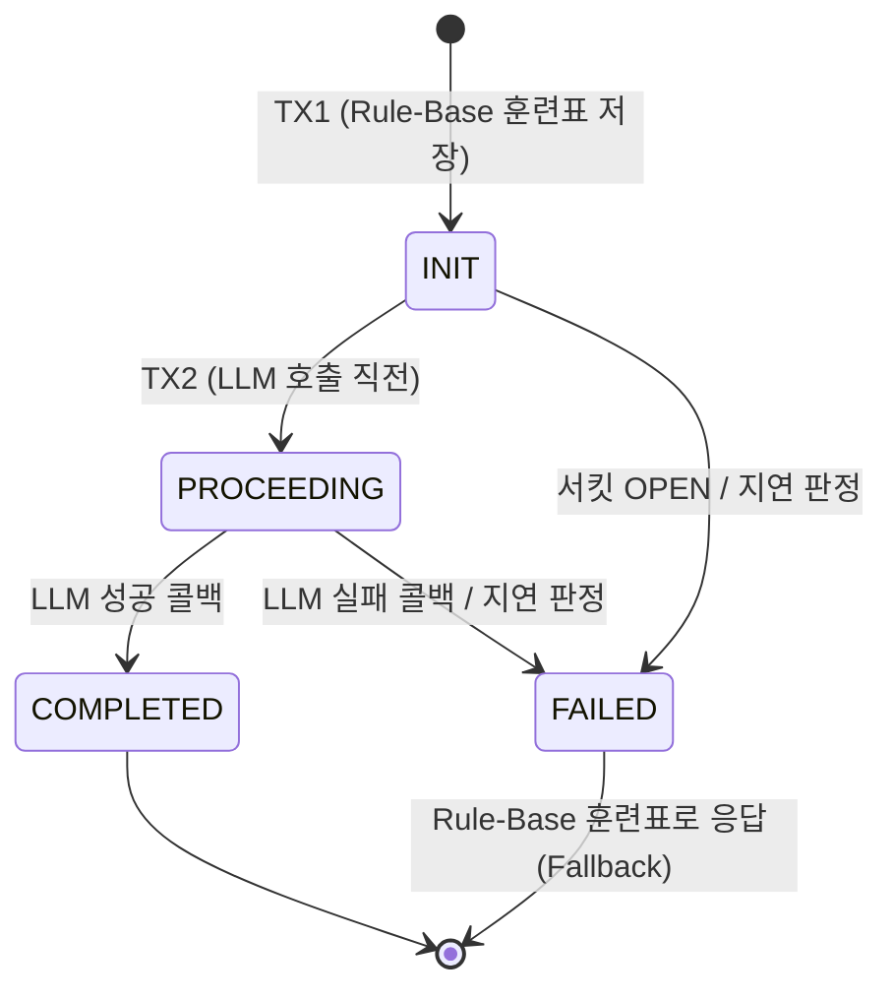
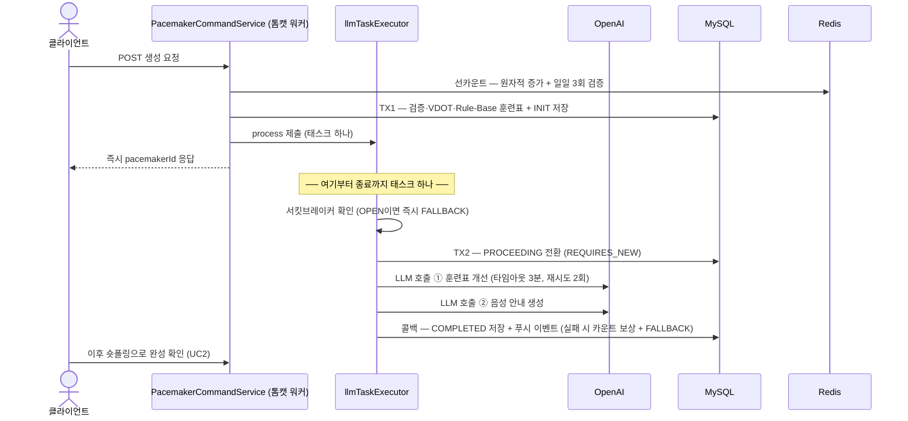

# 페이스메이커 유즈케이스 & LLM 파이프라인

> AI 페이스메이커(고스티) 도메인의 **모든 유즈케이스**가 어떻게 동작하는지, 그리고 배포(Graceful Shutdown)·장애 상황에서 어떻게 방어되는지 정리한 문서다.
> 기준: PR #170 (Graceful Shutdown 전체 완료 보장 + 리커버리 워커 제거 + CQRS 분리) 반영 이후.

## 1. 유즈케이스 한눈에 보기

| API | 유즈케이스 | 진입 서비스 | 성격 |
| --- | --- | --- | --- |
| `POST /v1/pacemaker` | UC1. 생성 (Rule-Base + LLM 개선) | `PacemakerCommandService` | 명령, 비동기 |
| `GET /v1/pacemaker/{id}` | UC2. 단건 폴링 (+ 지연 판정) | `PacemakerQueryService` | 조회 |
| `GET /v1/pacemaker?courseId=` | UC2′. 코스 내 폴링 (+ 지연 판정) | `PacemakerQueryService` | 조회 |
| `GET /v1/pacemaker/rate-limit` | UC3. 남은 사용량 조회 | `PacemakerRateLimitService` | 조회 (Redis만 — DB 트랜잭션 불필요) |
| `PATCH /v1/pacemaker/after-running` | UC4. 러닝 후 상태 업데이트 | `PacemakerCommandService` | 명령 |
| `DELETE /v1/pacemaker/{id}` | UC5. 삭제 (soft delete) | `PacemakerCommandService` | 명령 |

`PacemakerApi`는 Command/Query 서비스를 직접 주입받는다 — Running 도메인(`RunningApi → RunningCommandService + RunningQueryService`)과 같은 컨벤션.

## 2. 구성 요소

| 컴포넌트 | 역할 |
| --- | --- |
| `PacemakerCommandService` | 명령(생성·업데이트·삭제) 진입점 |
| `PacemakerQueryService` | 조회 진입점. 폴링 조회는 지연 판정을 겸한다 (해당 메서드만 readOnly 해제) |
| `PacemakerCreationService` | TX1 — 검증·VDOT 조회·Rule-Base 훈련표 계산·INIT 저장 |
| `PacemakerLlmApiTriggerService` | **유일한 `@Async` 진입점.** CB 확인 + TX2(PROCEEDING) + LLM 호출을 태스크 하나로 수행 |
| `PacemakerLlmService` | LLM 2회 호출 + 성공/실패 콜백. **동기 실행** (호출자의 태스크 안에서) |
| `PacemakerLlmCallbackService` | 성공(COMPLETED + 이벤트 발행) / 실패(카운트 보상 + FALLBACK) 콜백. 멱등 |
| `PacemakerOpenAiRestClient` | RestClient 기반 OpenAI 호출. 타임아웃 3분, 재시도 2회(백오프 2초) |
| `PacemakerStatusService` | TX2 상태 전이 전담 (REQUIRES_NEW) |
| `PacemakerRateLimitService` | Redis 일일 사용량 (선카운트·보상·잔여 조회) |
| `Pacemaker` (도메인) | 상태 머신(`canTransitionTo`)·지연 판정(`fallbackIfStaleOver`)·소유 검증의 주인 |
| `llmTaskExecutor` | LLM 전용 스레드풀 (core 16 / max 32 / queue 100). 톰캣 워커·HikariCP와 격리 |
| CircuitBreaker (resilience4j `llmApi`) | OPEN이면 LLM 호출 없이 즉시 FALLBACK |

## 3. 상태 머신



- `FAILED`는 "응답 불가"가 아니라 **Fallback** — TX1에서 저장한 Rule-Base 훈련표가 그대로 응답된다. LLM의 역할은 "개선"이므로, LLM 장애가 기능 장애로 이어지지 않는다.
- 전이 규칙은 `Pacemaker.Status.canTransitionTo()`가 도메인 레벨에서 강제하고, 시간 조건이 붙는 전이(지연 판정)는 `Pacemaker.fallbackIfStaleOver(threshold)`가 담당한다.

## 4. UC1 — 생성



**접수 — `PacemakerCommandService.createPacemaker`**

```java
public Long createPacemaker(String memberUuid, PacemakerCreateCommand command) {
    // 선카운트 (트랜잭션 밖 — 롤백돼도 Redis 카운트만 남는 정합성 문제 방지를 위해 분리)
    // 증가에 사용한 키를 반환받는다 — 키에 날짜가 들어가므로 보상은 반드시 이 키로
    String rateLimitKey = rateLimitService.incrementCounter(memberUuid);

    PacemakerCreationResult result;
    try {
        result = creationService.createInitialPacemaker(memberUuid, command);   // TX1: INIT
    } catch (Exception e) {
        rateLimitService.decrementCounter(rateLimitKey);    // TX1 실패 시에만 카운트 보상
        throw e;
    }

    llmTriggerService.process(result);      // 비동기 전달
    return result.getPacemakerId();         // 즉시 응답 → 클라이언트는 숏폴링 시작
}
```

**TX1 — `PacemakerCreationService.createInitialPacemaker`** (하나의 트랜잭션)

1. 멤버 조회 및 코스 검증
2. VDOT 조회 → 러닝 타입별 권장 페이스 산출 (VDOT 기록이 없으면 `VDOT_NOT_FOUND`로 즉시 실패)
3. Rule-Base 훈련표 생성 (`WorkoutService`)
4. `Pacemaker(INIT)` + `PacemakerSet`(message=null) 저장 — **이 세트가 이후 모든 Fallback 응답의 재료**

**비동기 — `PacemakerLlmApiTriggerService.process`** (유일한 `@Async` 진입점)

```java
@Async("llmTaskExecutor")
public void process(PacemakerCreationResult result) {
    if (isCircuitOpen()) {                                  // 서킷 OPEN → LLM 호출 없이 FALLBACK
        statusService.updateToFallback(pacemakerId);
        return;
    }
    try {
        statusService.updateToProceeding(pacemakerId);      // TX2: PROCEEDING (REQUIRES_NEW)
    } catch (Exception e) {
        return;  // INIT 유지 → 폴링 시 지연 판정이 FALLBACK으로 전환
    }
    requestLlm(result);     // 동기 호출 — 같은 태스크 안에서 LLM 2회 + 콜백까지
}
```

`PacemakerLlmService`는 **동기**로 LLM ①(훈련표 개선) → ②(음성 안내)를 호출하고 콜백을 부른다. 여기서 다시 `@Async`로 재제출하면 graceful shutdown 시 신규 제출이 거부되어 접수된 요청의 LLM 호출이 유실된다 — 전체 체인이 태스크 하나여야 하는 이유.

**콜백 — `PacemakerLlmCallbackService`** (멱등: 이미 COMPLETED/FAILED면 무시)

- **성공**: `complete()` 전이 + 기존 세트에 음성 안내 message 채움 + `PacemakerCreatedEvent` 발행 → `PushEventListener`가 푸시 알림 전송
- **실패**: Rate Limit 카운트 보상(사용자가 재시도할 수 있도록) + `fallback()` 전이 → Rule-Base 훈련표가 응답됨

## 5. UC2 — 폴링 조회와 지연 판정

클라이언트는 생성 직후부터 숏폴링으로 완성 여부를 확인한다. 폴링 메서드는 조회이지만 **지연 판정이라는 쓰기를 겸하므로 readOnly를 해제**한다.

```java
@Transactional  // 지연 판정의 상태 전환이 커밋되어야 하므로 readOnly 해제
public PacemakerPollingResponse getPacemaker(Long pacemakerId, String memberUuid) {
    Pacemaker pacemaker = findPacemaker(pacemakerId);
    pacemaker.verifyMember(memberUuid);         // 소유자 검증
    fallbackIfStale(pacemaker);                 // 지연 판정 — 고아 레코드 안전망

    if (pacemaker.isNotCompleted()) {
        return mapper.toPacemakerPollingResponse(pacemaker);        // 진행 중 — 상태만
    }
    // COMPLETED/FAILED — 세트(훈련표)와 러닝 팁까지 응답
    List<PacemakerSet> sets = pacemakerSetRepository.findByPacemakerIdOrderBySetNumAsc(pacemakerId);
    return mapper.toPacemakerPollingResponse(pacemaker, sets, runningTipsProvider.getRandomTip());
}
```

**지연 판정** — 판정은 도메인이, 전환은 DB 조건부 UPDATE가, 임계치(운영 정책)와 error 알림은 서비스가 담당한다.

```java
// Pacemaker (도메인) — 고아 여부 판정
public boolean isStaleOver(Duration threshold) {
    return isNotCompleted() && getCreatedAt().isBefore(LocalDateTime.now().minus(threshold));
}

// PacemakerRepository — 원자적 조건부 전환: 완료 콜백과의 경쟁에서 이미 COMPLETED면 0건 매치로 물러난다
@Modifying(clearAutomatically = true, flushAutomatically = true)
@Query("update Pacemaker p set p.status = 'FAILED' " +
        "where p.id = :pacemakerId and p.status in ('INIT', 'PROCEEDING')")
int fallbackIfNotCompleted(Long pacemakerId);

// PacemakerQueryService — 임계치 30분: 셧다운 대기(20분)·재시도 워스트(~18분)보다 길게
private Pacemaker fallbackIfStale(Pacemaker pacemaker) {
    if (!pacemaker.isStaleOver(STALE_THRESHOLD)) return pacemaker;
    if (pacemakerRepository.fallbackIfNotCompleted(pacemaker.getId()) == 1) {
        log.error("고아 페이스메이커 감지 → FALLBACK 전환 - ...");   // Sentry·Discord 개발자 알림
    }
    return findPacemaker(pacemaker.getId());    // 전환(또는 경쟁 상대의 완료) 결과 재조회
}
```

전환을 읽고-쓰기(dirty checking)가 아닌 **조건부 UPDATE**로 하는 이유: 폴링의 지연 판정과 LLM 완료 콜백이 같은 레코드를 서로 다른 트랜잭션에서 수정할 수 있는데, 각자 자기 스냅샷 기준으로 쓰면 나중에 커밋한 쪽이 상대를 덮는다(Lost Update — 최악은 LLM 결과가 FAILED로 되돌아가는 경우). 조건부 UPDATE는 "미완료일 때만 전환"을 DB가 원자적으로 보장하므로 이 경쟁이 사라진다.

- **왜 워커가 아니라 읽기 시점인가** — 고아는 SIGKILL·크래시·TX2 실패 같은 드문 이벤트에서만 생긴다. 1분 주기 스케줄러 + ShedLock을 상시 유지하는 대신, 실제로 조회될 때 해소하고 발생 사실은 error 로그로 알린다.
- **UC2′ (코스 내 조회)** 도 동일 — `findByCourseId`(해당 코스에서 아직 함께 뛰지 않은 최신 1건) 후 같은 지연 판정을 거친다.

## 6. UC3 — Rate Limit 정책과 잔여량 조회

- 키: `pacemaker_api_rate_limit:{memberUuid}:{오늘 날짜(KST)}` · **일일 3회** · TTL 24시간
- **선카운트**: 생성 요청 접수 즉시 Lua 스크립트로 원자적 "증가 + 임계치 검증" — 검증과 증가 사이의 Race Condition이 없다. 초과 시 접수 자체를 거절 (Fail-Fast)
- **보상(decrement)은 두 곳**: ① TX1 실패 시 (접수 자체가 무산) ② LLM 최종 실패 콜백 (사용자 잘못이 아니므로 재시도 기회 반환). 보상은 `@Retryable` 3회, 소진 시 `@Recover`가 error 로그 — TTL로 자정 리셋되므로 일시적 불일치는 허용
- `incrementCounter`는 **증가에 사용한 키를 반환**한다 — 키에 날짜가 포함되어, 자정 경계에서 증가한 키와 보상하는 키가 어긋나는 것을 방지
- 잔여량 조회(UC3)는 `DAILY_LIMIT - 현재 카운트`를 계산해 반환

## 7. UC4·UC5 — 러닝 후 업데이트, 삭제

- **UC4 (러닝 후 업데이트)**: 소유자 검증 → `updateAfterRunning(runningId)` — 함께 뛴 러닝을 연결하고 `hasRunWith=true`. 이미 연결된 페이스메이커면 도메인이 예외로 거절
- **UC5 (삭제)**: 소유자 검증 → `Pacemaker`와 `PacemakerSet` 모두 **soft delete** (`deleted=true`, `@Where`로 조회에서 자동 제외)

## 8. Graceful Shutdown

```java
// AsyncConfig — llmTaskExecutor
executor.setWaitForTasksToCompleteOnShutdown(true);
executor.setAwaitTerminationSeconds(1200);  // 20분 — 재시도 포함 워스트 (2회 호출 × 3시도 × 3분 + 백오프)까지 전부 대기
executor.setAcceptTasksAfterContextClose(true);  // 셧다운 드레인 중인 HTTP 요청의 태스크 제출이 거부되지 않도록
```

SIGTERM 수신 후 순서:

1. **커넥터 차단** — `server.shutdown: graceful`이 신규 HTTP 수락을 중단. 이후 요청은 LB가 다른 인스턴스로 라우팅
2. **드레인** — 처리 중이던 HTTP 요청은 완료. 이 창구에서의 `process` 제출은 `acceptTasksAfterContextClose(true)`가 보장
3. **스레드풀 대기** — 실행 중 + 큐 대기 중인 태스크를 **재시도 포함 끝까지** 수행 (최대 1200초). 태스크가 "TX2 + LLM 2회 + 콜백"을 전부 담고 있어 중간에 잘리는 지점이 없다
4. **완료 반영** — 대기 중 끝난 작업은 COMPLETED/FALLBACK이 DB에 저장 → 폴링(다른 인스턴스)에 그대로 반영. 사용자는 배포를 인지하지 못한다
5. **최후의 안전망** — 대기 초과·SIGKILL로 남은 고아는 다음 폴링에서 지연 판정이 해소 + error 알럿

방어선 3겹: **커넥터 차단**(새 요청은 안 받는다) → **태스크 단위 완주 대기**(받은 요청은 끝까지) → **지연 판정**(그래도 남으면 폴링이 해소하고 알럿).

## 9. 정책 수치

| 항목 | 값 | 근거 |
| --- | --- | --- |
| Rate Limit | 일일 3회, TTL 24h | LLM 비용·남용 방지 |
| LLM 응답 타임아웃 | 3분/호출 | OpenAI 응답 분포 |
| 재시도 | 2회, 백오프 2초 | 5xx·타임아웃·I/O 예외만 재시도 |
| 셧다운 대기 | 1200초 (20분) | 2회 호출 × 3시도 × 3분 + 백오프 = 워스트 약 18분 |
| 지연 판정 임계치 | 30분 | 셧다운 대기(20분)·재시도 워스트(18분)보다 길게 — 정상 진행을 고아로 오판하지 않도록 |
| 스레드풀 | core 16 / max 32 / queue 100 | 동시 LLM 대기 상한 = 접수 상한 132건 |
| `timeout-per-shutdown-phase` | 1200초 | yml은 gitignore — prod 배포 설정에 별도 반영 필요 |

## 10. 참고

- 서킷브레이커(resilience4j `llmApi`)는 유지 중 — OPEN이면 LLM 호출 없이 즉시 FALLBACK 처리된다.
- 인프라의 강제 종료 유예(ECS stopTimeout 등)가 20분보다 짧으면 8장 3단계가 그 시점에 잘리므로, 인프라 유예 시간도 함께 맞춰야 한다.
- 관련 PR: [#144](https://github.com/SGMRT/sgmrt-server/pull/144) (Webflux → MVC 전환), [#151](https://github.com/SGMRT/sgmrt-server/pull/151) (상태 세분화·Fallback), [#170](https://github.com/SGMRT/sgmrt-server/pull/170) (셧다운 전체 완료 보장 + 워커 제거 + CQRS 분리)
