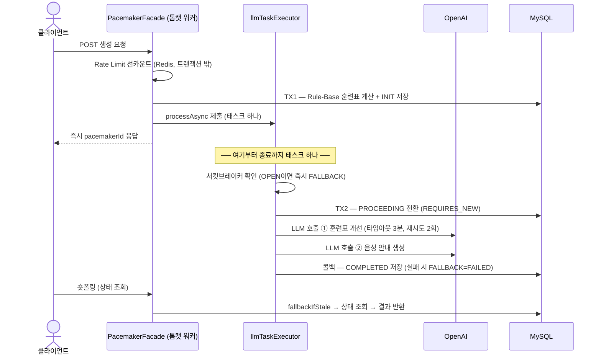
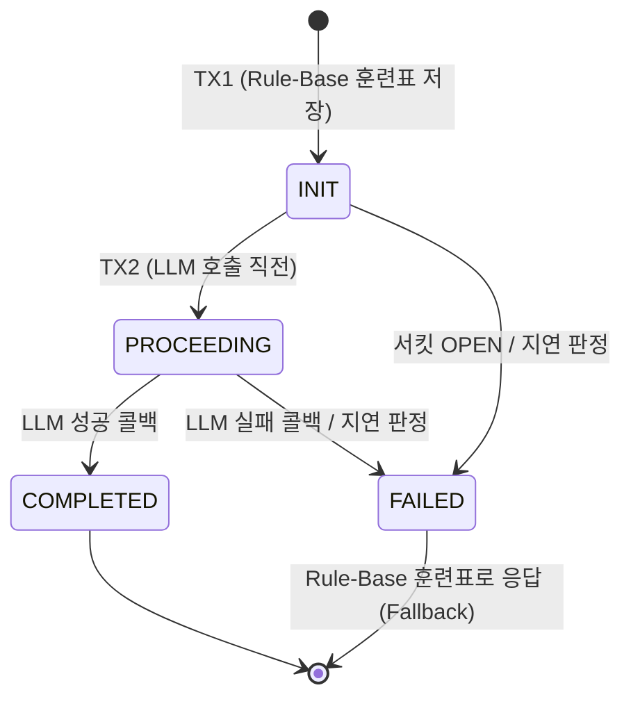

# 페이스메이커 LLM 파이프라인 플로우

> AI 페이스메이커(고스티) 생성이 요청 접수부터 응답까지 어떻게 흐르는지, 그리고 배포(Graceful Shutdown)·장애 상황에서 어떻게 방어되는지 정리한 문서다.
> 기준: PR #170 (Graceful Shutdown 전체 완료 보장 + 리커버리 워커 제거) 반영 이후.

## 1. 구성 요소

| 컴포넌트 | 역할 |
| --- | --- |
| `PacemakerFacade` | 모든 진입점. 생성·폴링·업데이트 오케스트레이션 |
| `PacemakerCreationService` | TX1 — Rule-Base 훈련표 계산 및 INIT 저장 |
| `PacemakerLlmTriggerService` | **유일한 `@Async` 진입점.** TX2(PROCEEDING) + LLM 호출을 태스크 하나로 수행 |
| `PacemakerLlmService` | LLM 2회 호출 + 성공/실패 콜백. **동기 실행** (호출자의 태스크 안에서) |
| `PacemakerOpenAiRestClient` | RestClient 기반 OpenAI 호출. 타임아웃 3분, 재시도 2회(백오프 2초) |
| `PacemakerStatusService` | 상태 전이 전담 (REQUIRES_NEW) + 폴링 시 지연 판정(`fallbackIfStale`) |
| `PacemakerQueryService` | 폴링 조회 |
| `llmTaskExecutor` | LLM 전용 스레드풀 (core 16 / max 32 / queue 100). 톰캣 워커·HikariCP와 격리 |
| CircuitBreaker (resilience4j) | OPEN이면 LLM 호출 없이 즉시 FALLBACK |

## 2. 생성 플로우



접수(HTTP)와 처리(LLM)가 분리되어 있고, 처리는 **처음부터 끝까지 `llmTaskExecutor`의 태스크 하나**다.

```java
// PacemakerFacade — 접수: TX1까지 끝내고 비동기로 넘긴 뒤 즉시 응답
public Long createPacemaker(String memberUuid, PacemakerCreateCommand command) {
    String rateLimitKey = rateLimitService.createRateLimitKey(memberUuid);
    rateLimitService.incrementCounter(memberUuid);      // 선카운트 (트랜잭션 밖 — 롤백 정합성 문제 방지)

    PacemakerCreationResult result;
    try {
        result = creationService.createInitialPacemaker(memberUuid, command);   // TX1: INIT
    } catch (Exception e) {
        rateLimitService.decrementCounter(rateLimitKey);    // TX1 실패 시에만 카운트 보상
        throw e;
    }

    llmTriggerService.processAsync(result);     // 비동기 전달
    return result.getPacemakerId();             // 즉시 응답 → 클라이언트는 숏폴링 시작
}
```

```java
// PacemakerLlmTriggerService — 유일한 @Async 진입점
@Async("llmTaskExecutor")
public void processAsync(PacemakerCreationResult result) {
    if (isCircuitOpen()) {                                  // 서킷브레이커 OPEN → LLM 호출 없이 FALLBACK
        statusService.updateToFallback(pacemakerId);
        return;
    }
    try {
        statusService.updateToProceeding(pacemakerId);      // TX2: PROCEEDING (REQUIRES_NEW)
    } catch (Exception e) {
        return;  // INIT 유지 → 폴링 시 fallbackIfStale이 FALLBACK으로 전환
    }
    requestLlm(result);                                     // 동기 호출 — 같은 태스크 안에서 LLM 2회
}
```

```java
// PacemakerLlmService — 동기 실행. 여기서 다시 @Async로 재제출하면
// graceful shutdown 시 신규 제출이 거부되어 접수된(PROCEEDING) 요청의 LLM 호출이 유실된다.
public void requestLlmToCreatePacemaker(...) {
    try {
        String improvedWorkoutStr = llmClient.improveWorkout(workoutImprovementPrompt);   // LLM ①
        String completedWorkoutStr = llmClient.fillVoiceGuidance(voicePrompt);            // LLM ②
        callbackService.handleSuccess(pacemakerId, completedWorkoutStr);                  // COMPLETED
    } catch (Exception e) {
        callbackService.handleError(rateLimitKey, pacemakerId);                           // FALLBACK
    }
}
```

## 3. 상태 머신



- `FAILED`는 "응답 불가"가 아니라 **Fallback** — TX1에서 저장한 Rule-Base 훈련표가 그대로 응답된다. LLM의 역할은 "개선"이므로, LLM 장애가 기능 장애로 이어지지 않는다.
- 전이 규칙은 `Pacemaker.Status.canTransitionTo()`가 도메인 레벨에서 강제한다.

## 4. 폴링과 지연 판정 (fallbackIfStale)

클라이언트는 생성 직후부터 숏폴링으로 완성 여부를 확인한다. 폴링 조회 직전에 **지연 판정**이 먼저 실행된다.

```java
// PacemakerFacade — 조회 전 지연 판정
public PacemakerPollingResponse getPacemaker(Long pacemakerId, String memberUuid) {
    statusService.fallbackIfStale(pacemakerId);
    return queryService.getPacemaker(pacemakerId, memberUuid);
}
```

```java
// PacemakerStatusService — 리커버리 워커를 대체하는 읽기 시점 안전망
private static final Duration STALE_THRESHOLD = Duration.ofMinutes(30);

private void fallbackIfStale(Pacemaker pacemaker) {
    boolean stale = pacemaker.isNotCompleted()
            && pacemaker.getCreatedAt().isBefore(LocalDateTime.now().minus(STALE_THRESHOLD));
    if (stale) {
        log.error("고아 페이스메이커 감지 → FALLBACK 전환 - ...");   // Sentry·Discord로 개발자 알림
        pacemaker.fallback();
    }
}
```

- **왜 워커가 아니라 읽기 시점인가** — 고아 레코드는 SIGKILL·크래시 같은 드문 이벤트에서만 생긴다. 1분 주기 스케줄러 + ShedLock(분산락)을 상시 유지하는 대신, 실제로 조회될 때 해소하고 발생 사실은 error 로그로 알린다.
- **임계치 30분의 근거** — graceful shutdown 대기(최대 20분)·LLM 재시도 워스트(약 18분)보다 길어야 정상 진행 중인 작업을 고아로 오판하지 않는다.

## 5. Graceful Shutdown

```java
// AsyncConfig — llmTaskExecutor
executor.setWaitForTasksToCompleteOnShutdown(true);
executor.setAwaitTerminationSeconds(1200);  // 20분 — 재시도 포함 워스트 (2회 호출 × 3시도 × 3분 + 백오프)까지 전부 대기
executor.setAcceptTasksAfterContextClose(true);  // 셧다운 드레인 중인 HTTP 요청의 태스크 제출이 거부되지 않도록
```

SIGTERM 수신 후 순서:

1. **커넥터 차단** — `server.shutdown: graceful`이 신규 HTTP 수락을 중단. 이후 요청은 LB가 다른 인스턴스로 라우팅
2. **드레인** — 처리 중이던 HTTP 요청은 완료. 이 창구에서의 `processAsync` 제출은 `acceptTasksAfterContextClose(true)`가 보장
3. **스레드풀 대기** — 실행 중 + 큐 대기 중인 태스크를 **재시도 포함 끝까지** 수행 (최대 1200초). 태스크가 "TX2 + LLM 2회 + 콜백"을 전부 담고 있어 중간에 잘리는 지점이 없다
4. **완료 반영** — 대기 중 끝난 작업은 COMPLETED/FALLBACK이 DB에 저장 → 폴링(다른 인스턴스)에 그대로 반영. 사용자는 배포를 인지하지 못한다
5. **최후의 안전망** — 대기 초과·SIGKILL로 남은 고아는 다음 폴링에서 `fallbackIfStale`이 해소 + error 알럿

방어선 3겹으로 요약된다: **커넥터 차단**(새 요청은 안 받는다) → **태스크 단위 완주 대기**(받은 요청은 끝까지) → **지연 판정**(그래도 남으면 폴링이 해소하고 알럿).

## 6. 정책 수치

| 항목 | 값 | 근거 |
| --- | --- | --- |
| LLM 응답 타임아웃 | 3분/호출 | OpenAI 응답 분포 |
| 재시도 | 2회, 백오프 2초 | 5xx·타임아웃·I/O 예외만 재시도 |
| 셧다운 대기 | 1200초 (20분) | 2회 호출 × 3시도 × 3분 + 백오프 = 워스트 약 18분 |
| 지연 판정 임계치 | 30분 | 셧다운 대기(20분)·재시도 워스트(18분)보다 길게 |
| 스레드풀 | core 16 / max 32 / queue 100 | 동시 LLM 대기 상한 = 접수 상한 132건 |
| `timeout-per-shutdown-phase` | 1200초 | yml은 gitignore — prod 배포 설정에 별도 반영 필요 |

## 7. 참고

- 서킷브레이커(resilience4j)는 유지 중 — OPEN이면 LLM 호출 없이 즉시 FALLBACK 처리된다.
- 인프라의 강제 종료 유예(ECS stopTimeout 등)가 20분보다 짧으면 3번 단계가 그 시점에 잘리므로, 인프라 유예 시간도 함께 맞춰야 한다.
- 관련 PR: [#144](https://github.com/SGMRT/sgmrt-server/pull/144) (Webflux → MVC 전환), [#151](https://github.com/SGMRT/sgmrt-server/pull/151) (상태 세분화·Fallback), [#170](https://github.com/SGMRT/sgmrt-server/pull/170) (셧다운 전체 완료 보장 + 워커 제거)
