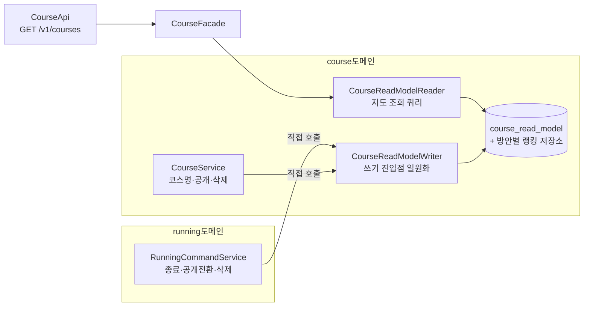
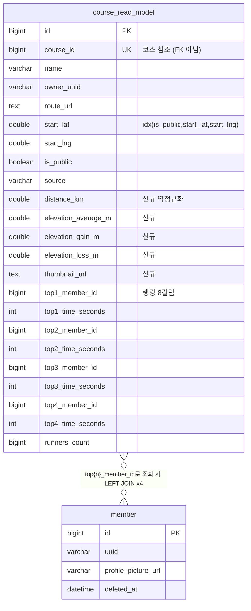
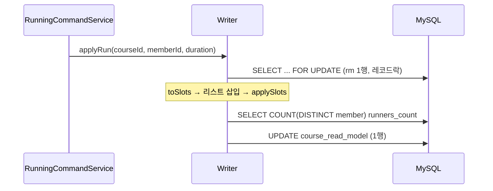
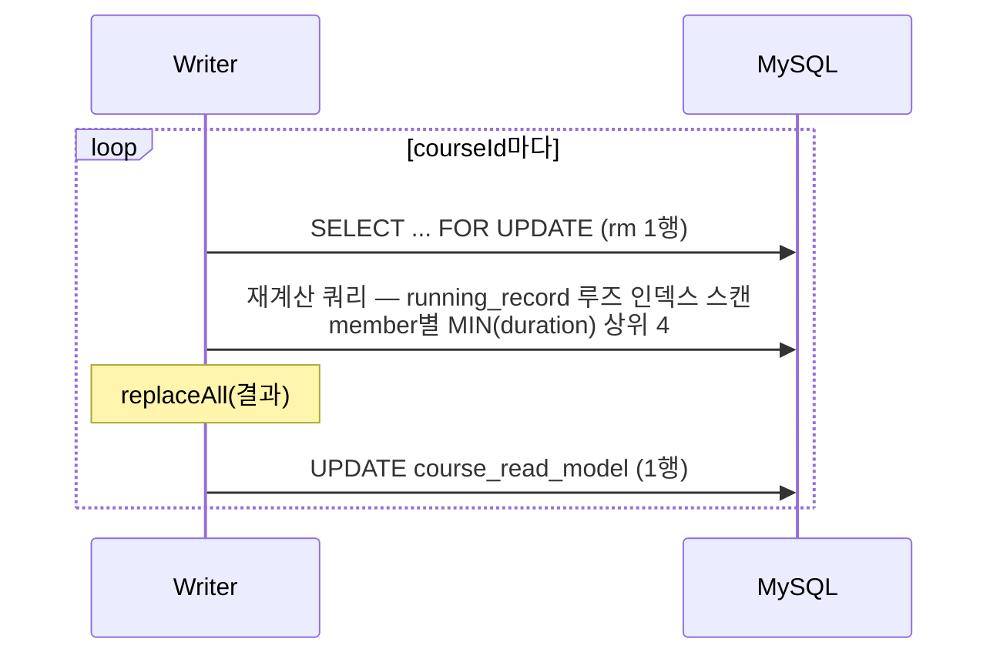
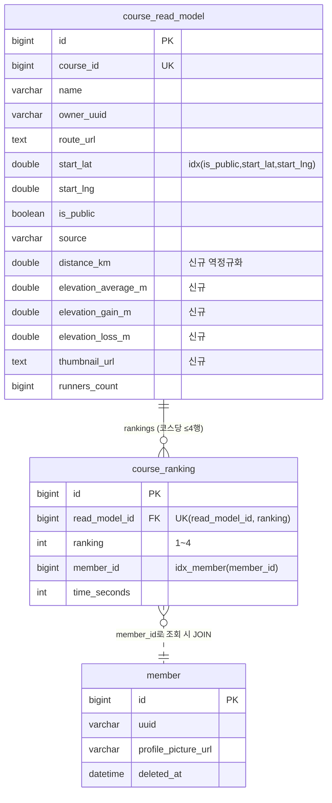
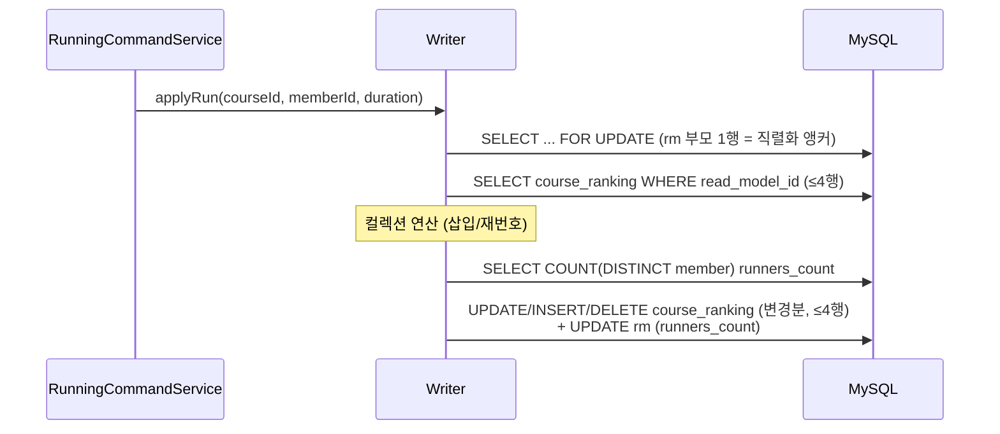

# 방안 A vs B 상세 구조 비교

> [02-redesign-options.md](02-redesign-options.md)의 부속 문서. 두 방안의 데이터 모델·컴포넌트 구조·작업별 흐름을 코드/SQL 수준으로 비교한다. 최종 선택 판단용.
>
> ⚠️ **요구사항 변경 반영 (탈퇴 러너 메인화면 유지)**: 회원 탈퇴 정정 경로가 설계에서 제거됨 — `MemberDeletedEvent` 불필요, 동기화는 100% 직접 호출. 본문 중 "탈퇴 정정" 비교(1-3, 2-3 일부, §3 해당 행)는 **무효**이며, A의 "과잉 재계산" 약점과 B의 "정확 역조회" 강점 모두 소멸했다. 조회 쿼리는 member JOIN의 `deleted_at IS NULL` 필터를 제거해 탈퇴 러너 프로필을 계속 표시한다.

## 0. 공통 구조 (방안과 무관하게 동일)

동기화는 직접 컴포넌트 호출로 일원화한다. **이벤트 신설 없음.**



- **Writer가 유일한 쓰기 진입점** — `findByCourseIdForUpdate`(X락)는 Writer 내부에서만 사용해 락 프로토콜을 코드로 강제.
- 러닝 종료 시 runnersCount 재집계(`countDistinctRunnersByCourseId`)는 양쪽 동일.
- 역정규화 필드(distance, elevation 3종, thumbnailUrl — 5개)는 양쪽 모두 `course_read_model`에 추가. checkpointsUrl/createdAt은 클라 미사용으로 응답에서 null 유지.
- 탈퇴 러너: 정정하지 않고 유지. 조회 시 member JOIN에 `deleted_at` 필터 없음.

---

## 1. 방안 A — 8컬럼 + RankSlot VO

### 1-1. 데이터 모델



- 테이블 1개. 랭킹은 행 안에 "펼쳐진 배열"로 존재.
- 러너 프로필(uuid/사진)은 저장하지 않고 **조회 시 member와 4-alias LEFT JOIN**으로 해석 → 항상 신선.

### 1-2. 엔티티 구조

```java
@Entity
public class CourseReadModel {
    // ... 코스 필드 + 역정규화 필드 ...
    private Long top1MemberId;  private Integer top1TimeSeconds;
    private Long top2MemberId;  private Integer top2TimeSeconds;
    private Long top3MemberId;  private Integer top3TimeSeconds;
    private Long top4MemberId;  private Integer top4TimeSeconds;

    // ── 컬럼과 로직 사이의 변환 계층 (이 방안의 비용) ──
    private List<RankSlot> toSlots() { ... }        // 8컬럼 → List
    private void applySlots(List<RankSlot> s) { ... } // List → 8컬럼

    public boolean applyRun(Long memberId, int time) {
        List<RankSlot> slots = toSlots();
        boolean changed = RankSlots.insertIfBetter(slots, memberId, time, 4);
        if (changed) applySlots(slots);
        return changed;
    }
    public void replaceAll(List<RankSlot> recalculated) { applySlots(recalculated); }
}

record RankSlot(Long memberId, Integer timeSeconds) {}
```

순위 로직 자체는 리스트 연산으로 단순해지지만, **toSlots/applySlots 변환 계층과 8컬럼 매핑이 영구 유지**된다.

### 1-3. 작업별 흐름과 SQL

#### 러닝 종료 (증분)


SQL 3회 / 락: rm 1행.

#### 재계산 (러닝 삭제·공개전환·탈퇴·백필 공통)



#### 회원 탈퇴 정정 (A의 약점)

```
MemberDeletedEvent(memberId)
 → SELECT DISTINCT course_id FROM running_record WHERE member_id = ?   -- FK 인덱스
 → 나온 모든 코스 재계산   ⚠️ TOP4에 없던 코스도 포함 (과잉 재계산)
```
활동적인 러너(코스 30개 러닝) 탈퇴 시 30회 재계산 — 실제 TOP4 정정 필요는 그중 일부.

#### 지도 조회

```sql
-- 쿼리 1방: rm 범위 스캔 + member 4-alias LEFT JOIN
SELECT rm.*, m1.uuid, m1.profile_picture_url, m2..., m3..., m4...
FROM course_read_model rm
LEFT JOIN member m1 ON rm.top1_member_id = m1.id AND m1.deleted_at IS NULL
LEFT JOIN member m2 ... m3 ... m4 ...
WHERE rm.is_public = true AND rm.start_lat BETWEEN ... AND rm.start_lng BETWEEN ...
LIMIT 50
-- + 내 고스트 쿼리 1방 (선별된 10개 코스)
```
총 2쿼리. 단, SELECT 컬럼 목록이 (rm 전체 + 4×3 멤버 컬럼)으로 넓고, 매핑 DTO도 top1~4 반복 필드를 가짐 (`CourseMapDto` 현행 구조).

---

## 2. 방안 B — 별도 랭킹 테이블

### 2-1. 데이터 모델



- 테이블 2개. 랭킹은 "정렬된 자식 행"으로 존재. 행 수 = 코스 수 × ≤4 (수천 규모, 무시 가능).
- `ranking` 컬럼명 주의: `rank`는 MySQL 8 예약어.

### 2-2. 엔티티 구조 (애그리거트)

```java
@Entity
public class CourseReadModel {
    // ... 코스 필드 + 역정규화 필드 + runnersCount ...

    @OneToMany(mappedBy = "readModel", cascade = ALL, orphanRemoval = true)
    @OrderBy("ranking ASC")
    private List<CourseRanking> rankings = new ArrayList<>();  // 항상 정렬 유지

    public boolean applyRun(Long memberId, int time) {
        // 컬렉션에서 기존 항목 제거/갱신 → 삽입 위치 판단 → 재번호(1..4) → 5위 이하 제거
    }
    public void replaceAll(List<RankEntry> recalculated) {
        rankings.clear();                       // orphanRemoval → DELETE
        recalculated.forEach(e -> rankings.add(CourseRanking.of(this, ...)));
    }
}

@Entity
public class CourseRanking {
    @ManyToOne(fetch = LAZY) private CourseReadModel readModel;
    private int ranking;        // 1~4
    private Long memberId;      // FK 제약 없이 ID만 (member 소프트삭제와 독립)
    private Integer timeSeconds;
}
```

**변환 계층이 없다** — "순위 = 정렬된 컬렉션"이 그대로 영속 모델. 시프트/스와프/toSlots 개념 소멸.

### 2-3. 작업별 흐름과 SQL

#### 러닝 종료 (증분)


SQL 4~5회 / 락: 부모 1행 (자식 경합은 부모 락으로 차단). A 대비 SELECT 1회·쓰기 행 수 증가 = **쓰기 증폭**.

#### 재계산

A와 동일 흐름이되 마지막이 `replaceAll` → `DELETE ≤4행 + INSERT ≤4행`. (A: UPDATE 1행)

#### 회원 탈퇴 정정 (B의 강점)

```
MemberDeletedEvent(memberId)
 → SELECT read_model_id FROM course_ranking WHERE member_id = ?   -- 전용 인덱스, 정확
 → TOP4에 실제로 들어있던 코스만 재계산 ✅
```

#### 지도 조회

```sql
-- 쿼리 ①: rm 범위 스캔 (좁은 컬럼)
SELECT rm.* FROM course_read_model rm
WHERE rm.is_public = true AND ... LIMIT 50

-- 쿼리 ②: 랭킹+멤버 배치 조회 (default_batch_fetch_size=100으로 JPA 자동 IN 배칭)
SELECT cr.*, m.uuid, m.profile_picture_url
FROM course_ranking cr
JOIN member m ON cr.member_id = m.id AND m.deleted_at IS NULL
WHERE cr.read_model_id IN (?, ?, ... 50개)
ORDER BY cr.read_model_id, cr.ranking
-- + 내 고스트 쿼리 1방
```
총 3쿼리. 쿼리 하나하나는 좁고 단순, DTO도 반복 필드 없이 자연스러운 리스트 매핑. 앱에서 코스별 그루핑 필요(JPA 연관 매핑 시 자동).

---

## 3. 작업별 비용 요약표

| 작업 | A (8컬럼+VO) | B (랭킹 테이블) |
|---|---|---|
| 지도 조회 | 2쿼리 (넓은 조인 1 + 내 고스트) | 3쿼리 (좁은 쿼리 2 + 내 고스트) |
| 러닝 종료 | SQL 3회, UPDATE 1행 | SQL 4~5회, 쓰기 ≤4행 |
| 재계산 (삭제/공개전환) | FOR UPDATE + 집계 + UPDATE 1행 | FOR UPDATE + 집계 + DELETE/INSERT ≤8행 |
| 탈퇴 영향 코스 탐색 | running_record 근사 (과잉 재계산) | course_ranking 정확 |
| 락 | rm 1행 | rm 1행 (부모 락 프로토콜 규율 필요) |
| 엔티티 복잡도 | 8컬럼 + 변환 계층(toSlots/applySlots) 영구 유지 | 애그리거트 컬렉션 — 변환 계층 없음 |
| DTO/매핑 | top1~4 반복 필드 (CourseMapDto 현행) | 리스트 매핑 (자연스러움) |
| DDL | ALTER ADD 컬럼 5개 | ALTER ADD 컬럼 5개 + CREATE TABLE 1개 (+추후 8컬럼 DROP) |
| 백필 | 전체 재계산 (동일) | 전체 재계산 (동일) |
| N 확장 | 컬럼 추가 필요 | ranking 값만 확장 |

## 4. 판단 가이드 (요약)

- **A** = "지금 있는 구조를 안전하게 다듬는다": diff 최소, 조회·쓰기 최경량. 대신 8컬럼 매핑·변환 계층·과잉 재계산이라는 구조적 타협을 계속 안고 간다.
- **B** = "구조를 바로잡는다": 도메인 모델과 정정 경로가 깔끔. 대신 쓰기 증폭(≤4행), 쿼리 1회 추가, 부모 락 규율, 테이블 1개 추가라는 비용을 지불한다.

두 방안 모두 즉시 반영(강한 일관성) 요구는 충족한다. 차이는 **비용을 어디서 지불하느냐** — A는 유지보수(코드 복잡도)에서, B는 런타임(쓰기 행 수·쿼리 1회)에서 지불한다. 이 서비스는 읽기 ≫ 쓰기이고 쓰기 절대량이 작으므로, 런타임 비용의 실질 영향은 작다.
