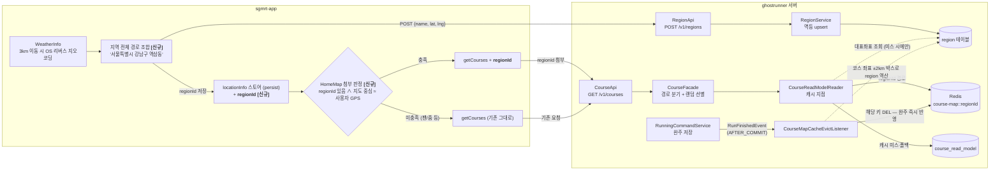
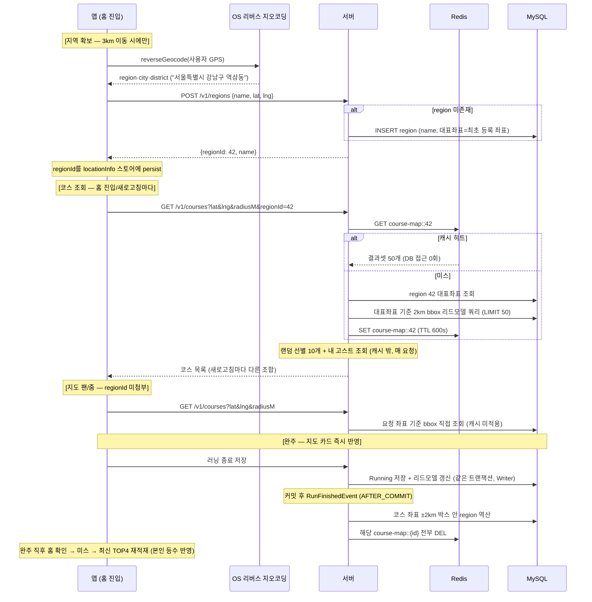
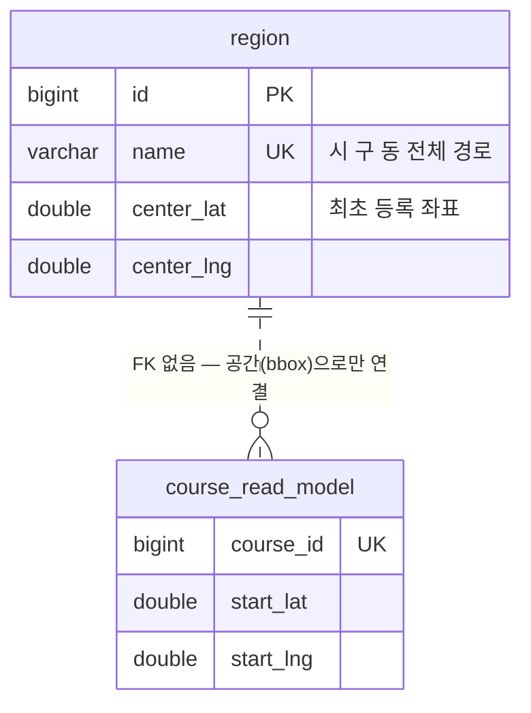
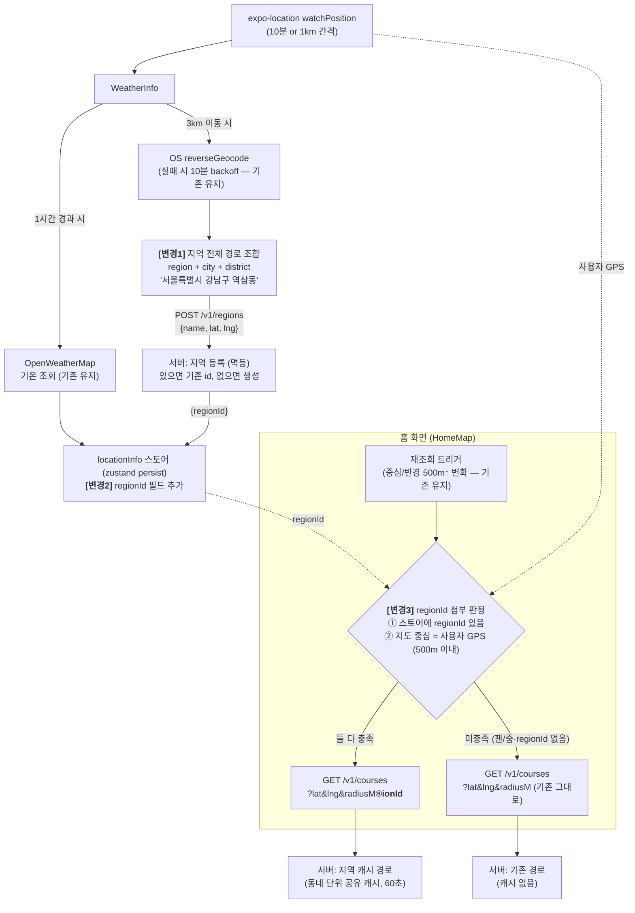

# 코스 지도 캐시키 재설계 — regionId(행정구역 그리드) 상세 설계

> 상태: **구현 완료** — 리뷰 iter2(91/S) 통과 + 성장 실험(v4)으로 TTL 600s·완주 이빅트 반영 (확정 사항 §10)
> 전제: PR-2에서 결과셋 캐시(반올림 키, TTL 60s)가 구현되어 있고, 이번 사이클에서 키 전략을 regionId로 교체한다. FE(sgmrt-app)도 함께 수정한다.
> 관련: 리드모델 본 설계는 `../core/04-detailed-design.md`, 히트율 시뮬레이션은 `../scripts/cache_hit_sim.py`

---

## 0. 전체 아키텍처

### 0-1. 컴포넌트 구조



### 0-2. 전체 플로우 (시퀀스)



핵심 성질:

| 성질 | 어떻게 보장하나 |
|------|----------------|
| 캐시 히트 시 DB 접근 0회 | 대표좌표 조회를 `@Cacheable` 메서드 **안**에 둠 — 히트면 메서드 본문 미실행 (§6-5) |
| 같은 키 = 같은 값 (결정성) | 값을 요청자 좌표가 아닌 **region 대표좌표 + 고정 반경 2km** 기준으로 정의 (§4) |
| 새로고침마다 다른 코스 조합 | 캐시 경계는 쿼리 결과 50개까지 — 랜덤 선별(10개)·내 고스트는 캐시 밖에서 매 요청 수행 |
| 구버전 앱·지오코딩 실패 무영향 | `regionId`는 선택 파라미터 — 없으면 기존과 동일한 비캐시 경로 (기존 API 스펙 불변) |
| 완주 즉시 반영 | 완주·러닝 공개 전환은 AFTER_COMMIT 이빅트로 해당 지역 키 DEL — 다음 조회가 최신 재적재 (시뮬레이션 v4: 본인 미반영 0%) |
| 쓰기 경로와 무결합 | Writer는 여전히 캐시를 모름 — 이빅트는 이벤트 리스너로 격리 ("커밋 후 부수효과 = 이벤트" 규칙). 이빅트 실패는 최대 TTL 지연으로 강등 |

---

## 1. 요청 특성 (FE 코드 분석 결과 — 설계의 전제)

캐시키를 정하기 전에, 실제 요청이 어떻게 생겼는지가 가장 중요하다. `sgmrt-app`을 분석한 결과:

| 사실 | 근거 | 설계에 주는 의미 |
|------|------|------------------|
| 코스 조회의 좌표는 **지도 뷰포트 중심** (사용자 GPS 아님) | `HomeMap.tsx` — 지도 중심 + 뷰포트 반경으로 `/courses?lat&lng&radiusM` 호출 | 임의 지점의 "지역"은 알 수 없음 → regionId 캐시는 기본 요청에만 적용 가능 |
| 중심 이동 500m↑ 또는 반경 변화 500m↑일 때만 재조회 | `HomeMap.tsx` `lastRef` 가드 | 요청 좌표가 이미 어느 정도 디바운스되어 있음 |
| 지역 이름은 **expo-location OS 리버스 지오코딩** (`district ?? city ?? region`) | `WeatherInfo.tsx` | 외부 HTTP 지오코딩 API 불필요 — OS가 무료 제공. 단 rate-limit 있음 (backoff 코드 존재) |
| 지역 갱신은 **사용자 GPS 기준, 3km 이동 시** | `weatherInfoPolicy.ts` | 지역 이름은 "사용자가 지금 있는 동네" 1개만 유지 — 팬으로 옮겨간 지점의 지역은 모름 |
| 홈 진입 시 첫 조회 = 사용자 위치 중심 + 기본 반경 | `HomeMap.tsx` 초기 center | **트래픽의 대부분이 이 기본 요청** — 캐시 실효 범위 |

핵심 긴장: **regionId는 "사용자가 있는 동네" 기준으로만 얻을 수 있고, 코스 조회는 "지도 중심" 기준으로 나간다.** 둘이 일치하는 것은 홈 진입/새로고침의 기본 요청뿐 → regionId 캐시의 적용 범위는 기본 요청으로 한정하고, 팬/줌 요청은 캐시 제외를 유지한다 (PR-2와 동일한 경계).

---

## 2. 세 방안 트레이드오프

### ① 반올림 (현행, PR-2 구현)

키 = `round(lat,2):round(lng,2):radiusM`. 요청 좌표를 1.1km 격자에 스냅.

| 장점 | 단점 |
|------|------|
| 구현 최소 (이미 완료), 서버 단독 완결, FE 무수정 | **격자 경계 분절**: 같은 동네인데 반올림 경계 양쪽이면 다른 키 → 히트 안 됨 |
| 키 계산 비용 0 | **인접 키 간 데이터 ~90% 중복 저장** (bbox가 겹침) |
| | 키가 "동네"라는 인간의 공간 단위와 무관 — 히트율이 좌표 분포 운에 좌우 |
| | 코스→키 역산 불가 → 이빅트 불가, 지역 메타데이터 확장성 없음 |

### ② 그리드 — regionId (행정구역을 자연 그리드로) ← **선택**

FE가 이미 갖고 있는 지역 이름(OS 리버스 지오코딩)을 서버에 등록해 `regionId`를 발급받고, 이후 조회에 `regionId`를 실어 보내면 서버가 이를 캐시키로 쓴다. **행정구역(동)을 균일 격자 대신 쓰는 그리드 방식** — 격자선이 수학적 경계가 아니라 사람이 인지하는 동네 경계에 놓인다.

| 장점 | 단점 |
|------|------|
| **키가 인간의 공간 단위와 일치** — "역삼동 사람들"은 전부 같은 키 → 히트율이 인구 밀집과 정비례 | **FE-BE 동시 작업 필요** (resolve 호출 + 파라미터 추가) |
| 키 카디널리티 유한 (활성 지역 수백~수천) — 메모리 상한 예측 가능 | OS 지오코딩 명칭이 기기/OS별로 다를 수 있음 → 같은 동네에 키 2개 (히트율 소폭 손실, 정합성 문제 아님) |
| region 테이블이 이후 지역 기능(지역별 랭킹·통계·날씨 캐시)의 기반 | regionId 없는 요청(팬/줌·지오코딩 실패·구버전)은 캐시 불가 → 폴백 필요 |
| 무료 (OS 지오코딩 재사용), regionId→대표좌표로 이빅트도 이론상 가능 | 동명 지역("중앙동" 전국 수십 개) → 이름 단독 키 불가 → `시 구 동` 전체 경로로 해결 (§3) |

### ③ 지오해싱

키 = geohash(lat, lng, precision) 문자열. 개념상 ①의 세련된 버전 (균일 격자 + 표준 인코딩).

| 장점 | 단점 |
|------|------|
| 표준 인코딩 — FE도 같은 키 계산 가능, prefix로 줌 계층 표현 | ①과 같은 **격자 경계 분절 문제 그대로** (인코딩 개선일 뿐) |
| 서버 단독 구현 가능 | precision 딜레마: p5(4.9km) 너무 큼 / p6(1.2×0.6km) 세로로 길쭉+잘게 쪼개짐 |
| | 키가 그냥 문자열 — 지역 이름·메타데이터 확장성 없음, 인접 셀 중복 저장 동일 |

### 시뮬레이션 검증 (`../scripts/cache_hit_sim.py`)

> ⚠️ 아래는 **초기 비교 모델(v2)** 의 결과다 — 균일 포아송·요청 무개체·명칭 분화 5%·TTL 60s 가정. 이후 현실 모델(v3~v5, 시간대 피크·자기상관·이빅트 반영)의 재검증 결과는 `06-home-locality-analysis.md` §6.5~6.7 — **절대값은 다르지만 전략 간 순위는 전 모델에서 일관**된다.

동네 400개, 사용자 위치 σ=400m(동네 중심 기준), Zipf 트래픽, TTL 60s, OS 명칭 분화 5% 모델:

| 초당 요청 | 반올림(1.1km) | geohash p6 | geohash p5 | regionId |
|---|---|---|---|---|
| 0.5 | 21.9% | 17.3% | 57.1% | **35.9%** |
| 2 | 43.3% | 37.4% | 80.7% | **56.4%** |
| 10 | 67.5% | 60.9% | 94.6% | **75.2%** |
| 50 | 86.5% | 81.8% | 98.8% | **89.3%** |
| 평균 스냅 오차 | 385m | 307m | 1,606m | 501m |

- 같은 스케일(1km급) 셀 대비 **regionId가 전 구간 +8~14%p** — 격자선이 동네 경계에 놓이는 효과.
- p5는 히트율 1등이지만 스냅 오차 1.6km(최대 ~3.5km) — 셀을 키우면 히트율은 공짜로 오르므로 히트율 단독 비교는 무의미하고, 오차와 함께 봐야 한다. 2km 반경 조회에서 탈락.

### 판정

- ①↔③은 본질이 같다(균일 격자). ③이 ①보다 나은 점은 인코딩 표준화뿐, 히트율을 결정하는 경계 문제는 동일하다.
- ②만이 키를 트래픽의 실제 분포(동네 단위 밀집)에 정렬시킨다. 러닝 앱 홈 트래픽의 본질이 "각자 자기 동네에서 앱을 연다"이므로 동네=키가 히트율 상한이 가장 높고, 시뮬레이션이 이를 확인했다.
- → **② regionId로 진행.** regionId 없는 요청은 비캐시 폴백. 반올림 캐시는 제거 (두 캐시 체계 공존은 복잡도만 추가).

---

## 3. 데이터 모델

### 3-1. `region` 테이블

```sql
CREATE TABLE region (
    id          BIGINT       NOT NULL AUTO_INCREMENT,
    name        VARCHAR(100) NOT NULL,   -- 정규화된 전체 경로: "서울특별시 강남구 역삼동"
    center_lat  DOUBLE       NOT NULL,   -- 대표좌표 = 최초 등록 요청의 좌표
    center_lng  DOUBLE       NOT NULL,
    created_at  DATETIME(6)  NULL,
    updated_at  DATETIME(6)  NULL,
    PRIMARY KEY (id),
    UNIQUE KEY uk_region_name (name)
);
```



### 3-2. 설계 결정과 이유

| 결정 | 이유 |
|------|------|
| 키는 **전체 경로 이름** (`시 구 동` 결합) | 동명 지역 충돌 방지 ("중앙동" 전국 수십 개). FE 지오코딩 결과에 region/city/district가 함께 오므로 조합 비용 0 |
| **대표좌표 = 최초 등록 좌표** (행정 경계 폴리곤 없음) | 경계 데이터를 관리하지 않는다. region은 "이 동네 사람들의 공유 스냅 포인트"일 뿐 — 캐시 값이 대표좌표 기준 반경 조회라 폴리곤이 필요 없다 |
| course와 **FK 없음** | region↔코스 관계는 조회 시점의 bbox 계산으로만 성립. 코스에 region을 태깅하면 경계 갱신·재태깅 문제가 생긴다 |
| soft delete 없음 | region은 삭제할 일이 없다 (오염 발견 시 운영자가 행 삭제 → FE가 재등록) |
| 대표좌표 이상치는 **신규 등록 시점에 1차 방어** | 대표좌표는 최초 등록 후 불변이고 복구 수단이 운영자의 수동 삭제뿐이라, 오염되면 그 동네 전원의 지도가 영구히 어긋난다(히트율이 아니라 **정합성** 문제). 신규 등록 경로에만 서비스 영역(한국 bbox: lat 33~39, lng 124~132) 검증을 걸고, 기존 행과 10km 초과로 어긋난 재요청은 WARN으로 관측한다(로그에 좌표는 남기지 않는다 — 개인위치정보). 영역 안의 이상치는 수용한다(폴리곤 부재). **자동 보정은 금지** — 대표좌표를 갱신하면 같은 키의 캐시 값이 달라져 §4의 결정성 근거가 무너진다 |
| 이름 정규화: **NFC + trim + 공백 축약** | `RegionService.resolve` 진입점 한 곳에서만 적용 — iOS(NFD)/Android(NFC)가 같은 동네를 다른 유니크 키로 분열시키는 것을 막는다. 조회·저장 모두 정규화된 값만 쓴다 |

---

## 4. 캐시 구조

| 항목 | 값 | 근거 |
|------|-----|------|
| 캐시 이름 | `course-map` (기존 재사용) | CacheConfig의 TTL 설정 그대로 |
| 키 | `course-map::{regionId}` | 카디널리티 = 활성 지역 수 (수백~수천) |
| 값 | region **대표좌표 기준 고정 반경 2km** bbox 쿼리 결과 (LIMIT 50, `List<CourseMapDto>`) | 요청자 좌표·반경을 쓰면 같은 키에 다른 값이 적재돼 결정성이 깨진다 |
| TTL | **600초** | 이빅트가 즉시성을 담당하므로 TTL은 히트율용으로 연장 (v4: 이빅트 없인 TTL 연장 불가 — 본인 미반영 57%) |
| 무효화 | **완주·러닝 공개 전환 시 이빅트** (AFTER_COMMIT 리스너) | "완주 직후 지도 카드에서 내 등수 확인" 요구사항 (v4: TTL 60s만으로도 미반영 14~29%). 코스 ±2km 박스로 region 역산 후 DEL. 그 외 변경(코스 공개 전환·이름 변경 등)은 TTL 상한 수용 |
| 직렬화 | GenericJackson2JsonRedisSerializer (기존 CacheConfig) | 변경 없음 |

**고정 반경 2km인 이유** — FE의 radiusM은 뷰포트 유래 연속값(기기마다 다름)이라 키에 포함하면 히트율이 파편화된다. regionId가 첨부되는 요청은 홈 기본 뷰(≈2km)뿐이므로 서버가 반경을 2km로 고정해 결정성을 확보한다. 요청의 radiusM은 regionId 경로에서 무시된다. 단, 상한(3,000m) 초과 요청은 캐시 경로 자체를 타지 않는다(§5-2) — **무시와 오답은 다르다**. 광역 뷰포트에 2km 결과를 돌려주는 것은 침묵 오답이므로 서버가 스스로 폴백으로 내린다.

**스냅 오차 허용 근거** — 사용자 실제 위치 ↔ 대표좌표는 같은 동 안에서 평균 ~500m (시뮬레이션). 조회 반경 2km 대비 허용 범위이고, FE 지도는 계속 사용자 위치 중심으로 그려지므로 UX 변화 없음.

**메모리 추정** — 엔트리당 50개 DTO ≈ 30~50KB. TTL 600초 내 활성 지역이 1,000개여도 ≤50MB. 상한은 활성 지역 수로 자연 형성된다 (반올림 키의 무한 좌표 조합과 대비).

### 관측 (운영 히트율 실측)

`RedisCacheManager`에 `.enableStatistics()`를 켜서 캐시별 히트/미스를 Micrometer → Prometheus로 노출한다:

```
cache_gets_total{cache="course-map", result="hit" | "miss"}   # 히트율 산출
cache_puts_total{cache="course-map"}                          # 적재(≈ 생성 키) 수
```

```promql
# Grafana 히트율 패널
sum(rate(cache_gets_total{cache="course-map",result="hit"}[5m]))
/ sum(rate(cache_gets_total{cache="course-map"}[5m]))
```

목적: 배포 후 **시뮬레이션 예측치(§2)와 실측 히트율을 비교 검증**하는 루프를 닫는다. 반올림(배포 전) 구간의 히트율을 미리 수집해 두면 전환 효과를 전후 비교로 증명할 수 있다. 보조 지표: Redis `INFO stats`의 keyspace_hits/misses(인스턴스 전역 — course-map만 분리 불가), `INFO keyspace` 키 수 스팟체크.

---

## 5. API 설계

### 5-1. 신규: `POST /v1/regions` — 지역 등록(resolve)

```json
// 요청
{ "name": "서울특별시 강남구 역삼동", "lat": 37.5008, "lng": 127.0365 }
// 응답 200 (기존재/신규 동일)
{ "regionId": 42, "name": "서울특별시 강남구 역삼동" }
```

- **멱등 upsert** — 있으면 즉시 기존 id 반환, 없으면 생성 후 반환.
- 검증: `name` @NotBlank @Size(max=100) @Pattern(`^[가-힣\u1100-\u11FFA-Za-z0-9 ]+$`), `lat` [-90,90], `lng` [-180,180].
  - `@Pattern`으로 문자 공간을 좁혀 캐시 키 카디널리티(=행 수) 폭증을 막는다. 자모 범위 `U+1100~U+11FF`를 **반드시 포함**한다 — `@Pattern`은 DTO 바인딩 시점, 즉 `RegionService`의 NFC 정규화 **이전**에 평가되므로 iOS가 보내는 NFD 한글은 `가-힣`에 걸리지 않는다(빠뜨리면 iOS 등록이 전량 400).
  - 좌표는 추가로 **신규 등록 시점에만** 서비스 영역(한국 bbox) 검증을 통과해야 한다 → `C-006` (§3-2). 기존 지역 조회는 좌표와 무관하게 통과한다.
- 인증: 기존 JWT 필터 체계 그대로 (인증 사용자만).
- 실패해도 FE는 regionId 없이 코스 조회 가능 (폴백) — 홈 화면을 막지 않는다.

### 5-2. 변경: `GET /v1/courses` — `regionId` 선택 파라미터 추가

| 경우 | 동작 |
|------|------|
| `regionId` 있음 + `radiusM <= 3000` | **캐시 경로** — 대표좌표 기준 2km 결과셋 (히트 시 DB 0회) |
| `regionId` 있음 + `radiusM > 3000` | 비캐시 폴백 (**광역 줌 방어** — 캐시 값은 고정 2km라 광역 뷰포트에 주면 침묵 오답, §4) |
| `regionId` 없음 | 기존과 완전 동일 (요청 좌표 bbox 직접 조회, 캐시 없음) |
| 발급된 적 없는 `regionId` | 서버가 **WARN 로그 후 요청 좌표 폴백으로 강등** (아래 참고) |

**기존 API 스펙의 어떤 필드·의미도 변하지 않는다** (외부 API 불변 원칙 — 파라미터 추가는 하위호환).

*폴백 강등을 택한 이유*: §5-1의 "실패해도 FE는 regionId 없이 코스 조회 가능 — **홈 화면을 막지 않는다**" 원칙과 일치시킨다. dev는 `ddl-auto: create`라 배포마다 `region` 테이블이 비워지는 반면 FE는 `regionId`를 persist하고 3km 이동 시에만 갱신하므로, "발급된 적 없는 regionId"는 가능성이 아니라 **배포마다 확정 재현되는 스케줄된 사고**다. 404로 응답하면 QA 기기 전원의 홈이 백지가 된다. Crash Early는 복구 경로가 없을 때 유효한 원칙인데, 여기엔 좌표 폴백이라는 완전한 복구 경로가 이미 정상 동작으로 구현돼 있다.

구현 위치가 핵심이다 — `CourseReadModelReader`는 **그대로 `RegionNotFoundException`을 던지고**, `CourseFacade`가 그것을 잡아 좌표 폴백으로 강등한다. catch가 `@Cacheable` 프록시 **바깥**(Facade)에 있어야 캐시 오염이 없다: Reader 안에서 잡으면 캐시 프록시가 폴백 결과를 `course-map::{regionId}`에 적재해 **없는 지역의 좌표 기반 결과가 캐시에 실린다**. 예외가 프록시를 뚫고 나가면 Spring Cache는 적재하지 않는다.

### 5-3. 에러 코드

```java
REGION_NOT_FOUND("C-005", NOT_FOUND, "존재하지 않는 지역"),        // 내부 신호 — 외부 노출 없음
REGION_COORDINATE_NOT_VALID("C-006", BAD_REQUEST, "서비스 영역 밖의 지역 좌표"),
```

- `C-005`는 **외부 API로 노출되지 않는다** — Reader→Facade 간 내부 신호로만 쓰이고 Facade가 좌표 폴백으로 흡수한다 (§5-2).
- `C-006`은 `POST /v1/regions`의 **신규 등록** 응답으로만 나간다 (기존 지역 조회는 좌표 검증 대상 아님).

---

## 6. 핵심 컴포넌트 상세 구현

패키지: 전부 `domain/course` 하위 (§10-Q2 확정 — 지역 기능이 커지면 독립 도메인으로 승격).

```
domain/course/
  domain/Region.java                       ← 신규 엔티티
  dao/RegionRepository.java                ← 신규
  application/RegionService.java           ← 신규 (멱등 upsert)
  api/RegionApi.java                       ← 신규 (POST /v1/regions)
  dto/request/RegionResolveRequest.java    ← 신규
  dto/response/RegionResolveResponse.java  ← 신규
  application/CourseReadModelReader.java   ← 캐시키 교체 (반올림 제거)
  application/CourseFacade.java            ← regionId 경로 분기
  api/CourseApi.java                       ← regionId 파라미터 추가
global/error/ErrorCode.java               ← C-005 추가
```

### 6-1. `Region` 엔티티

```java
@Getter
@NoArgsConstructor(access = AccessLevel.PROTECTED)
@Entity
@Table(name = "region",
       uniqueConstraints = @UniqueConstraint(name = "uk_region_name", columnNames = "name"))
public class Region extends BaseTimeEntity {

    @Id @GeneratedValue(strategy = GenerationType.IDENTITY)
    private Long id;

    @Column(nullable = false, length = 100)
    private String name;              // "서울특별시 강남구 역삼동"

    @Column(nullable = false)
    private Double centerLat;         // 대표좌표 = 최초 등록 요청의 좌표

    @Column(nullable = false)
    private Double centerLng;

    public static Region of(String name, Double centerLat, Double centerLng) { ... }
}
```

- `uk_region_name`이 동시 등록 경쟁의 최종 심판 (§6-3).
- 수정 메서드 없음 — 대표좌표는 최초 등록 후 불변 (캐시 값의 결정성 근거).

### 6-2. `RegionRepository`

```java
public interface RegionRepository extends JpaRepository<Region, Long> {
    Optional<Region> findByName(String name);
}
```

### 6-3. `RegionService` — 멱등 upsert와 동시성

```java
@Slf4j
@Service
@RequiredArgsConstructor
@Transactional(propagation = Propagation.NEVER)     // 트랜잭션 합류 금지를 런타임 강제 (아래)
public class RegionService {

    private static final double SERVICE_AREA_MIN_LAT = 33.0, SERVICE_AREA_MAX_LAT = 39.0;
    private static final double SERVICE_AREA_MIN_LNG = 124.0, SERVICE_AREA_MAX_LNG = 132.0;
    private static final double COORDINATE_DRIFT_WARN_M = 10_000;

    private final RegionRepository regionRepository;

    public Region resolve(String rawName, Double lat, Double lng) {
        String name = normalize(rawName);           // 조회·저장 모두 정규화된 값만 사용
        return regionRepository.findByName(name)
                .map(existing -> warnIfCoordinateDrifted(existing, lat, lng))
                .orElseGet(() -> saveNewRegion(name, lat, lng));
    }

    /** iOS(NFD)/Android(NFC)가 같은 동네를 다른 키로 분열시키는 것을 막는다 */
    private String normalize(String rawName) {
        return Normalizer.normalize(rawName, Normalizer.Form.NFC).trim().replaceAll("\\s+", " ");
    }

    private Region saveNewRegion(String name, Double lat, Double lng) {
        validateWithinServiceArea(lat, lng);        // 신규 생성 경로에만 — 기존 지역 조회는 통과
        try {
            return regionRepository.save(Region.of(name, lat, lng));
        } catch (DataIntegrityViolationException raceLost) {
            // 동시 등록 경쟁에서 진 쪽 — 승자의 행을 재조회해 돌려준다
            return regionRepository.findByName(name).orElseThrow(() -> raceLost);
        }
    }

    /** 자동 보정은 하지 않는다(결정성 훼손). 로그에 좌표는 남기지 않는다 — regionId와 거리만 */
    private Region warnIfCoordinateDrifted(Region region, Double lat, Double lng) { ... }
}
```

**클래스에 트랜잭션을 걸지 않는 이유** — 유니크 충돌이 나면 그 트랜잭션은 rollback-only로 오염되어 같은 트랜잭션 안의 재조회까지 실패한다. 서비스에 트랜잭션이 없으면 각 리포지토리 호출이 독립 트랜잭션으로 수행되므로 `충돌 → 재조회` 복구가 안전하다. (조회 1건 + 삽입 1건뿐이라 원자성으로 묶을 불변식 자체가 없다.)

**`NEVER`인 이유** — 위 문단은 주석이고, **주석은 실행되지 않는다**. 트랜잭션 있는 호출자가 생기면 rollback-only 오염이 `UnexpectedRollbackException`이 되어 **호출자 쪽에서** 터진다 — 실패 지점과 원인 지점이 분리된다. `NEVER`는 이 계약을 런타임 규칙으로 만들어 위반 시 **진입 즉시** `IllegalTransactionStateException`으로 실패시킨다. (테스트도 프로덕션과 같은 조건에서 검증해야 하므로 `RegionServiceTest`는 `NOT_SUPPORTED`로 테스트 트랜잭션을 벗어난다.)

### 6-4. `RegionApi` + DTO

```java
@RestController
@RequiredArgsConstructor
@RequestMapping("/v1")
public class RegionApi {

    private final RegionService regionService;
    private final CourseMapper courseMapper;      // 기존 MapStruct 매퍼에 메서드 추가

    @PostMapping("/regions")
    public RegionResolveResponse resolveRegion(@Valid @RequestBody RegionResolveRequest request) {
        Region region = regionService.resolve(request.name(), request.lat(), request.lng());
        return courseMapper.toRegionResolveResponse(region);   // @Mapping(source="id", target="regionId")
    }
}

public record RegionResolveRequest(
        @NotBlank @Size(max = 100)
        @Pattern(regexp = "^[가-힣\\u1100-\\u11FFA-Za-z0-9 ]+$")   // NFD 자모(U+1100~11FF) 필수 — 빠지면 iOS 등록 전량 400
        String name,
        @NotNull @Min(-90) @Max(90) Double lat,
        @NotNull @Min(-180) @Max(180) Double lng) { }

public record RegionResolveResponse(Long regionId, String name) { }
```

### 6-5. `CourseReadModelReader` — 캐시 지점 교체

```java
@Component
@RequiredArgsConstructor
public class CourseReadModelReader {

    public static final String COURSE_MAP_CACHE = "course-map";
    private static final int MAP_QUERY_LIMIT = 50;

    /** 지역 캐시 경로의 고정 조회 반경 — 요청 radiusM을 쓰지 않는 이유는 §4 */
    private static final int REGION_MAP_RADIUS_M = 2000;   // 외부 참조 없음 — Reader 내부 정책

    private final CourseReadModelRepository readModelRepository;
    private final RegionRepository regionRepository;

    /** 캐시 경로 — 히트 시 본문 미실행이므로 region 조회 포함 DB 접근 0회 */
    @Cacheable(cacheNames = COURSE_MAP_CACHE, key = "#regionId")
    public List<CourseMapDto> findCoursesForMapByRegion(Long regionId) {
        Region region = regionRepository.findById(regionId)
                .orElseThrow(() -> new RegionNotFoundException(regionId));
        return queryCoursesForMap(region.getCenterLat(), region.getCenterLng(), REGION_MAP_RADIUS_M);
    }

    /** 비캐시 폴백 경로 — 팬/줌, regionId 미첨부 */
    public List<CourseMapDto> findCoursesForMap(double lat, double lng, int radiusM) {
        return queryCoursesForMap(lat, lng, radiusM);
    }

    private List<CourseMapDto> queryCoursesForMap(double lat, double lng, int radiusM) {
        CourseService.LatLngs bounds = CourseService.getBoundingBoxLatLngs(lat, lng, radiusM);
        return readModelRepository.findCoursesForMap(
                bounds.minLat(), bounds.maxLat(), bounds.minLng(), bounds.maxLng(), MAP_QUERY_LIMIT);
    }
}
```

PR-2 대비 변경: `cacheKey()`/`roundToCell()`(반올림) 삭제, `cacheable` 플래그 파라미터 삭제(경로 분기는 Facade 책임으로 이동), 캐시 메서드와 폴백 메서드 분리.

### 6-6. `CourseFacade` — 경로 분기 (기존 흐름 유지)

```java
@Transactional(readOnly = true)
public List<CourseMapResponse> findCoursesByPosition(Double lat, Double lng, Integer radiusM,
                                                     CourseSortType sort, CourseSearchFilterDto filters,
                                                     Long regionId, String viewerUuid) {
    List<CourseMapDto> nearbyCourses = findCandidateCourses(lat, lng, radiusM, sort, filters, regionId);

    // 이하 기존과 동일: 랜덤 선별(10개) → 내 고스트 조회(선별분만) → 응답 조립
    ...
}

private List<CourseMapDto> findCandidateCourses(Double lat, Double lng, Integer radiusM, CourseSortType sort,
                                                CourseSearchFilterDto filters, Long regionId) {
    if (!useRegionCache(regionId, radiusM, sort, filters)) {
        return courseReadModelReader.findCoursesForMap(lat, lng, radiusM);
    }
    try {
        return courseReadModelReader.findCoursesForMapByRegion(regionId);
    } catch (RegionNotFoundException unknownRegion) {          // catch는 반드시 @Cacheable 프록시 바깥 (§5-2)
        log.warn("unknown regionId {}, fallback to coordinates", regionId);
        return courseReadModelReader.findCoursesForMap(lat, lng, radiusM);
    }
}

/** ① regionId 첨부 ② 요청 반경이 고정 2km와 어긋나지 않을 만큼 좁음 — 둘 다 만족해야 캐시 */
private boolean useRegionCache(Long regionId, Integer radiusM) {
    return regionId != null
            && (radiusM == null || radiusM <= MAX_CACHEABLE_RADIUS_M);  // 3000 = 고정 2km + 뷰포트 오차 여유
}
```

정렬·필터 기본값 판정은 넣지 않는다 — 이 경로는 정렬·필터를 적용하지 않으므로(클라 미사용, core/04 §1) 어떤 요청이든 결과가 같아 캐시 공유가 안전하다. **필터를 실제로 적용하게 바뀌면 기본 요청 판정을 이 조건에 복원해야 한다** (코드 주석에도 명시 — 안 하면 필터 요청이 무필터 캐시 값을 받는 버그). `MAX_CACHEABLE_RADIUS_M`은 FE 규율에 의존하지 않는 **서버 자체 방어**다 (§4).

### 6-7. `CourseApi` — 파라미터 추가

```java
@GetMapping("/courses")
public List<CourseMapResponse> getCoursesByPosition(
        @RequestParam Double lat,
        @RequestParam Double lng,
        @RequestParam(required = false, defaultValue = "2000") @Max(20000) Integer radiusM,
        ... (기존 그대로),
        @RequestParam(required = false) Long regionId,        // ← 추가
        @AuthenticationPrincipal JwtUserDetails userDetails) {
    return courseFacade.findCoursesByPosition(lat, lng, radiusM, sort, filters, regionId, userDetails.getUserId());
}
```

### 6-8. `RegionNotFoundException`

```java
public class RegionNotFoundException extends EntityNotFoundException {
    public RegionNotFoundException(Long regionId) {
        super(ErrorCode.REGION_NOT_FOUND, regionId);
    }
}
```

---

### 6-9. `CourseMapCacheEvictListener` — 완주 시 이빅트 (성장 실험 v4 반영)

```java
@Component
@RequiredArgsConstructor
public class CourseMapCacheEvictListener {

    private final CourseReadModelRepository readModelRepository;
    private final RegionRepository regionRepository;
    private final CacheManager cacheManager;

    @TransactionalEventListener   // 기본 phase = AFTER_COMMIT
    public void handleRunFinishedEvent(RunFinishedEvent event) { evictMapCacheAroundCourse(event.courseId()); }

    @TransactionalEventListener
    public void handleRunUpdatedEvent(RunUpdatedEvent event) { evictMapCacheAroundCourse(event.courseId()); }

    private void evictMapCacheAroundCourse(Long courseId) {
        CourseReadModel readModel = readModelRepository.findByCourseId(courseId).orElse(null);
        if (readModel == null) return;                       // 비공개 코스 — 지도에 없으므로 스킵
        LatLngs box = getBoundingBoxLatLngs(readModel.getStartLat(), readModel.getStartLng(), REGION_MAP_RADIUS_M);
        regionRepository.findByCenterLatBetweenAndCenterLngBetween(...)   // 코스 → 영향 캐시 역산
                .forEach(region -> cache.evict(region.getId()));
        // 실패는 log.warn — 이빅트 실패 = 정합성 사고가 아니라 최대 TTL 지연으로 강등
    }
}
```

설계 결정과 이유:

| 결정 | 이유 |
|------|------|
| Writer가 아니라 **AFTER_COMMIT 리스너** | "같은 트랜잭션 동기 로직 = 직접 호출, 커밋 후 부수효과 = 이벤트" 규칙(core/04 §6). Writer는 계속 캐시를 모름. 커밋 **전** 이빅트는 지운 자리에 커밋 전 데이터가 재적재되는 레이스가 있어 불가 |
| 이빅트 대상 = 코스 시작점 **±2km 박스 안 대표좌표를 가진 모든 region** | 캐시 값이 "대표좌표 기준 2km bbox"이므로 이 역산이 곧 "이 코스가 보이는 모든 엔트리". 코스가 여러 region에 걸치는 문제를 자연 해결. regionId 키라서 가능 (반올림 키는 역산 불가) |
| 소비 이벤트 = `RunFinishedEvent` + `RunUpdatedEvent` | 완주와 러닝 공개 전환이 TOP4/러너 수를 바꾸는 두 경로. **이 이벤트들은 구경로 정리 후에도 존치** (신규 소비자 생김) |
| 예외는 삼키고 WARN | 이빅트 실패의 결과는 "최대 TTL 지연"뿐 — 정합성 사고 아님. AFTER_COMMIT 리스너의 예외는 어차피 원 트랜잭션에 영향 없음 |
| 커버 범위 밖: 코스 공개 전환·이름 변경 | 완주 대비 빈도 낮고 본인 즉시 확인 요구 약함 — TTL(10분) 수용. 필요해지면 같은 리스너에 이벤트만 추가 |

**시뮬레이션 근거** (`../scripts/cache_evict_sim.py`, cache/06 §6.6): DAU 1만 기준 —

| 정책 | 전체 히트 | 본인 미반영 |
|---|---|---|
| TTL60 (구) | 45.6% | 14.1% |
| TTL600 단독 | 61.9% | 57.3% ❌ |
| **TTL600+이빅트 (채택)** | **51.4%** | **0.0%** |

> 위 0%는 **모델링된 변경(완주·러닝 공개 전환)이 이빅트에 성공한 경로에 한정된 시뮬레이션 결과**다. 이빅트 실패 시(리스너 예외 등) TTL 폴백으로 최대 600초 지연되며, 이빅트 범위 밖 변경(코스 공개 전환·이름 변경)은 애초에 TTL 상한을 따른다 — 운영 전체에 대한 보장이 아니다.

## 7. FE 변경 설계 (sgmrt-app)

### 7-1. FE 전체 구조 (FE 개발자 공유용)

기존 컴포넌트는 실선 흐름 그대로 유지되고, **굵은 테두리 3곳만 신규/변경**된다.



FE가 지켜야 할 규칙 요약:

| 규칙 | 이유 |
|------|------|
| resolve는 **주소 갱신 시점(3km 이동)에만** 호출 | 기존 지오코딩 빈도와 동일 — 추가 트래픽·rate-limit 부담 없음 |
| `name`은 `region + city + district` **전체 경로로 결합** (공백 구분) | 동명 지역("중앙동" 전국 수십 개) 충돌 방지 — 서버는 이 문자열을 유니크 키로 씀 |
| **`district`(동)가 없으면 resolve 자체를 생략** — regionId 없이 조회(폴백) | 구(city)는 지름 5~8km — 대표좌표±2km 캐시 값이 구석 사용자에게 화면 밖 코스만 담긴 결과(빈 지도)가 되는 구조적 문제. 동 단위만 키로 쓰면 사용자↔대표좌표 거리가 ~1.5km 이내로 구조적으로 보장됨 |
| **주소가 갱신되면 이전 regionId를 신뢰하지 않는다** — resolve 성공 시에만 교체, 실패·이름 조합 불가 시 즉시 클리어 | 이사/이동 후 옛 동네 키가 남으면 새 위치에서 옛 동네의 2km 결과를 받음 — 스테일 regionId 무효화 규칙 |
| regionId는 **지도 중심이 사용자 GPS와 가까울 때만**(500m 이내) 첨부 | 팬으로 옮겨간 지도의 요청에 "내 동네" 키를 붙이면 엉뚱한 동네의 캐시 결과가 나옴 |
| resolve 실패·backoff·regionId 없음 → **첨부 없이 요청** | 서버가 자동으로 기존 경로로 처리 (홈 화면이 지역 기능에 의존하지 않게) |
| regionId 첨부 시 응답은 **내 위치가 아니라 동네 대표좌표 기준 2km** 결과 | 같은 동네 사용자들이 캐시를 공유하기 위한 트레이드오프 (평균 오차 ~500m, 지도 표시는 영향 없음) |

### 7-2. 변경 목록

| # | 변경 | 위치 |
|---|------|------|
| 1 | 지오코딩 성공 시 `region·city·district`를 공백 결합한 전체 경로로 `POST /v1/regions` 호출 → `regionId`를 스토어에 persist | `WeatherInfo.tsx` 주소 갱신 블록 + `locationInfo.ts` 스토어에 `regionId` 필드 추가 |
| 2 | 홈 코스 조회 시 **지도 중심이 사용자 GPS와 가까울 때만**(예: 500m 이내) `regionId` 첨부 — 팬으로 옮겨간 지도의 요청에 내 동네 키를 붙이는 오류 방지 | `HomeMap.tsx` `getCourses` 호출부 |
| 3 | resolve 실패·백오프 중·regionId 없음 → 첨부 없이 요청 (자동 폴백) | 동일 |

- resolve 호출 빈도 = 주소 갱신 빈도(3km 이동 시)와 동일 — 추가 트래픽 미미.
- 상세 구현은 FE 저장소에서 별도 진행 (이 문서는 BE 관점의 계약만 확정).

### 7-3. 검토된 확장 — 스크롤 지점도 regionId로 캐시 (이번 범위 제외)

마지막 조회 좌표를 로컬에 저장해 두고, 재조회 시 Nkm 이상 차이나면 **스크롤한 지도 중심을 지오코딩**해 그 동네의 regionId를 받아 캐시 경로를 태우는 방안. OS 지오코더는 임의 좌표를 받으므로 기술적으로 가능하고 서버 변경도 0이다 (regionId를 "임의 지점 → 동네 스냅 함수"로 일반화하는 자연스러운 확장).

이번 범위에서 제외한 이유:

| 이유 | 내용 |
|------|------|
| 히트율 낮음 | 캐시 가치 = 같은 키에 몰리는 밀도. 홈 트래픽은 "자기 동네" 밀집이지만 스크롤 좌표는 long-tail 분산 |
| 조회 지연 직렬화 | 팬 → 지오코딩 → resolve → 조회. 비동기로 빼면 적재는 "60초 내 같은 곳 재스크롤"부터 — 드묾 |
| rate-limit 리스크 | 지오코딩 쿼터를 주소/날씨와 공유 (사고 이력: REACT-NATIVE-8, 27명 8,005건). 스크롤은 3km 이동보다 훨씬 잦은 트리거 |
| 줌 불일치 | regionId 값은 고정 2km인데 탐색은 줌아웃이 많음 — 현재 폴백(뷰포트 반경 그대로)이 더 정확 |

핫플레이스 몰림이 관측되어 스크롤 트래픽 캐시가 필요해지면, 타일 캐시 신설보다 이 방식이 1순위 (FE만 수정).

---

## 8. 테스트 계획 (핵심 로직만)

| 대상 | 시나리오 | 방식 |
|------|---------|------|
| `RegionService` | 신규 등록 → 같은 이름 재요청 시 같은 id (멱등) | 통합 (IntegrationTestSupport) |
| `RegionService` | 동시 등록 경쟁: save가 유니크 충돌 → 재조회로 승자 행 반환 | 단위 (mock — save가 DataIntegrityViolationException 던지게) |
| `CourseReadModelReader` | 같은 regionId 반복 조회 → 캐시 히트 (TTL 내 스테일 수용 확인, 키 `course-map::{id}`, TTL ≤60s) | 통합 (기존 ReaderTest 재작성) |
| `CourseReadModelReader` | regionId 경로는 대표좌표 기준 2km — 요청 좌표와 무관하게 동일 결과 | 통합 |
| `CourseReadModelReader` | 미존재 regionId → RegionNotFoundException | 통합 |

`POST /v1/regions` 컨트롤러는 얇은 위임이라 별도 API 테스트 생략 (핵심 로직만 원칙).

리뷰 iter1 반영으로 추가된 4케이스:

| 대상 | 시나리오 | 방식 |
|------|---------|------|
| `RegionService` | NFD(자모 분해) 이름 → NFC 기존 행과 같은 id (정규화) | 통합 |
| `RegionService` | 서비스 영역 밖 좌표 신규 등록 → C-006 예외 / 기존 행 조회는 좌표 무관 통과 | 통합 |
| `CourseFacade` | 미발급 regionId → 예외 없이 좌표 폴백 + 캐시 키 미생성 | 통합 |
| `CourseFacade` | regionId + radiusM=10000 → 캐시 우회 + 요청 반경 실적용 (5km 코스 포함 검증) | 통합 |

---

## 9. 롤아웃

1. **BE 선배포** — region 테이블(DDL §3-1) + resolve API + `regionId` 파라미터. 구버전 앱 무영향 (파라미터 미첨부 → 기존 동작).
2. **FE 배포** — resolve 호출 + regionId 첨부.
3. FE 배포 전까지는 전 요청이 폴백 경로(캐시 없음) — 리드모델 단일 쿼리라 감당 가능 (PR-2 이전에도 캐시 없이 운영하던 경로). 반올림 캐시는 BE 배포 시점에 제거된다 (§10-Q4).

DDL 실행: 배포 전 `region` CREATE TABLE 1개 (기존 테이블 무변경, 백필 불필요 — 데이터는 사용자 요청이 채운다).

---

## 10. 확정 사항 (2026-08-04 사용자 확인)

- **Q1. 지역 단위**: FE 폴백 체인(`district ?? city ?? region`) 그대로 — OS가 주는 가장 세밀한 값 사용. ✅
- **Q2. Region 도메인 위치**: `domain/course` 하위. 지역 기능이 커지면 독립 도메인으로 승격. ✅
- **Q3. resolve API**: `POST /v1/regions`로 확정 (멱등 upsert, 기존 리소스 명사형 컨벤션 일치). ✅
- **Q4. 반올림 캐시 제거 시점**: 이번 브랜치에서 즉시 교체 (두 체계 공존 방지). ✅
- **Q5. resolve 시 기온 연계**: 이번엔 캐시키만. 날씨 캐시 공유는 후속. ✅
- **랜덤 다양성 유지 확인**: 캐시 경계는 쿼리 결과(50개), 랜덤 선별(10개)은 캐시 밖 매 요청 — 같은 위치 새로고침에도 조합이 달라지는 기존 구조 그대로. ✅
- **Q1 보완 (2026-08-04)**: 폴백 체인 중 `district`(동)가 없으면 **resolve 생략** — 구 단위 region은 넓이 때문에 구석 사용자가 빈 지도를 보는 구조적 문제가 있어 키로 쓰지 않는다 (§7 규칙). ✅
- **성장 실험 v4 반영 (2026-08-04)**: TTL 60s→600s + 완주·러닝 공개 전환 시 AFTER_COMMIT 이빅트 채택 — "완주 직후 지도 카드 등수 확인" 요구사항을 본인 미반영 0%로 보장하면서 히트율 확보 (§4, §6-9). 기본 요청(정렬·필터) 가드는 죽은 분기라 제거 (복원 조건 §6-6). ✅
- **리뷰 iter1 반영 (2026-08-04)**: 미발급 regionId를 404 → **좌표 폴백 강등**(§5-2), 지역 이름 **NFC 정규화**(§3-2·§6-3), 신규 등록 시 **서비스 영역 검증** + 이탈 재요청 WARN(§3-2·§5-1), 캐시 판정에 **radiusM 상한 3,000m 가드**(§4·§5-2·§6-6), `RegionService`에 **`@Transactional(NEVER)`**로 트랜잭션 합류 금지 런타임 강제(§6-3). 근거: `docs/reviews/course-map-cache-iter1.md`. ✅
