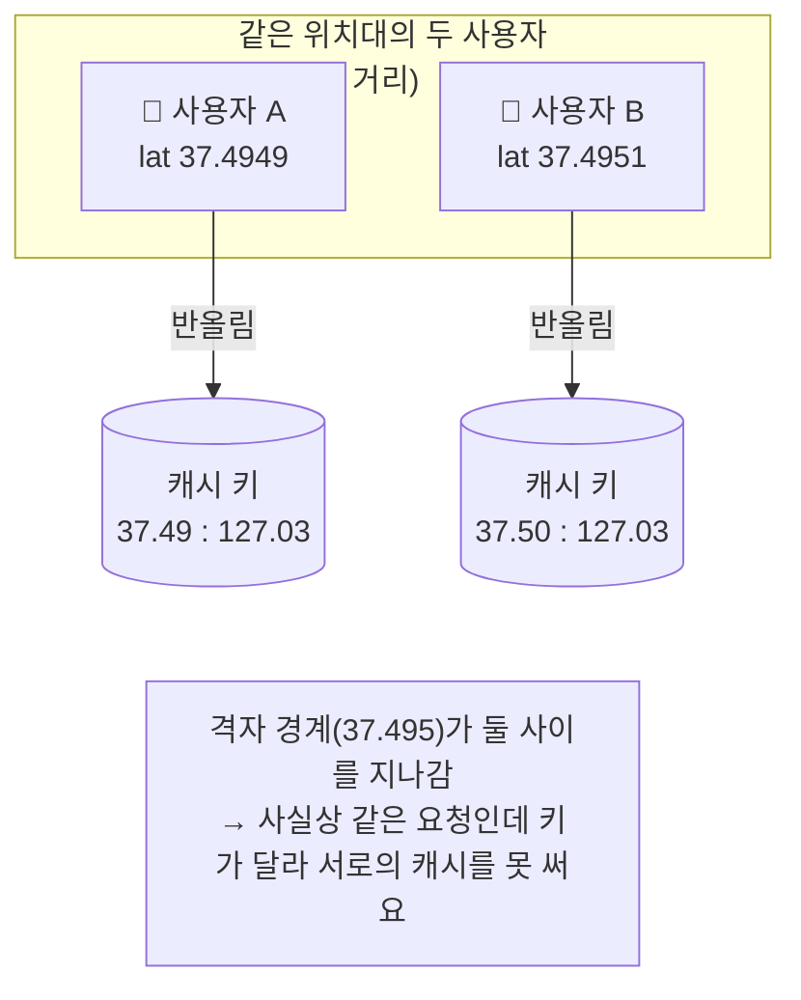
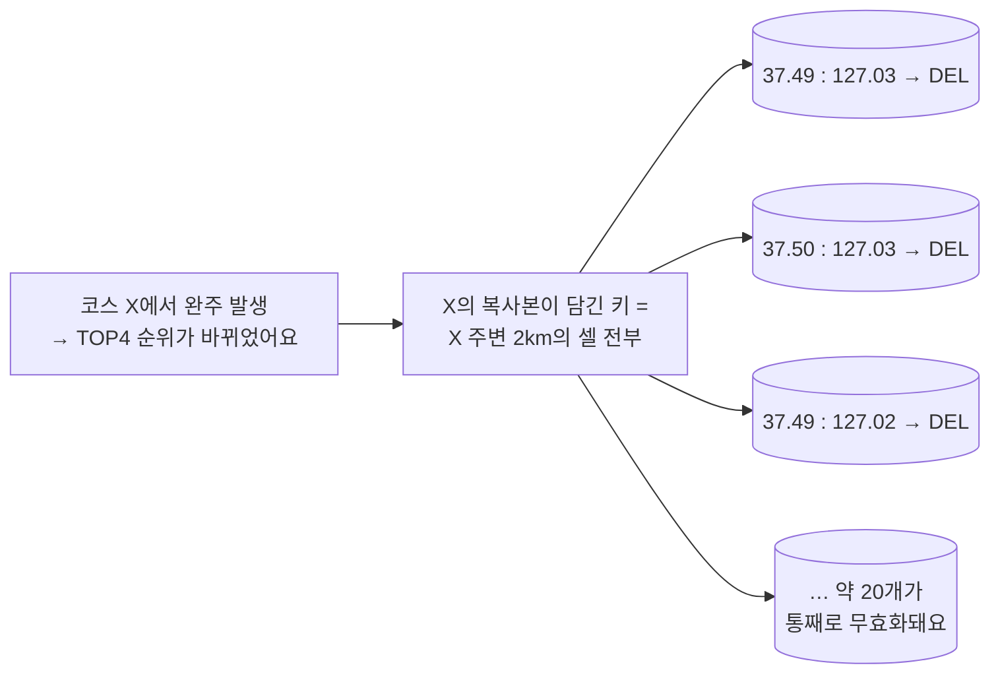
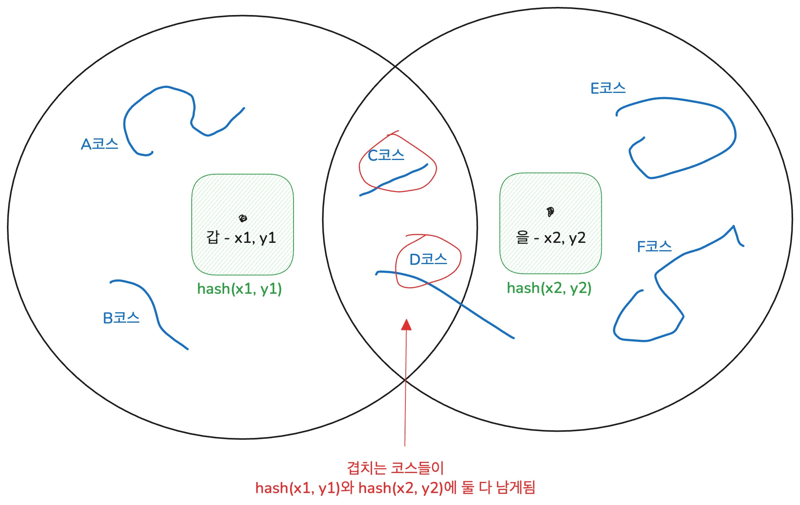
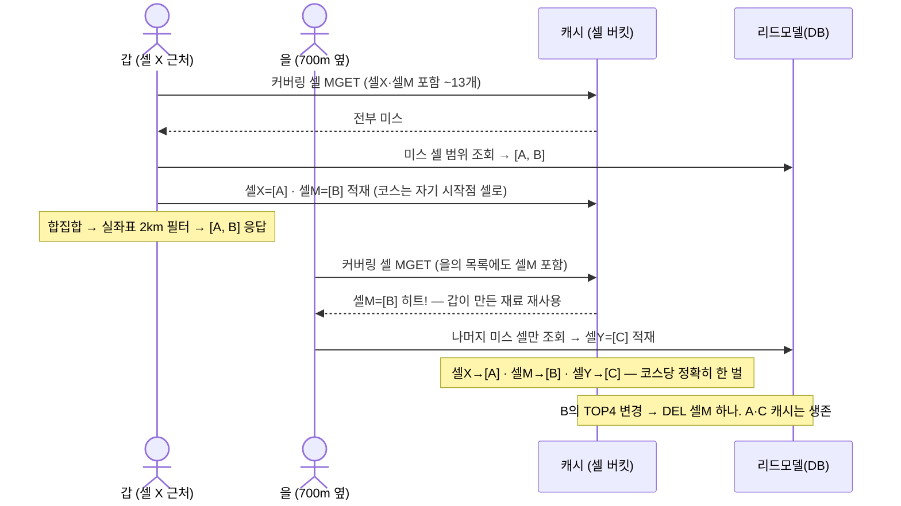
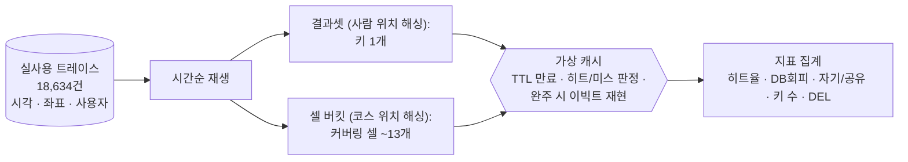

> 리드모델 편의 후속이에요. 지도 조회에 캐시를 얹으려 했고, **캐시키 전략 세 가지(반올림 · 지오해싱 · 셀 버킷)를 9.5개월 실사용 트래픽 "리플레이"로 비교**해서 가려낸 과정이에요. 결론까지 전부 숫자로 남겼어요 — **현재 트래픽과 ×100 성장 시나리오 모두에서 검증해 셀 버킷을 채택했어요.**
>

# 1. 왜 캐시를 검토했고, 무엇이 어려운가

---

!image.png

메인 화면에서 보여줄 코스 메타 정보의 리드모델 전환으로 조회는 이미 빨라졌어요 (P90 1.8s, DB CPU 27%). 그래도 조회는 매번 DB까지 가요. 트래픽이 늘었을 때 DB 앞 단의 캐시를 설계한 과정이에요.

지켜야 할 요구사항은 세 가지예요.

- **반경**
  - 응답은 "내 주변 약 2km의 코스"예요. 팀원들과 반경의 기준을 실험하며 2km가 적합하다고 의사결정을 내렸었어요
- **완주 직후 내 등수**
  - 완주하고 지도를 열면 내 순위가 바로 보여야 해요. 모든 사람이 공유하는 코스 내 랭킹을 보여주는 서비스 특성상, TOP4 안에 들었을 때 유저는 자신의 기록이 표시되는 것을 바로 보고 싶어해요.
  - 이러한 이유로 캐시는 인스턴스마다 갭이 생길 수 있는 로컬 캐시가 아닌, 글로벌 캐시인 레디스를 활용했어요.
- **정확도**
  - 내가 있는 곳 기준의 결과를 받아야 해요. 엉뚱한 지점 기준의 결과는 지도에서 티가 나요.

키를 설계할 때 지도에서 코스 데이터를 갖고와야 하기 때문에 고민이 있었어요.
우선 **두 사람이 10m 옆에 서 있어도 좌표는 다른 값이에요.** 그런데 캐시는 키가 같아야만 재사용돼요. 그래서 "좌표가 달라도 비슷한 위치면 같은 키를 보게" 묶어야 하는데, 그 기준이 어긋나면 두 가지 문제가 생겨요

- 너무 잘게 묶으면 같은 데이터가 캐시에 여러 벌 중복되고
- 너무 크게 묶으면 사용자가 자기 위치와 동떨어진 결과를 받아 어색해져요.

# 2. 캐시 키를 누구 기준으로 만들까 — 사람의 위치 vs 코스의 위치

검토한 기술적인 후보는 셋(좌표 반올림 · 지오해싱 · 셀 버킷)이었는데, 정리하고 보니 본질은 하나였어요.
**"무엇의 위치를 해싱해서 키로 쓸 것인가 — 조회하는 사람인가, 저장되는 코스인가."** 반올림과 지오해싱은 사람 기준(인코딩만 다름), 셀 버킷은 코스 기준이에요. 이 장의 모든 차이가 이 선택 하나에서 따라 나와요.

---

## 2-1. 사람의 위치를 해싱하는 방식

> 키 = **조회한 사람의 위치를 해싱한 값**, 값 = **그 질문의 답(2km 조회 결과) 통째**예요. 해싱(격자로 묶는) 방법으로는 두 가지를 검토했어요.
>

### **[1] 좌표 반올림**

좌표를 소수점 2자리로 반올림하면 약 1.1km 격자가 생겨요. 같은 격자 안에서 온 요청은 같은 키가 되고, 값에는 **그 조회의 결과(코스 목록) 통째**가 들어가요.

```
키:  round(37.5231, 2) : round(126.9253, 2)  →  "37.52:126.93"
값:  [그 지점 기준 2km 조회 결과 — 코스 카드 12개]
```

**한계 ① — 격자 경계선이 사람을 갈라요. 히트율이 "사용자들이 우연히 격자 안쪽에 모여 있느냐"에 좌우돼요.**



**한계 ② — 코스 하나가 여러 캐시에 복사돼 있어서, 무효화가 어려워요.**



값이 "조회 결과 통째"라서, 한 코스가 **주변 여러 키의 값에 복사되어** 들어 있어요 (이웃 격자의 2km 원들이 겹치니까요).

완주로 순위가 바뀌면, 순위가 즉시 반영되어야 한다는 요구사항을 지키려면 **코스 시작점 주변 2km의 셀을 산수로 열거해 전부 지워야 해요.**
문제는 비용이에요. **변경 하나가 키 ~20개를 통째로 무효화**하고, 지워진 엔트리들에 담겨 있던 다른 코스들까지 전부 다시 조회해 재적재해야 해요. 코스는 하나 바뀌었는데 주변 캐시 전체가 초기화되는 구조예요.

### **[2] 지오해싱**

geohash는 좌표를 격자 문자열로 바꾸는 표준 인코딩이에요. 위도·경도를 이진 탐색으로 쪼개가며 문자를 만들고, 글자 수로 셀 크기를 조절해요 (p6 ≈ 1.2km×0.6km).

```
(37.5231, 126.9253)  →  "wydm6p"     ← 글자가 많을수록 셀이 작아짐
```

키가 표준 문자열이 되고 prefix로 줌 계층을 표현할 수 있다는 장점이 있지만, 여전히 [1] 좌표 반올림의 두 가지 한계가 존재하게 되어요.



갑과 을(700m 옆)은 이웃이에요. 갑의 2km 안에는 코스 A-D가, 을의 2km 안에는 C-F가 있어요.
**C, D가 두 사람의 2km 반경 내 코스 조회 시에 겹치**게 되고, 각각의 키에 함께 저장돼요. 중복해서 저장되는 것도 stale하게 남는 문제와 함께 아래 문제들이 남게되어요.

- **캐시가 을을 하나도 못 도왔어요.**
  - 을이 조회한 순간 캐시에는 이미 C·D가 있었지만(갑의 값 안), 캐시는 "키를 주면 값을 통째로 주는" 창구라 값 안을 열어 검색해주지 않아요.
  - 을의 키에 값이 없으면 그걸로 끝 — 을은 DB 풀 조회를 해요. 히트의 유일한 조건은 "TTL 안에 정확히 같은 셀에서 재조회"뿐이에요.
- **C, D 코스가 두 벌 저장됐어요.**
  - 겹치는 코스는 겹치는 만큼 복사돼요. 구조적 상한은 "코스 주변 2km의 셀 수"(~20벌)예요.
- **C가 바뀌면 두 캐시를 모두 무효화해야 해요.**
  - 그 과정에서 안에 같이 들어있던 A·B·D·E·F까지 통째로 날아가 전부 재적재돼요.

세 문제의 근간은 하나예요. **저장 키는 "질문한 사람의 위치"인데, 내용물은 "여러 사람이 공유하는 코스들"**인 것이에요.

## 2-2. 코스의 시작점을 해싱하는 방식

이번에는 **해싱의 대상을 바꿔요 — 사람이 아니라 코스예요.** 코스 시작점을 해싱한 값이 키가 되고, 값에는 그 칸에 시작점을 둔 코스 목록이 들어가요. 사람의 위치는 저장에는 쓰이지 않고, **읽을 때 "방문할 칸 목록"을 계산하는 데만** 쓰여요.

원리는 다음과 같아요.

- 지도를 geohash 셀로 나누고, 각 셀에 **그 셀에 시작점이 있는 코스 목록**을 저장해요. 코스는 정확히 **한 셀에만** 속해요.
- 조회가 오면: 사용자 좌표의 2km 원을 덮는 셀 ~13개를 **산수로** 계산 → Redis MGET → 합집합 → **실좌표 기준 거리 필터** → 응답
- 완주가 나면: 그 코스의 셀 **1개**를 DEL. 끝.

> *(각주 — 셀 수치에 대해) 이 문서의 "~13개"는 리플레이가 사용한 0.01° 격자 기준이에요. 실제 구현은 geohash p6(위도 0.0055° × 경도 0.011°)를 쓰기 때문에 커버링 키 수가 달라져요 — 서울 위도에서 반경 2km는 35~48개, 3km(광역 가드 상한)는 70~88개예요. MGET은 키가 몇 개든 왕복 1회라, 격자 크기는 이 문서의 결론(코스당 1벌 저장 · 부분 히트 · 단일 키 이빅트)에 영향을 주지 않아요. 아래에 나오는 "13셀 중 9셀" 같은 표현도 같은 리플레이 격자 기준의 예시예요.*

시나리오를 단순화해 코스 세 개(A·B·C, 갑·을의 겹침 = B)로 다시 돌려볼게요. 아래에서 셀M = geohash(코스 B의 시작점)이에요 — **키의 주인이 코스**예요.



**이 구조가 성립시키는 세 가지:**

- **정확해요.**
  - 최종 판정을 매번 사용자 실좌표로 하니까 스냅 오차가 0이에요.
- **이빅트가 단순하고 정확해요.**
  - **코스의 복사본이 세상에 하나뿐이라 "저장된 곳 = 지울 곳"이 항상 1:1**이에요.
  - 따라서, 한계 ②가 구조적으로 소멸해요.
- **부분 히트가 있어요**
  - 13셀 중 9셀만 캐시에 있어도 나머지 4셀만 DB에 물어요. 이전 캐싱의 "All or Nothing"이 완화돼요.
  - 그렇기 때문에 같은 시나리오를 대보면, 결과셋에서 을을 돕지 못했던 B가 여기서는 **자기 주소(셀M)에 저장돼 있어서 을이 찾아 써요.**

|  | 조회 위치 기준 | 코스 시작점 기준 |
| --- | --- | --- |
| 값 | 조회 결과 통째 | 셀 소속 코스 목록 |
| 히트 조건 | **똑같은 격자**에서 재조회 | **근처 아무 데서나** 조회 (셀 공유) |
| 코스 저장 위치 | 주변 키마다 복사 (~90% 중복) | 정확히 1곳 |
| 이빅트 | 주변 셀 ~20개 팬아웃 DEL + 통째 재적재 | **소속 셀 1개 DEL** |
| 응답 정확도 | 격자 중심 기준 (스냅 오차) | 실좌표 기준 (**오차 0**) |
| 구현 | `@Cacheable` 한 줄 | MGET·부분 채움 커스텀 코드 |

## 2-3. 세 번째 축도 있었어요 — 행정구역(동네) 단위 (검토 후 기각)

격자 대신 서버에서 사용자의 위치 기준 regionId를 관리하는 **행정동("역삼동")을 묶음 단위로 쓰는 변형**도 검토해보았지만 **사용자 입장에서 생각했을 때 한계**가 있었어요.

- 옆동네를 조회하지 못한다.
  - 유저가 위치한 동네만 조회할 수 있어요. 동네의 가장 자리에 산다면 옆 동네의 코스를 알지 못하는건 사용자 입장에서 불편해요. 실측으로도 홈 조회 2km 원의 **평균 58.7%가 자기 행정동 밖**이라, 첫 화면에서 주변 코스의 절반 이상이 사라지는 셀이었어요.
  - 물론, 고스트러너가 자체적으로 지도를 가져 지도에 렌더링되는 사용자 주변 regionId를 모두 알 수 있으면 가능하겠지만 오픈 소스 지도를 사용하고 있기에 기술적인 한계가 있었어요.
- 반경 조절이 제한적이다.
  - 사용자는 2km 이내의 주변 코스를 알고싶어 해요.
  - 동네는 2km 이상인 곳이 많기 때문에 반경 범위 밖의 코스도 함께 캐싱되고 조회되어요.

# 3. 실사용 트래픽 리플레이

---

## 3-1. 왜 부하테스트가 아니라 리플레이인가

히트율은 코드의 속성이 아니라 **트래픽의 속성**이에요. 히트란 "같은(또는 근처) 키에 TTL 안에 다음 조회가 도착하는 사건"이라, 조회들이 시간과 공간에서 어떻게 분포하느냐가 답을 정해요. 그래서:

- **부하테스트(k6)로 재면** — 트래픽 생성기의 성질을 재는 거예요. 랜덤 좌표를 쏘면 랜덤의 히트율이 나와요.
- **합성 시뮬레이션으로 재면** — 가정(인구 분포, 시간 패턴, 이동 모델…)이 결과를 좌우해요. 가정을 바꾸면 답이 바뀌어요.

고스트러너는 **코스 조회에 성공할 때마다 그 좌표를 Amplitude에 기록하고 있었어요** (`gotten_courses_info` 이벤트 — 시각·좌표·사용자ID). 이 9.5개월치 기록을 시간순으로 그대로 재생하며 히트율을 실험했어요.

이를 통해 아래의 이점을 지녀요.

- 실제 사용자들이 실제로 조회한 위치와 시각 그대로예요.
- 세 방식을 같은 트래픽 위에서 키 규칙만 바꾸어 비교해요.
- 배포 없이 결론이 나요.
  A/B 배포 실험이면 몇 달 걸리고 현 트래픽으론 통계도 안 모일 일을, 과거 데이터로 하루에 끝내요.

## 3-2. 데이터 수집·정제

- Amplitude API로 원시 이벤트 **125,456건**을 내려받아 `gotten_courses_info` **18,866건** 추출 (2025-10 ~ 2026-08, 사용자 3,184명)
- 완주 모델링용으로 `Run End` 이벤트 중 0.5km 이상 실제 러닝 **3,614건**도 추출
- 사용자별 "홈" = 가장 자주 조회한 셀로 정의 → **홈 반경 2km 내 조회 71% / 탐색 29%**

과거 이벤트를 시간순으로 하나씩 꺼내, 가상의 캐시에 그대로 흘려보내요.



이벤트 하나를 처리하는 절차:

1. 가상 캐시에서 TTL이 살아있는 엔트리인지 판정해요 (히트/미스). Spring `@Cacheable`처럼 **히트가 TTL을 연장하지 않는 것**까지 동일하게 재현했어요
2. 미스면 그 시각에 채워요 (채운 사용자를 기억 → 나중에 자기 히트/공유 히트 구분)
3. 그 시각 이전에 완주(`Run End`)가 있었다면 방식별 이빅트 규칙대로 지워요 — 결과셋은 완주 지점 ±2km 앵커 팬아웃, 셀 버킷은 소속 셀 1개

정직하게 남기는 근사 두 개: 완주 좌표는 이벤트에 없어서 **완주자의 직전 조회 좌표**로 근사했고, 홈/탐색 구분은 **최빈 셀에서 2km 이내 여부**로 근사했어요.

**지표 정의:**

| 지표 | 의미 |
| --- | --- |
| full-hit% | 필요한 키가 전부 히트 → **DB 조회 0회**로 응답한 비율 |
| DB회피% | 부분 히트 포함 — 전체 조회 단위 중 캐시가 흡수한 비율 (셀 버킷의 "13셀 중 9셀" 절감이 여기 잡혀요) |
| 자기/공유 | 캐시를 채운 사람 본인의 재조회 히트 vs 다른 사용자의 히트 |
| 키 수 / DEL | 생성된 키 수 / 이빅트로 지운 횟수 |

## 3-4. 결과

**TTL 600초 + 완주 이빅트 기준:**

|  | full-hit% | DB회피% | 공유 히트 | 생성 키 | 이빅트 DEL |
| --- | --- | --- | --- | --- | --- |
| 반올림/지오해싱 | 13.5 | 13.5 | 72 | 5,245 | 8,299 (팬아웃) |
| **셀 버킷** | **13.8** | **22.0** | 4,248유닛 | 24,028 | **3,060 (단일)** |

아래 세 가지를 알 수 있었어요.

- **DB 회피 22% vs 13.5%.**
- **이빅트도 팬아웃(8,299 DEL) 대신 단일 키(3,060 DEL)로 끝났어요.**
- 완전 히트는 세 방식 모두 ~14%

## 3-5. 트래픽이 늘면?

현재 트래픽(×1)의 히트율은 낮아요. 그런데 캐시는 성장을 대비하는 장치죠. 그래서 "트래픽이 많다고 치고"의 가상 부하 대신, **실측 패턴을 그대로 보존한 채 사용자 수만 N배로 증폭**해서 다시 재생했어요.

증폭 방법: 실제 사용자 각각을 N배로 복제해요. 클론은 원본의 조회 시퀀스를 유지하되 **위치 ±250m(같은 동네의 다른 사람), 시각 ±30분**의 지터만 받아요. 공간 밀도 지도·시간대 패턴·홈/탐색 비율(71/29)이 기대값 그대로 보존돼요 — **"패턴은 현재, 규모만 미래"인 트래픽**이에요.

| 배수 | 조회수 | 지오해싱 full-hit / DB회피% | 셀 버킷 full-hit / DB회피% |
| --- | --- | --- | --- |
| ×1 (현재) | 18,634 | 13.5 / 13.5 | 13.8 / **22.0** |
| ×5 | 93,170 | 28.3 / 28.3 | 24.0 / **50.2** |
| ×20 | 372,680 | 52.2 / 52.2 | 45.5 / **78.1** |
| ×100 | 1,863,400 | 74.0 / 74.0 | 72.8 / **93.8** |

DB 부하는 ×100에서 **26.0% vs 6.2%인** **4배 차이**예요. 특히, DB 총부하 기준에서는 셀 버킷이 전 구간 우위예요. 하지만, **full-hit 비율만 보면 ×5에서 결과셋이 4.3%p 높아요.** 셀 버킷은 13개 셀(리플레이 격자 기준) 전부 히트가 조건이라 더 엄격하기 때문이에요.

# 4. 결론

---

#### **① 캐시키 전략은 셀 버킷으로 확정했어요.**

현재 트래픽 기준으로 DB 회피율 22% vs 13.5%로 앞서고, 사용자 수가 늘어남에 따라 더 유효해지는 것을 트래픽 ×100 기준에서 DB 회피율이 93.8% vs 74.0%까지 벌어짐을 알 수 있었어요. 여기에 단일 키 이빅트, 서버 단독 구현(FE 협조 불필요), 스냅 오차 0, 탐색 조회까지 캐시 가능이라는 구조적 장점이 더해져요.

#### **② 정책은 TTL 600초 + 완주 시 소속 셀 단일 이빅트예요.**

리플레이에서 TTL 60초 vs 600초를 비교하니 60초에서는 히트의 30%가 증발했어요. 현재 트래픽이 희소해서 같은 셀에 다음 조회가 60초 안에 도착하는 경우가 드물기 때문이에요. 정합성은 이빅트(단일 셀 DEL)가 책임지니 TTL은 길게 가져가 히트율을 확보하는 분업이 가능했고, 이빅트의 히트율 비용은 ≈0으로 측정됐어요. 같은 맥락에서, 쓰기 시점에 새 값을 미리 채우는 write-through도 검토했지만 보류했어요 — 분산 트래픽에서는 미리 채운 엔트리가 읽히기 전에 만료될 확률이 높아서예요. 완주가 수 초 간격으로 몰리는 핫 구역이 생기면 그때 재검토할 레버예요.

#### **③ 저장소는 로컬 캐시가 아니라 Redis(글로벌 캐시)예요.**

인스턴스 메모리에 저장하는 로컬 캐시(Caffeine 등)가 더 빠르지만, 앱 서버가 여러 대가 되는 순간 **인스턴스마다 서로 다른 사본**이 생겨요. 완주 이빅트의 DEL은 그중 한 곳에서만 실행되니 다른 인스턴스의 사본은 TTL까지 낡은 채 남아요. 요청이 어느 서버에 떨어지느냐에 따라 "완주 직후 내 등수"가 보였다 안 보였다 하는 갭이 생기는 거예요. Redis 같은 글로벌 캐시면 사본이 하나라 DEL 1회가 모든 인스턴스에 즉시 적용돼요.
