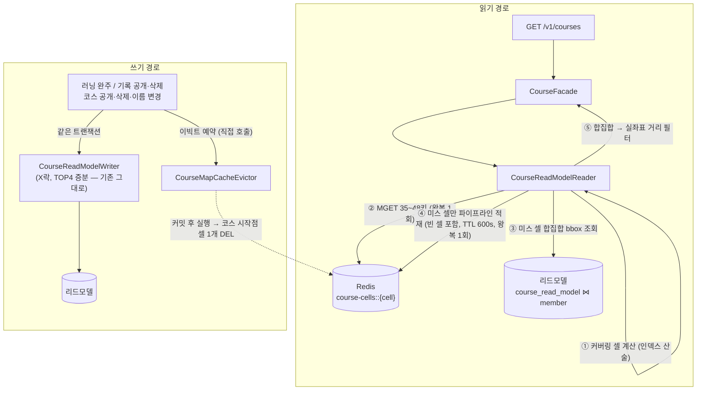
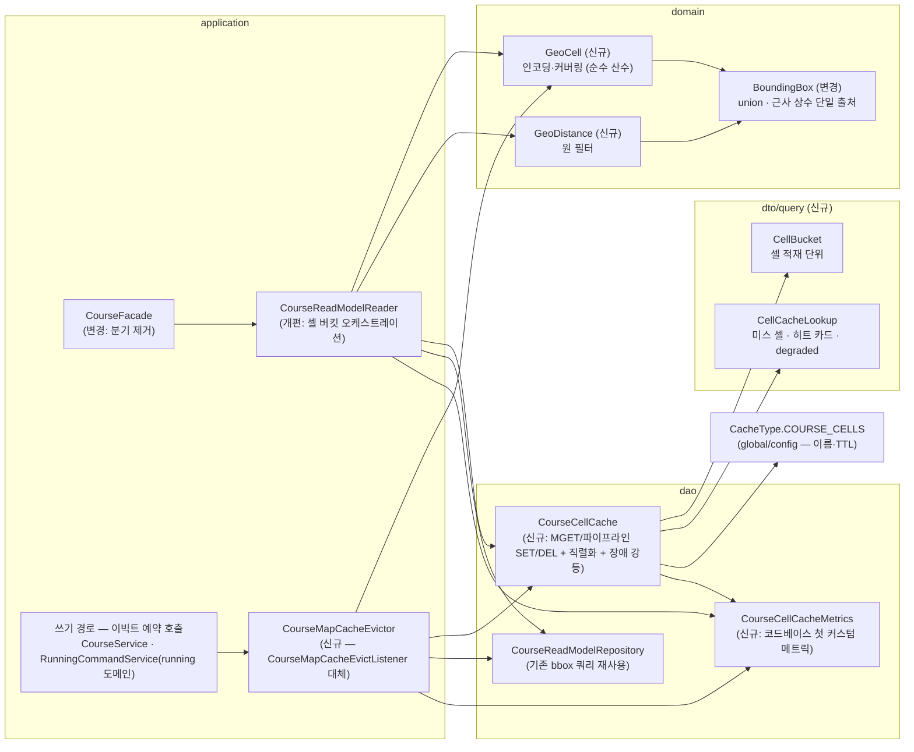

# 셀 버킷 캐시 — 구현 기록

> **상태: 구현 완료.** PR: _(링크 예정)_
> [`07-cell-bucket-design.md`](07-cell-bucket-design.md)(설계 결정·실측 리플레이)의 구현 문서다.
> 05(regionId 결과셋)는 07·08로 대체됐다. 전환은 **서버 단독 배포**로 끝난다 — FE 수정 없음, 외부 API 스펙 불변.
>
> **확정 설계·전체 파일 목록·테스트 16건·리스크 수용표는 [`docs/design/course-cell-bucket-cache-design.md`](../../../design/course-cell-bucket-cache-design.md)에 있다.**
> 이 문서는 그 설계를 중복 서술하지 않고, **초안에서 무엇이 어떻게 바뀌었고 왜 바뀌었는지**를 남긴다.
>
> 이 문서는 원래 구현 착수 전에 쓴 초안이었다. 구현하며 틀렸다고 드러난 판단은 지우지 않고
> "초안에서는 X였으나 구현에서 Y로 바꿨다 — 이유는 Z"로 남긴다. 판단이 바뀐 이력 자체가 이 문서의 내용이다.

## 0. 구현 결정 요약

| 항목 | 결정 | 근거 |
|------|------|------|
| 셀 단위 | **geohash precision 6** (위도 0.0055°≈610m × 경도 0.011°, 서울 967m) | 표준 인코딩 — 디버깅 도구·라이브러리 존재, prefix로 상위 셀 표현 가능 |
| 키 포맷 | `course-cells::{geohash6}` | `CacheType.COURSE_CELLS`로 이름·TTL 일원화 (기존 규약 유지) |
| 값 | 셀에 시작점을 둔 `List<CourseMapDto>` (JSON) | 지도 응답 조립에 필요한 리드모델+멤버 투영 그대로. **빈 셀도 빈 배열로 저장** (네거티브 캐싱) |
| TTL | 600s | 07 §3-4 — 60s는 히트 30% 증발, 정합성은 이빅트가 담당 |
| 이빅트 | 쓰기 경로가 `CourseMapCacheEvictor`를 직접 호출해 **커밋 후 소속 셀 1개 DEL** | 코스 복사본이 1벌이라 저장 규칙 = 삭제 규칙. 실패는 TTL 폴백 (로그만). **1차 구현은 AFTER_COMMIT 이벤트 리스너였다 — 왜 바꿨는지는 §3-6** |
| 저장소 | Redis (글로벌 캐시) | 로컬 캐시는 스케일아웃 시 인스턴스별 사본 갭 → "완주 직후 내 등수" 붕괴 (07 §4-③) |
| 커버링 | 요청 반경 bbox의 셀 전부를 **인덱스 산술로 열거**(관대 수집) + **응답 시 실좌표 거리 필터** | 수집은 관대하게(누락 방지), 최종 판정은 정확하게 |
| 광역 가드 | radiusM > 3,000이면 캐시 우회 (리드모델 직행) | 커버링 셀 수 폭증 방지. 탐색(스크롤) 요청도 좌표만 있으면 캐시 가능하므로 별도 홈 판정 불필요 |
| 커버링 상한 가드 | `MAX_COVERING_CELLS = 128` — **열거 전에 `coveringCount()` O(1) 산술로 판정** | 좌표에 검증 애노테이션이 없어 극단 좌표가 그대로 들어온다 (**초안에 없던 가드**) |
| 롤백 스위치 | ~~`course.cache.cell-bucket.enabled` 플래그~~ → **없다. 제거했다** | 초안·1차 구현은 "배포 후 이상 시 플래그로 직행 전환"이었다. **[이후 판단 변경]** 쓰지 않을 스위치를 남겨두는 비용을 지불하지 않기로 했다 — 롤백은 **PR 리버트 + 재배포**다. 단 Redis 장애 같은 런타임 실패는 남은 강등 3갈래가 그대로 직행으로 뺀다 (§3-5, 설계 D14) |
| Redis 타임아웃 | 응답 500ms · 재시도 1회 × 200ms (`RedisConfig.redisTimeoutCustomizer`) | 타임아웃이 없으면 "Redis 장애 시 강등"이 성립하지 않는다 (**초안에 없던 사실** — §3-10) |
| regionId 인프라 | 파라미터 **수용하되 미사용**, `POST /v1/regions`·`region` 테이블 존치 | 외부 API 불변 (배포된 FE가 호출 중) + 지역 기능 자산 |

## 1. 아키텍처 구조도



읽기에서 사람의 좌표는 ①(방문할 셀 계산)과 ⑤(거리 필터)에만 쓰이고, 저장(④)과 삭제(이빅트)는 **코스의 시작점 좌표**로만 결정된다 — "키의 주인은 코스" (07 §2-2).

## 2. 핵심 컴포넌트 구조도



| 컴포넌트 | 책임 | 하지 않는 것 |
|----------|------|--------------|
| `GeoCell` | 좌표→셀 인코딩, 셀→경계 디코딩, 커버링 열거, `coveringCount` O(1) 판정. **순수 함수** | I/O, 캐시 접근, 상한 정책 판단(호출자 몫) |
| `GeoDistance` | 실좌표 원 필터. `BoundingBox`와 **같은 근사**를 참조 | 정확한 측지 거리(Haversine 미사용 — §3-2) |
| `CellBucket` / `CellCacheLookup` | 적재 단위 / 조회 결과. `degraded`를 **타입에 강제** | 로직 |
| `CourseCellCache` | 셀 키 조립, MGET / 파이프라인 SET / DEL, JSON 직렬화, **실패 흡수 + 신호화** | 어떤 셀을 읽을지 결정 (호출자 몫) |
| `CourseCellCacheMetrics` | 미터명·태그 규약 응집. `result` 태그로 결과 표현 | 판정 (호출자가 결과를 넘긴다) |
| `CourseReadModelReader` | 조회 오케스트레이션: 커버링 → 캐시 → 부분 채움 → 필터. **강등 3갈래 판정**(광역 요청 · 커버링 폭발 · Redis 장애) | 랜덤 선별·응답 조립 (Facade 몫 — 기존 그대로) |
| `CourseMapCacheEvictor` | 커밋 후 코스 셀 1개 DEL을 예약·실행. 콜백 전체 try/catch | 리드모델 갱신 (Writer 몫 — 같은 트랜잭션), 언제 지울지 판단 (호출자 몫) |

**기존 코드 정리 결과:**

| 대상 | 처리 | 초안 대비 |
|------|------|-----------|
| `CourseReadModelReader.findCoursesForMapByRegion` (@Cacheable) | 제거 | 그대로 |
| `CourseFacade.findCandidateCourses`의 regionId 분기·`useRegionCache` | 제거 | 그대로 |
| `CourseMapCacheEvictListener` (region ±2km 역산) | `CourseMapCacheEvictor`로 대체 | **초안·1차 구현은 "이벤트 리스너로 대체"였으나 직접 호출 협력자로 바꿨다** (§3-6) |
| `CacheType.COURSE_MAP` | `COURSE_CELLS`로 대체 | 그대로 |
| **`CacheConfig` 클래스 전체** (`@EnableCaching` + `RedisCacheManager`) | **제거** | **초안은 "course-map 구성만 정리"였으나 클래스 통째로 삭제로 바꿨다** |
| **`RegionNotFoundException` · `ErrorCode.C-005`** | **제거** | **초안은 "존치"였으나 삭제로 바꿨다** |
| `Region` 도메인, `POST /v1/regions`, `region` 테이블 | **존치** | 그대로 (외부 API 불변 + 지역 기능 자산) |

**`CacheConfig`를 통째로 지운 이유 (초안 §3-6에서 판단 변경).**
초안은 `CacheType`을 남기고 `CacheConfig`에서 course-map 항목만 빼는 그림이었다. 그런데 구현을 끝내고 보니 프로젝트 전체에서 `@Cacheable` 사용처가 **0**이 됐다. 아무도 쓰지 않는 `@EnableCaching`과 `RedisCacheManager`를 남기면, 훗날 누군가 `@Cacheable` 한 줄을 붙이는 순간 **아무도 이빅트하지 않는 캐시**가 조용히 생긴다. 죽은 인프라가 있으면 그것을 쓰는 코드가 자란다. 그래서 Spring Cache 인프라를 프로젝트에서 걷어내고, `CacheType`은 "RedisTemplate 기반 캐시의 이름·TTL 레지스트리"로 의미를 좁혔다.

**`RegionNotFoundException`·`C-005`를 지운 이유 (초안 §2 표에서 판단 변경).**
초안은 "지역 기능 자산이니 존치"로 적었는데, 실제로 확인하니 **던지는 곳도 잡는 곳도 사라진 dead code**였다. 유일한 소비자가 `CourseFacade`의 regionId 폴백이었고 그 경로가 없어졌기 때문이다. 게다가 C-005는 애초에 외부로 나가지 않는 내부 신호(Reader가 던지고 Facade가 잡는 용도)라 API 계약도 아니다. 존치의 근거였던 "지역 기능 자산"은 `Region` 도메인·`POST /v1/regions`·`region` 테이블이 이미 담당한다. C-005 코드는 재사용하지 않고 주석으로 결번을 남겼다.

## 3. 주요 부분 구현

### 3-1. `GeoCell` — 인코딩과 커버링 (domain, 신규)

> **초안의 샘플링 방식은 폐기했다. 이 절은 통째로 교체된 부분이다.**

**초안이 하려던 것** — 표준 geohash 이진 탐색으로 인코딩하고, 커버링은 bbox를 `SAMPLE_STEP_DEG = 0.005`(p6 셀 최소 변보다 작은 간격)로 훑으며 만난 셀을 모으는 샘플링이었다.

```java
// 초안 — 폐기됨
private static final double SAMPLE_STEP_DEG = 0.005;

public static List<GeoCell> covering(double lat, double lng, int radiusM) {
    BoundingBox box = BoundingBox.of(lat, lng, radiusM);
    Set<GeoCell> cells = new LinkedHashSet<>();
    for (double la = box.minLat(); la <= box.maxLat() + 1e-9; la += SAMPLE_STEP_DEG) {
        for (double lo = box.minLng(); lo <= box.maxLng() + 1e-9; lo += SAMPLE_STEP_DEG) {
            cells.add(of(la, lo));
        }
    }
    return List.copyOf(cells);
}
```

**왜 폐기했나 — 조용한 누락 실패 모드.**
샘플 간격을 셀 변보다 작게 잡아도 **bbox의 상단·우측 경계에 걸친 셀은 빠질 수 있다.** 마지막 샘플점이 `maxLat`에 정확히 닿지 않으면(부동소수 누적 오차 + 간격이 범위를 정수배로 나누지 않는 일반적인 경우) 그 위쪽 셀을 한 번도 방문하지 않는다. 그 셀에 시작점을 둔 코스는 **반경 안에 있는데도 응답에서 사라진다.** 예외도 로그도 나지 않고, 사용자에게는 "주변 코스가 원래 그만큼"으로 보인다. 캐시가 정답을 조용히 바꾸는 실패는 성능 최적화가 감수할 종류의 위험이 아니다.

또 하나. 샘플링은 `of()`(인코딩)와 커버링이 **서로 다른 논리**로 셀을 정한다. "코스가 저장되는 셀"과 "조회가 방문하는 셀"의 일치가 우연에 기대는 구조다.

**구현 — 셀 인덱스 산술 열거.**
p6 = 30비트 = **경도 15비트 + 위도 15비트**라는 사실을 그대로 쓴다. 각 축을 2^15 = 32,768칸의 균일 격자로 보고, 좌표를 인덱스로 바꾼 뒤 **인덱스 범위를 정수로 순회**한다.

```java
private static final int BITS_PER_AXIS = 15;
private static final int AXIS_CELLS = 1 << BITS_PER_AXIS;        // 32,768
/** 180 / 2^15, 360 / 2^15 — 둘 다 이진 부동소수로 정확히 표현된다 */
private static final double LAT_SPAN = 180.0d / AXIS_CELLS;      // 0.0054932° ≈ 610m
private static final double LNG_SPAN = 360.0d / AXIS_CELLS;      // 0.010986°  (적도 1,219m / 서울 967m)

private static int latIndex(double lat) {
    return clamp((int) Math.floor((lat - LAT_ORIGIN) / LAT_SPAN));   // LAT_ORIGIN = -90
}

public static List<GeoCell> covering(double lat, double lng, int radiusM) {
    CellIndexRange range = indexRange(lat, lng, radiusM);
    List<GeoCell> cells = new ArrayList<>();
    for (int latIdx = range.latFrom(); latIdx <= range.latTo(); latIdx++) {
        for (int lngIdx = range.lngFrom(); lngIdx <= range.lngTo(); lngIdx++) {
            cells.add(new GeoCell(encode(new CellIndex(latIdx, lngIdx))));
        }
    }
    return cells;
}
```

`encode`는 인덱스를 MSB부터 경도·위도 교대로 인터리브해 30비트를 만들고 base32 6글자로 적는다 — 표준 geohash와 **완전히 같은 결과**이며, 전 지구 랜덤 10,000점에서 이진 탐색 참조 구현과 대조해 테스트로 고정했다.

이 방식이 사는 것:

- **누락이 산수 수준에서 불가능하다.** 범위의 양 끝 인덱스를 포함해 순회하므로 경계 셀이 빠질 자리가 없다.
- **`of()`와 `covering()`이 같은 인덱스 함수를 공유한다.** "반경 안의 코스가 커버링 밖 셀에 저장"되는 경우가 구조적으로 성립하지 않는다.
- **개수를 열거 없이 알 수 있다** — 아래 `coveringCount`.

**`coveringCount()`를 열거와 분리한 이유 (초안에 없던 결정, [R1]).**
커버링 상한 가드를 "리스트를 만든 뒤 `size()`로 판정"하면, **가드가 필요한 바로 그 좌표에서 최악으로 동작한다.** lat/lng에 검증 애노테이션이 없어 고위도 좌표가 그대로 들어올 수 있고, 그때 `cos(lat)`이 0에 수렴해 경도 범위가 전 지구로 clamp된다. 즉 **수십만 개의 셀 객체를 전부 할당한 다음 버리게 된다.** 개수는 인덱스 범위의 곱이므로 할당 없이 O(1)로 나온다.

```java
/** 커버링 셀 개수만 O(1)로 계산한다. 극단 좌표에서 열거(할당) 전에 상한 가드를 판정하기 위한 것이다. */
public static long coveringCount(double lat, double lng, int radiusM) {
    return indexRange(lat, lng, radiusM).cellCount();       // (latTo-latFrom+1) * (lngTo-lngFrom+1), long
}
```

`covering`과 `coveringCount`가 **반드시 같은 `indexRange`를 공유**해야 개수 가드가 실제 열거와 어긋나지 않는다. 판정과 실행이 다른 식을 쓰면 가드는 있으나 마나다.

**커버링 키 수 정정 — 초안의 "25~30개"는 오기다.**

| 반경 | 커버링 셀 수 (서울 위도 37.4~37.7 실측) |
|------|------------------------------------------|
| 2,000m | **35 ~ 48개** (위도 7~8칸 × 경도 5~6칸) |
| 3,000m (광역 가드 상한) | **70 ~ 88개** (위도 10~11칸 × 경도 7~8칸) |

07 본문의 "~13개"는 **리플레이가 쓴 0.01° 격자 기준**이라 다른 값이다 — 리플레이의 결론(코스당 1벌 저장, 부분 히트, 단일 키 이빅트)은 격자 크기와 무관하므로 그대로 유효하다. 07에는 이 차이를 각주로만 달았다.

MGET은 키가 몇 개든 **왕복 1회**라 지연에 미치는 영향은 페이로드 크기뿐이다. 다만 이 키 수가 `MAX_COVERING_CELLS = 128` 가드의 근거가 된다 — 정상 요청의 최대치(88)보다 넉넉히 위, 극단 좌표의 폭발(수만~수십만)보다는 한참 아래다.

antimeridian(±180)은 clamp만 하고 wrap하지 않는다 — 서비스 지역에 해당 케이스가 없고, wrap을 넣으면 인덱스 범위 순회가 두 조각으로 갈라져 복잡도만 는다.

### 3-2. `GeoDistance` — 원 필터 (domain, 신규 — 초안에 없던 컴포넌트)

초안은 Reader 안의 `withinRadius(...)` 프라이빗 메서드 정도로 생각했지만, **어떤 거리 공식을 쓰는지가 두 경로의 파리티를 좌우한다**는 것이 구현 중에 드러나 별도 도메인 클래스로 뽑았다.

```java
private static final double METERS_PER_LAT_DEGREE = BoundingBox.KILOMETERS_PER_LAT_DEGREE * 1000d;

public static boolean withinRadius(double centerLat, double centerLng,
                                   double lat, double lng, double radiusM) {
    double dyM = (lat - centerLat) * METERS_PER_LAT_DEGREE;
    double dxM = (lng - centerLng) * METERS_PER_LAT_DEGREE * Math.cos(Math.toRadians(centerLat));
    return dyM * dyM + dxM * dxM <= radiusM * radiusM;   // sqrt 생략
}
```

**Haversine을 쓰지 않은 이유.**
`BoundingBox.of`는 `latDelta = r/111`, `lngDelta = r/(111·cos(centerLat))`로 박스를 만든다. **같은 근사**로 거리를 재면 `dy² + dx² ≤ r²` ⟹ `|dy| ≤ r ∧ |dx| ≤ r` ⟹ 점이 박스 안, 즉 **원 ⊆ 박스**가 부등식으로 증명된다. 이 포함관계가 곧 "직행 경로(박스 조회 후 원 필터)와 캐시 경로(셀 커버링 후 원 필터)의 결과가 같다"는 파리티의 산술적 근거다.

Haversine을 쓰면 포함관계가 **얇은 고리에서 깨진다** — 박스 밖인데 원 안으로 판정되는 점이 생겨, 직행에서는 조회되지 않고 캐시 경로에서는 조회되는 코스가 발생한다. 정확도 0.4%를 포기하고 **"두 경로가 같다"는 증명 가능한 성질**을 택했다. 근사 상수는 `BoundingBox.KILOMETERS_PER_LAT_DEGREE` **한 곳에서만** 정의하고 `GeoDistance`는 참조만 한다 — 복제하면 한쪽만 바뀌었을 때 원 ⊆ 박스가 조용히 깨진다.

`cos`는 점의 위도가 아니라 **요청 중심 위도**로 계산한다. 박스와 같은 기준이어야 포함관계가 성립하기 때문이다.

### 3-3. `CellBucket` / `CellCacheLookup` (dto/query, 신규 — 초안에 없던 타입)

초안은 캐시 조회 결과를 `Map<GeoCell, List<CourseMapDto>>`로 주고받는 그림이었다. 구현하며 두 가지가 걸렸다.

첫째, 호출자가 Map에서 실제로 뽑아내는 건 세 가지뿐이다 — 채워야 할 셀, 이미 가진 카드, 캐시를 믿어도 되는가. Map을 넘기면 호출자가 매번 `covering.stream().filter(c -> !cached.containsKey(c))`로 미스 셀을 재계산한다.

둘째가 본질적이다. **"Redis 장애"와 "전 셀 미스"는 처리가 정반대다.**

| | 전 셀 미스 | Redis 장애(degraded) |
|---|---|---|
| 원인 | 캐시가 차갑다 (정상) | MGET 예외·null·크기 불일치 |
| 처리 | 미스 채움 — 조회 후 **적재** | 요청 단위 **직행 강등**, 적재하지 않음 |

초안처럼 장애를 "빈 Map 반환"으로 뭉뚱그리면 호출자는 둘을 구분할 수 없고, **장애 순간에 모든 요청이 대형 채움 쿼리 + 재적재를 동시에 시도한다.** Redis가 아픈 그 순간 DB 부하가 증폭되는 것이다. 그래서 `degraded`를 boolean 필드로 **타입에 강제**했다.

```java
public record CellCacheLookup(List<GeoCell> missedCells,
                              List<CourseMapDto> cachedCourses,
                              boolean degraded) {

    public static CellCacheLookup degraded(List<GeoCell> covering) { ... }
    public static CellCacheLookup empty() { ... }

    public boolean fullHit() { return !degraded && missedCells.isEmpty(); }
}
```

`CellBucket(GeoCell cell, List<CourseMapDto> courses)`은 적재 단위다. "이 셀에 시작점을 둔 코스 전부"이며, **요청 반경으로 자른 목록이 아니다** — 자른 값을 넣으면 같은 셀을 더 넓게 보는 다음 요청이 오답을 받는다.

### 3-4. `CourseCellCache` — Redis 어댑터 (dao, 신규)

초안 대비 세 가지가 바뀌었다.

**(1) `putAll`이 셀당 SET N회 → `executePipelined` 1왕복.**
초안 코드는 `entries`를 돌며 `opsForValue().set(...)`을 호출했다. 커버링이 35~48개인 콜드 요청에서 이건 **최대 ~80 RTT**다(§3-1에서 키 수가 초안 추정의 2배 가까이로 정정된 것이 결정타였다). 파이프라인은 1왕복이라 지연뿐 아니라 **채움-이빅트 레이스의 창도 N배에서 1배로 줄어든다** — 마커 없이 레이스를 수용할 수 있는 근거다.

```java
public void putAll(List<CellBucket> buckets) {
    if (buckets.isEmpty()) return;
    try {
        List<CellPayload> payloads = serialize(buckets);   // Redis를 건드리기 전에 직렬화를 모두 끝낸다
        redisTemplate.executePipelined((RedisCallback<Object>) connection -> {
            for (CellPayload payload : payloads) {
                connection.stringCommands()
                        .set(payload.key(), payload.value(), Expiration.from(TTL), SetOption.upsert());
            }
            return null;
        });
        metrics.recordFill(FillResult.STORED);
    } catch (Exception e) {
        log.warn("CourseCellCache - putAll failed (cache remains cold)", e);
        metrics.recordFill(FillResult.FAILED);
    }
}
```

직렬화를 Redis 접근 **이전에** 전부 끝내는 것도 의도다 — 중간에 직렬화가 실패해 일부만 적재된 상태를 만들지 않는다.

**(2) 역직렬화 실패는 전체 미스가 아니라 셀 단위 미스.**
초안은 `try`가 MGET 루프 전체를 감싸고 있어서, **값 하나가 깨지면 요청 전체가 미스로 강등**됐다. 그러면 깨진 값 하나가 요청 전체를 대형 채움 쿼리로 몰아넣는다. 구현에서는 셀별로 잡는다.

```java
/** 미스면 null. 값이 없는 것과 값이 깨진 것은 호출자 입장에서 같은 처리(그 셀만 채움)라 구분하지 않는다. */
private List<CourseMapDto> deserializeOrNull(GeoCell cell, String json) {
    if (json == null) return null;
    try {
        return objectMapper.readValue(json, VALUE_TYPE);
    } catch (Exception e) {
        log.warn("CourseCellCache - broken cache value, treat as single cell miss. cell={}", cell.id(), e);
        return null;
    }
}
```

**(3) MGET 응답의 null·크기 불일치도 degraded ([R4]).**
초안은 예외만 강등 조건으로 봤다. 하지만 `multiGet`이 `null`을 주거나 요청 키 수와 다른 크기를 주면 **인덱스로 셀과 값을 맞출 수 없다** — 몇 번째 값이 어느 셀 것인지 모르는 채 부분 신뢰하면 히트를 엉뚱한 셀에 귀속시킨다. 응답 자체를 쓸 수 없는 경우이므로 미스가 아니라 강등이다.

```java
private List<String> fetchCellValues(List<GeoCell> covering) {
    try {
        List<String> cellValues = redisTemplate.opsForValue().multiGet(keysOf(covering));
        if (cellValues == null || cellValues.size() != covering.size()) {
            log.warn("... MGET returned unusable response, degrade to direct query. requested={}, returned={}", ...);
            return null;
        }
        return cellValues;
    } catch (Exception e) {
        // 예외 클래스명을 남긴다 — 타임아웃(느려짐)과 연결 실패(끊어짐)는 운영 대응이 다르다
        log.warn("... MGET failed({}), degrade to direct query. cells={}", e.getClass().getSimpleName(), covering.size(), e);
        return null;
    }
}
```

**값 타입이 `StringRedisTemplate`인 이유** — `RedisTemplate<String,Object>`(GenericJackson2)는 값에 `@class` 타입 정보를 심어 **패키지 이동만으로 기존 캐시가 전부 깨지고**, 파이프라인에서 바이트를 직접 제어할 수 없다.

세 메서드 모두 실패를 흡수한다. 밖으로 나가는 신호는 반환값뿐이다 — `lookup`은 `degraded`로, `putAll`·`evict`는 best-effort(손해가 각각 "캐시가 차갑게 남음", "최대 TTL만큼 스테일")다.

### 3-5. `CourseReadModelReader` — 조회 오케스트레이션 (개편)

초안의 골격(커버링 → MGET → 부분 채움 → 필터)은 그대로다. 바뀐 것은 **강등의 구조**와 **직행 경로의 필터**다.

```java
public List<CourseMapDto> findCoursesForMap(double lat, double lng, int radiusM) {
    if (radiusM > MAX_CACHEABLE_RADIUS_M) {          // 강등① 광역 요청
        return queryDirect(lat, lng, radiusM);
    }
    if (isCoveringTooLarge(lat, lng, radiusM)) {     // 강등② 커버링 폭발(극단 좌표) — coveringCount O(1) 판정
        return queryDirect(lat, lng, radiusM);
    }

    CellCacheLookup lookup = cellCache.lookup(GeoCell.covering(lat, lng, radiusM));
    if (lookup.degraded()) {                         // 강등③ Redis 장애
        return queryDirect(lat, lng, radiusM);
    }
    return withinRadius(candidatesOf(lookup), lat, lng, radiusM);
}
```

> **[이후 판단 변경] 강등①은 원래 롤백 플래그(`course.cache.cell-bucket.enabled`) off였다.** 플래그와 그 분기를 제거하면서 **4갈래가 3갈래로 줄었고** 나머지가 ①②③으로 당겨졌다. 위 코드가 현재 사실이다 (설계 D14).

**강등 3갈래가 전부 `queryDirect` 한 곳으로 수렴한다.** 강등 결과가 언제나 직행 경로와 같아야 **같은 요청이 Redis 상태에 따라 다른 결과를 내지 않는다.** 판정 순서는 **싼 것부터**다 — 광역(비교 1회) → 커버링 수(산술) → Redis 장애(1왕복). 걸러질 요청일수록 적은 비용으로 빠진다.

**플래그가 사라졌으므로 "끄는 수단"과 "폴백"이 갈린다.** 재배포 없이 새 캐시를 끌 방법은 없다 — 캐시 로직 자체가 잘못됐다면 **PR 리버트 + 재배포**다. 반면 `queryDirect` 폴백은 위 3갈래가 계속 쓰므로 **Redis 장애 같은 런타임 실패에는 여전히 자동으로 직행한다.** 인프라 장애 대응은 유지되고, 로직 결함 대응만 리버트로 옮겨간 것이다.

**초안에 없던 결정 — 직행 경로에도 원 거리 필터를 적용한다.**

```java
private List<CourseMapDto> queryDirect(double lat, double lng, int radiusM) {
    BoundingBox bounds = BoundingBox.of(lat, lng, radiusM);
    List<CourseMapDto> rows = readModelRepository.findCoursesForMap(
            bounds.minLat(), bounds.maxLat(), bounds.minLng(), bounds.maxLng(), MAP_QUERY_LIMIT);
    return withinRadius(rows, lat, lng, radiusM);     // 캐시 경로와 똑같은 마무리
}
```

초안은 직행을 "기존 bbox 조회 그대로(변경 없음)"로 뒀다. 그러면 **박스 모서리에 있는 코스가 캐시 경로에서는 빠지고 직행에서는 나온다.** 플래그를 내리는 순간 응답 내용이 바뀌는 롤백은 롤백이 아니다. 두 경로가 같은 필터로 끝나야 §3-2의 "원 ⊆ 박스"가 파리티로 완성된다. (부수 효과로 현행 API의 반경 정확도가 올라간다 — 모서리 오검출이 사라진다.)

> **[이후 판단 변경] 근거가 바뀌었고, 결정은 유지된다.** 위 "플래그를 내리는 순간…"은 롤백 플래그가 있던 시점의 서술이다. 플래그는 제거됐지만(설계 D14) **결정 자체는 그대로 유효하다** — 남은 강등 3갈래(광역·커버링 폭발·Redis 장애)가 여전히 직행으로 빠지므로, 두 경로의 필터가 다르면 **같은 요청이 Redis 상태에 따라 다른 결과를 내게 된다.** 즉 이 결정을 떠받치는 것은 롤백 편의가 아니라 정확도 요구다. 플래그가 사라져 오히려 근거가 강해졌다.

**강등③에서 메트릭을 다시 세지 않는다.** `CourseCellCache`가 이미 `LookupResult.DEGRADED`를 기록했다. 여기서 또 세면 이중 계수로 degraded 비율이 부풀어 장애 신호가 오염된다.

**적재는 언제나 원 필터보다 앞이다.**

```java
private List<CourseMapDto> candidatesOf(CellCacheLookup lookup) {
    if (lookup.fullHit()) {          // 전 셀 히트 — DB를 아예 건드리지 않는 경로
        return lookup.cachedCourses();
    }
    List<CourseMapDto> candidates = new ArrayList<>(lookup.cachedCourses());
    candidates.addAll(fillMissedCells(lookup.missedCells()));
    return candidates;
}
```

캐시 값은 요청자와 무관한 "셀의 내용물"이다. 원 필터를 먼저 걸고 적재하면 캐시에 "요청 반경으로 잘린 셀"이 실려, 같은 셀을 더 넓게 보는 다음 요청이 오답을 받는다.

**채움 LIMIT — 초안의 "도달 시 warn 로그"에서 "도달 시 적재 전체 스킵"으로 강화했다.**

```java
private void cacheUnlessTruncated(List<CellBucket> buckets, int fetchedRowCount) {
    if (fetchedRowCount >= cellFillLimit) {
        log.warn("... cell fill limit reached ({}), skip caching for this request", cellFillLimit);
        metrics.recordFill(FillResult.SKIPPED_OVER_LIMIT);
        return;
    }
    cellCache.putAll(buckets);
}
```

잘린 결과는 공간적으로 **편향돼 있다**(`ORDER BY start_lat, start_lng`이라 북쪽이 잘린다). 이번 응답에 쓰는 것은 손해가 작지만, 그 편향된 값이 TTL 동안 캐시에 각인되면 **이후 요청 전부가 같은 오답을 본다.** 로그만 남기고 적재하면 "한 번의 절단이 10분간의 오답"이 된다.

`cellFillLimit`은 상수가 아니라 `@Value("${course.cache.cell-bucket.fill-limit:500}")` 주입값이다. 이 경로를 테스트하려고 코스를 수백 개 만들지 않기 위함이고, 운영 튜닝 레버는 부수 효과다.

미스 셀 채움은 **합집합 박스 1회 조회**다. 박스에 딸려온 히트 셀 소속 행은 `groupByStartCell`이 버리므로(그 셀의 캐시 값이 이미 정답이다) 중복이 생기지 않는다. 미스 셀은 코스가 없어도 **빈 버킷으로 선초기화**해 적재한다 — 안 하면 그 셀은 TTL 내내 영구 미스가 되어 외곽 요청이 매번 채움 쿼리를 돌린다(네거티브 캐싱).

### 3-6. 무효화 — `CourseMapCacheEvictor` (신규, 기존 리스너 대체)

> 이 절은 판단이 **두 번** 바뀌었다. 초안(리드모델 역산 리스너) → 1차 구현(좌표 동봉 도메인 이벤트 + `@TransactionalEventListener`) → 최종(직접 호출 이빅터)이다.
> 아래는 그 순서대로 남긴다. 최종 코드만 궁금하면 「이벤트를 걷어내고 직접 호출로」로 건너뛰면 된다.

#### 1차 구현 — 좌표를 동봉한 도메인 이벤트 (폐기)

**초안의 리스너 코드는 코스 삭제에서 동작하지 않는다.** 초안은 `readModelRepository.findByCourseId(courseId)`로 좌표를 역산하는 구조였는데, **코스 삭제는 커밋 후 리드모델이 남아 있지 않다.** courseId만으로는 어느 셀을 지울지 알 방법이 없다. 그래서 `CourseMapDataChangedEvent`가 **좌표를 동봉**하도록 했다.

```java
public record CourseMapDataChangedEvent(Long courseId, Double startLat, Double startLng) { }
```

좌표는 발행 시점 트랜잭션 안에서 이미 로드된 `Course`에서 읽으므로 추가 쿼리가 없다. 생성 경로는 `Course#createMapDataChangedEvent()` 하나로 고정했다(도메인이 자기 좌표를 싣는다). 시작점이 없는 코스면 좌표가 null일 수 있고, 그때는 지울 셀을 정할 수 없으므로 구독자가 건너뛴다.

```java
@TransactionalEventListener
public void handleCourseMapDataChanged(CourseMapDataChangedEvent event) {
    try {
        if (event.startLat() == null || event.startLng() == null) return;
        cellCache.evict(GeoCell.of(event.startLat(), event.startLng()));
    } catch (Exception e) {
        log.warn("... evict failed for course {} (stale up to TTL)", event.courseId(), e);
    }
}
```

`RunFinishedEvent`·`RunUpdatedEvent`는 코스가 살아 있는 변경이므로 기존대로 리드모델에서 좌표를 되찾는다. 리드모델이 없으면 **비공개 코스 = 애초에 지도에 없는 코스**라 실패가 아니다 — 예외 대신 `EvictionResult.READ_MODEL_ABSENT` 메트릭만 남긴다.

**초안에 없던 규칙 — 3핸들러 전부를 try/catch로 감싼다 ([R3]).**
`AbstractPlatformTransactionManager.triggerAfterCommit`은 AFTER_COMMIT 동기화에서 던져진 예외를 **호출자에게 전파한다.** 즉 커밋은 이미 성공했는데 사용자에게는 500이 나가는, 가장 나쁜 형태의 실패가 된다. 이빅트 실패의 손해는 정합성 사고가 아니라 최대 TTL만큼의 스테일이므로 밖으로 던질 이유가 없다. `CourseCellCache#evict`가 Redis 예외를 이미 흡수하므로 이 catch가 잡을 것은 좌표 null 같은 프로그래밍 오류뿐이지만, 그 하나가 500이 되는 것을 막는다.

**AFTER_COMMIT인 이유**는 초안 그대로다 — 커밋 전에 DEL하면 지운 자리에 다른 요청이 **커밋 전 데이터**를 재적재해 TTL까지 잔존한다(자가 치유가 없다). 커밋 후 DEL은 "이미 반영된 값을 한 번 더 지우는" 안전한 방향으로만 틀린다.

#### 이벤트를 걷어내고 직접 호출로 (최종 — 1차 구현에서 판단 변경)

위 구조를 다 만들어 돌린 뒤에 이벤트를 지웠다. 남은 것은 `domain/course/application/CourseMapCacheEvictor` 하나이고, 쓰기 경로가 이걸 **직접 주입받아 부른다.**

```java
/** 좌표를 아는 호출자용 — 코스 삭제는 커밋 후 리드모델이 없어 역산이 불가능하다(M2). DB 조회 0회. */
public void evictCellAfterCommit(Long courseId, Double startLat, Double startLng)

/** courseId만 아는 호출자용 — 완주·러닝 수정은 커밋 후에도 리드모델이 남아 좌표를 되찾을 수 있다. */
public void evictCourseCellAfterCommit(Long courseId)
```

**왜 바꿨나.**

- **발행자-구독자가 1:1이었다.** `CourseMapDataChangedEvent`를 발행하는 곳과 소비하는 곳이 각각 하나뿐이라, 간접 계층이 파는 값(구독자를 늘리거나 갈아끼우는 자유)이 실제로는 생기지 않았다. 남은 것은 "어디서 어디로 흐르는지 코드만 봐서는 알 수 없다"는 비용뿐이다.
- **결합을 줄인 게 아니라 가리고 있었다.** `RunningCommandService`는 이미 `CourseService`·`CourseReadModelWriter`·`CourseSubscriptionService`를 직접 주입받아 쓴다. 그 옆에서 캐시 무효화만 이벤트로 나가는 것은 결합의 일부를 이름 뒤로 감춘 것에 가깝다. 이빅터를 하나 더 주입해도 결합도는 사실상 그대로이고, 대신 호출 흐름이 눈에 보인다.
- **애초에 도메인 사건이 아니었다.** "지도 데이터가 변경됐다"는 사후 사실의 통지가 아니라 **캐시를 지우라는 명령**이다. 인프라 관심사를 도메인 이벤트로 포장한 대가로 `Course` 엔티티가 캐시 팩토리(`createMapDataChangedEvent`)를 갖게 됐다 — 도메인이 캐시를 알게 되는 구조였다. 이벤트를 지우니 `Course`도 원래대로 돌아왔다.
- 이 저장소는 #165 "동기 이벤트 제거 1단계"에서 이미 같은 방향을 잡았다. 같은 트랜잭션 안에서 반드시 일어나야 하는 일은 이벤트로 흘리지 않는다.

**단, AFTER_COMMIT 타이밍은 이벤트의 장식이 아니라 정합성 근거라 그대로 가져왔다.** 커밋 전에 지우면 그 틈의 조회가 커밋 전 데이터를 재적재해 TTL 600초 동안 잔존한다(자가 치유 없음). 그래서 이빅터 내부에 `afterCommit` 헬퍼를 두고 `TransactionSynchronizationManager.registerSynchronization`으로 커밋 후 실행을 예약한다. 동기화가 비활성이면(트랜잭션 밖 호출) 기다릴 커밋이 없으므로 즉시 실행한다 — 예약을 건너뛰면 이빅트가 조용히 사라지기 때문이다.

```java
private void afterCommit(Long courseId, Runnable evict) {
    Runnable guarded = () -> {
        try { evict.run(); }
        catch (Exception e) { log.warn("... evict failed for course {} (stale up to TTL)", courseId, e); }  // [R3]
    };
    if (!TransactionSynchronizationManager.isSynchronizationActive()) { guarded.run(); return; }
    TransactionSynchronizationManager.registerSynchronization(new TransactionSynchronization() {
        @Override public void afterCommit() { guarded.run(); }
    });
}
```

[R3]의 try/catch는 그대로 살아 있다. 근거가 이벤트가 아니라 **동기화 콜백**에 있었기 때문이다 — `AbstractPlatformTransactionManager.triggerAfterCommit`은 afterCommit 콜백의 예외를 호출자에게 전파하고, 그러면 커밋이 이미 성공한 요청에 500이 나간다. 리스너든 직접 등록한 동기화든 이 사실은 같다.

**좌표를 이벤트에 동봉하던 우회가 사라졌다.** 이벤트 시절에는 "구독자가 좌표를 알 방법이 없다"는 제약 때문에 좌표를 페이로드로 실어 보내야 했다. 직접 호출에서는 **호출 지점이 곧 좌표를 아는 지점**이라 그냥 인자로 넘기면 된다. 그래서 `Course.createMapDataChangedEvent()`도, `domain/events` 패키지도 필요 없어졌다. 커밋 후까지 들고 가야 하는 `deleteRunnings`만 값 스냅샷이 필요해 `CourseMapCell`(private record)로 남았다.

**대신 지켜야 할 규칙이 하나 생겼다 — 콜백은 primitive만 캡처한다.** 커밋 시점에는 영속성 컨텍스트가 정리돼 있어, 클로저에 담긴 엔티티·LAZY 프록시를 만지면 `LazyInitializationException`이 난다. 이벤트 시절 [R2]가 "좌표를 벌크 삭제 전에 뽑아라"였다면, 직접 호출에서는 그 규칙이 **콜백 캡처 범위**까지 확장된다.

**테스트가 좋아진 것이 부수 효과다.** `IntegrationTestSupport`는 클래스 레벨 `@Transactional`이라 테스트 메서드 안에서 커밋이 나지 않는다. 이벤트 시절에는 그 제약 때문에 **핸들러를 직접 호출**해 AFTER_COMMIT을 흉내 냈고, 그래서 정작 가장 중요한 "커밋 전에는 지우지 않는다"가 검증되지 않았다(리스너를 직접 부르면 타이밍이 사라진다). 이제는 이빅터가 스스로 동기화에 등록하므로 `TransactionTemplate`(`PROPAGATION_REQUIRES_NEW`)으로 **진짜 커밋**을 일으켜 그 불변식을 확인한다 — 트랜잭션 안에서는 키가 살아 있고, 커밋이 끝난 뒤에 사라진다.

**`RunFinishedEvent`/`RunUpdatedEvent`/`CourseRunEvent` 발행은 지우지 않았다.** 셀 캐시 이빅트가 그 구독에서 빠져나왔을 뿐, `@Deprecated CourseCacheEventListener`(구경로 `course:{id}` 캐시)가 아직 `RunFinished`/`RunUpdated`를 소비하고 `CourseRunEvent`는 푸시가 소비한다. 지금 지우면 구경로 무효화가 죽는다. 구경로 제거 PR에서 소비자가 0이 되면 발행도 함께 사라진다.

> **[이후 판단 변경] 그 "구경로 제거 PR"이 곧바로 왔고, 두 이벤트는 사라졌다.**
> 존치 근거였던 "지금 지우면 구경로 무효화가 죽는다"는 **전제부터 틀렸다.** 구경로의 진입점 `CourseFacade.findCoursesByPositionCached`는 프로덕션 호출자가 0이었다 — `CourseApi`를 포함해 main 어디서도 부르지 않고 테스트만 참조하고 있었다. 아무도 타지 않는 경로의 캐시를 무효화하고 있었던 셈이라, 지켜야 할 무효화가 애초에 없었다. `GET /v1/courses`의 계약과도 무관해 외부 API 불변 제약에 걸리지 않는다.
>
> 그래서 구경로 자체(`findCoursesByPositionCached` + 전용 헬퍼, `CourseCacheEventListener`, `CourseCacheRepository`)와 딸린 부속(`CourseQueryModel`, `CourseMapper.toCourseQueryModel`, `CourseSubMapper`)을 제거했고, **`RunFinishedEvent`/`RunUpdatedEvent`는 그 리스너가 유일한 소비자였으므로 소비자 0이 되어 함께 사라졌다** — record 2개, `Running.createFinishedEvent()`/`createUpdatedEvent()`, `RunningCommandService`의 발행 4곳과 관련 주석 전부.
>
> **`CourseRunEvent`만 남았다.** 이쪽은 소비자가 실재한다 — `PushEventListener.notifyCourseRunEvent`·`notifyCourseTopPersonalRecordUpdate`가 받아 푸시를 보낸다. `RunningCommandService`가 `ApplicationEventPublisher`를 계속 주입받는 이유가 이것 하나다. 발행 지점이 코스를 따라 뛴 러닝의 완주 한 곳으로 정리되면서 메서드명도 `publishCourseRunEvents` → `publishCourseRunEvent`(단수)가 됐다.
>
> 세 이벤트의 운명을 가른 기준은 "이벤트라서"가 아니라 **소비자가 있는가**였다. 확정 결정 10("구경로 존치 — 범위 밖")이 뒤집힌 기록은 설계 문서 D13에 있다.

#### 이빅트 트리거 정리 (초안 표 정정)

> 아래 표의 "이벤트 발행"은 1차 구현 기준 표현이다. 최종 코드에서는 같은 지점에서 `CourseMapCacheEvictor` 호출로 바뀌었고, **어느 지점에서 무엇을 트리거하는가**라는 결론은 그대로다.

| 변경 | 초안의 서술 | **실제** | 처리 |
|------|------------|---------|------|
| 러닝 완주 | `RunFinishedEvent` (기존) | 맞음 | 리드모델 좌표 → 셀 DEL |
| 기록 이름 변경·공개 전환 | `RunUpdatedEvent` (기존) | 맞음 | 리드모델 좌표 → 셀 DEL |
| **기록 삭제** | "`RunUpdatedEvent` (기존)" | **틀림 — `deleteRunnings`는 원래 아무 이벤트도 발행하지 않았다** | **좌표 동봉 이벤트 발행을 신규 추가** |
| 코스 공개 전환·삭제 | "이벤트 없음 — 추가 필요" | 맞음 | `CourseService.updateCourse`/`deleteCourse`에서 좌표 동봉 이벤트 발행 |
| **코스 이름 변경** | "TTL(≤10분) 수용 — 저위험" | **판단 변경** | **이벤트로 커버.** 공개 여부 변경과 같은 진입점(`updateCourse`)이라 추가 비용이 DEL 1회뿐이고, "이름만 낡은 카드"를 10분 방치할 이유가 없다. 이름+공개가 함께 바뀌어도 **발행은 1회**(중복 발행은 이빅트 메트릭을 부풀려 관측을 왜곡한다) |

**기록 삭제 경로의 함정 — 수집이 삭제보다 앞서야 한다.**
`deleteRunnings`에 이벤트를 붙이면서 순서 문제가 드러났다. `deleteInRunningIds`는 `@Modifying(clearAutomatically = true)`라 **벌크 삭제 직후 영속성 컨텍스트가 비워지고**, LAZY인 `Running.course` 프록시는 미초기화 상태로 detach 된다. 그 뒤에 좌표를 읽으면 `LazyInitializationException`이 나 **러닝 삭제 API가 항상 500**이 된다.

```java
// 1. 수집 — 삭제하면 알아낼 수 없는 정보를 미리 확보한다
List<Course> affectedCourses = distinctCoursesOf(runningsToDelete);
List<CourseMapDataChangedEvent> mapDataChanges = affectedCourses.stream()
        .map(Course::createMapDataChangedEvent)  // LAZY 프록시가 초기화되는 지점 — 아직 컨텍스트가 살아있어야 한다
        .toList();

// 2. 삭제
runningRepository.deleteInRunningIds(runningIds);
// 3. 재계산 — 남은 러닝만으로 코스 집계를 다시 계산
courseReadModelWriter.recalculate(affectedCourseIds);
// 4. 발행 — 리드모델 최종 상태가 확정된 뒤
mapDataChanges.forEach(eventPublisher::publishEvent);
```

`distinctCoursesOf`는 `course.getId()`(식별자 게터라 프록시를 초기화하지 않는다)로 `LinkedHashMap`에 접어 중복을 제거한다. 같은 코스의 러닝을 여러 건 지워도 트리거는 코스당 1건이다.

직접 호출로 바뀐 뒤에도 **순서 제약은 그대로**다. 바뀐 것은 좌표를 담는 그릇뿐이다 — 이벤트 대신 값 스냅샷(`CourseMapCell`)을 뽑고, 마지막에 발행 대신 예약한다.

```java
// 1. 수집 — 이벤트 대신 값 스냅샷을 뽑는다 (엔티티를 커밋 후까지 들고 가지 않기 위해)
List<CourseMapCell> mapCells = affectedCourses.stream()
        .map(RunningCommandService::mapCellOf)   // 프록시 초기화 지점 — 아직 컨텍스트가 살아있어야 한다
        .toList();
...
// 4. 이빅트 예약 — 리드모델 최종 상태가 확정된 뒤 (실행은 커밋 후)
mapCells.forEach(cell ->
        courseMapCacheEvictor.evictCellAfterCommit(cell.courseId(), cell.startLat(), cell.startLng()));
```

### 3-7. `CourseCellCacheMetrics` (dao, 신규 — 초안에 없던 컴포넌트)

초안 §4-3은 관측을 "커스텀 메트릭으로" 한 줄로 적고 넘어갔다. 실제로는 **이것이 코드베이스의 첫 커스텀 메트릭**이라 이름·태그 규약부터 정해야 했다. 규약을 한 클래스에 응집하지 않으면 사용처마다 이름이 표류하고, **결과값을 미터명에 섞어 넣는 순간 카디널리티가 통제를 벗어난다.**

규약 — 이름은 `ghostrunner.<도메인>.<기능>.<복수형>`, 결과는 미터명이 아니라 **태그 `result`**로 표현한다.

| 미터 | `result` 태그 | 읽는 법 |
|------|--------------|---------|
| `ghostrunner.course.cell.cache.cells` | `hit` / `miss` | **`hit / (hit+miss)` = DB 회피율.** 배포 후 리플레이 예측(22%)과 대조한다 |
| `…cache.lookups` | `full_hit` / `partial_hit` / `all_miss` / `degraded` | 요청 단위 결과. **`degraded` 급증 = Redis 장애 신호** (서비스는 직행으로 동작하지만 DB 부하가 오른다) |
| `…cache.fills` | `stored` / `skipped_over_limit` / `failed` | `skipped_over_limit`이 관측되면 채움 LIMIT을 상향해야 한다 |
| `…cache.evictions` | `ok` / `read_model_absent` / `failed` | `read_model_absent`는 비공개 코스라 정상이다 |
| `…cache.candidates` (DistributionSummary) | — | 요청 1회의 반경 내 후보 코스 수. **캐시 경로의 모집단에 상한이 없다는 결정에 대한 조기 경보** |

셀 단위(`cells`)와 요청 단위(`lookups`)를 따로 세는 것이 핵심이다. 07의 리플레이가 **full-hit%와 DB회피%를 나눠 측정**했으므로(§3-4), 관측도 같은 두 축으로 나와야 예측과 대조할 수 있다.

### 3-8. `CourseFacade` — 분기 단순화 (변경)

초안대로다. `findCandidateCourses`·`useRegionCache`·`RegionNotFoundException` 폴백이 전부 사라지고 한 줄이 됐다.

```java
// before — regionId 캐시 분기 + 미발급 폴백 + 캐시 오염 방어(catch 위치가 @Cacheable 프록시 바깥이어야 했다)
// after
List<CourseMapDto> candidateCourses = courseReadModelReader.findCoursesForMap(lat, lng, radiusM);
```

`MAX_CACHEABLE_RADIUS_M`·`MIN_CACHEABLE_RADIUS_M` 상수도 Facade에서 사라졌다 — 반경 판정은 Reader의 책임이 됐다(하한은 아예 불필요해졌다. 캐시 값이 "고정 2km 결과"가 아니라 "셀의 내용물"이라 좁은 반경 요청도 안전하다). **Facade는 이제 캐시를 알지 못한다** — 경로 판정은 전적으로 Reader의 책임이고 Facade에는 선별과 조립만 남는다.

`regionId`는 시그니처에 남되(외부 API 불변) 조회에 쓰이지 않는다. 이후의 랜덤 선별(10개) → 내 고스트 조회 → 응답 조립은 변경 없다.

### 3-9. `CacheType` 재정의 · `CacheConfig` 제거 (변경)

```java
/**
 * RedisTemplate 기반 캐시의 이름·TTL 단일 출처 레지스트리. (Spring Cache 애노테이션과 무관)
 * 이 프로젝트는 @EnableCaching/CacheManager를 쓰지 않는다.
 */
public enum CacheType {
    COURSE_CELLS(Names.COURSE_CELLS, Duration.ofSeconds(600));

    public static final class Names {
        public static final String COURSE_CELLS = "course-cells";
        private Names() {}
    }
}
```

초안은 "`@Cacheable` 사용처가 사라지면 `CacheConfig`의 course-map 구성도 함께 정리한다"였으나, **클래스 전체를 삭제**했다. 이유는 §2에 적었다.

### 3-10. Redis 클라이언트와 타임아웃 — 초안에 없던 전제

강등 설계 전체가 딛고 선 사실 하나가 초안에 빠져 있었다.

**이 애플리케이션은 Lettuce를 쓰지 않는다.** `redisson-spring-boot-starter`의 `RedissonAutoConfigurationV2`가 `@AutoConfiguration(before = RedisAutoConfiguration.class)`로 먼저 등록되어, Lettuce 자동 구성(`@ConditionalOnMissingBean(RedisConnectionFactory.class)`)이 아예 건너뛰어진다. 실제 커넥션 팩토리는 `RedissonConnectionFactory`이고, `RedisTemplate`·`StringRedisTemplate`·분산락이 전부 **같은 Redisson 클라이언트**를 쓴다. **Lettuce 타임아웃 설정은 이 앱에서 아무 효과가 없다.**

**왜 이게 중요한가 — 타임아웃이 없으면 강등이 발동하지 않는다.**
지도 조회는 `@Transactional(readOnly = true)` 안에서 Redis를 왕복한다. Redis는 "끊어지는" 대신 **"느려지는"** 형태로 더 자주 아프다(fork 스톨·이빅션 폭풍·슬로우 커맨드). 느려진 Redis는 **예외를 던지지 않는다.** `CourseCellCache`의 catch가 발동하지 않고, readOnly 트랜잭션이 DB 커넥션을 쥔 채 매달린다 — Redis 부분 장애가 전면 장애로 번진다.

**호출자 대기 = `(timeout + retryInterval) × (retryAttempts + 1)`이다.** Redisson은 응답 타임아웃 뒤에도 재시도하므로 **타임아웃만 줄이면 강등이 발동하지 않는다.** 기본값(응답 3s + 재시도 3회 × 1500ms ≈ 최악 7.5s)에서 타임아웃만 500ms로 낮춰도 응답 없는 Redis에 6초를 매달렸다 — **Testcontainers 실측 6,022ms, 이때 `degraded=false`였다.**

그래서 `RedisConfig.redisTimeoutCustomizer`로 재시도까지 함께 조였다.

| 키 | 기본값 | 비고 |
|---|---|---|
| `spring.data.redis.timeout` | 500ms | Boot 표준 키 — Redisson 자동설정도 같은 키를 읽으므로 값이 갈라지지 않는다 |
| `spring.data.redis.connect-timeout` | 500ms | 동일 |
| `ghostrunner.redis.retry-attempts` | 1 | 재시도는 Redisson 고유 개념이라 `RedisProperties`에 없는 키다. `spring.data.redis.*` 아래 두면 "알 수 없는 속성"으로 표시돼 운영자가 오타로 오해한다 |
| `ghostrunner.redis.retry-interval` | 200ms | 동일 |

재시도는 **1회로 줄이되 없애지 않는다** — 순간적인 블립은 흡수하면서, 진짜 장애는 `(500 + 200) × 2` = 1.4초 안에 `QueryTimeoutException`으로 드러나 강등이 발동한다(같은 조건 실측 **1.45s**).

**요청당 대기 상한은 커맨드 1회 값의 2배로 잡는다.** 지도 조회 1건이 Redis를 만지는 횟수는 최대 2회다(`lookup`의 MGET + `putAll` 파이프라인). 따라서 **요청 단위 대기 상한 ≈ 2왕복 2.9s**이며, HikariCP 풀 산정에는 1.45s가 아니라 이 값을 써야 한다.

값은 **프로퍼티에서 읽고 기본값만 코드에 둔다**(`application-*.yml`은 전부 gitignore 대상이라 커밋할 수 없다). 운영자는 재배포 없이 환경변수로 오버라이드할 수 있으나, `@Value`는 빈 생성 시 1회 해석이라 **반영에는 프로세스 재기동이 필요**하다.

재시도 축소가 안전한 근거도 확인했다 — Redisson은 응답 타임아웃 뒤 **idempotent 커맨드만** 재시도하고 SET·DEL·EVAL은 재시도 없이 실패시킨다. 따라서 재시도 축소가 리프레시 토큰 저장이나 처리율 제한 Lua의 **중복 실행을 만들 수 없다**(= 중복 차감 없음).

대신 잃는 것: `retryInterval × retryAttempts`(아직 전송하지 못한 커맨드의 흡수 창)가 4,500ms → 200ms로 줄었다. **강등 경로가 없는 소비자**(`RefreshTokenService` → 로그인·재발급, `PacemakerRateLimitService`의 증가 경로)는 그 요청이 5xx가 될 빈도가 늘 수 있다. 배포 후 auth 5xx 비율을 함께 관측하고, 늘면 `retry-attempts`를 2~3으로 되돌린다(대가: 지도 조회의 강등 발동이 그만큼 늦어진다).

## 4. 롤아웃

1. **배포 순서 없음** — 서버 단독 배포. 콜드 스타트 무해 (미스 비용 = 현행 직행과 동일한 bbox 쿼리). 프리로드 불필요.
2. **롤백** — ~~`course.cache.cell-bucket.enabled=false`로 직행 전환~~ → **[판단 변경] 플래그를 제거했다(설계 D14). 롤백은 PR 리버트 + 재배포다** — 재배포 없이 새 캐시를 끄는 수단은 없다. 다만 Redis 장애·광역 요청·커버링 폭발은 강등 3갈래가 런타임에 직행으로 빼주므로, **인프라 장애에 리버트를 기다릴 필요는 없다.** 리버트는 캐시 로직 자체가 잘못됐을 때의 수단이다. 직행에도 원 필터를 적용했으므로(§3-5) **어느 경로로 빠지든 응답 내용은 같다.**
3. **관측** — §3-7의 메트릭. `cells{hit}/(hit+miss)`를 리플레이 예측(×1 회피 22%)과 대조하고, `lookups{degraded}`와 auth 5xx 비율을 함께 본다.

## 5. 테스트 (구현 결과)

핵심 로직·불변식 중심으로 붙였다. 전체 16건 명세는 설계 문서 §6에 있다.

| 대상 | 검증한 것 |
|------|-----------|
| `GeoCellTest` | 인덱스 산술 셀 ID가 **표준 geohash p6(이진 탐색)와 전 지구 랜덤 10,000점에서 완전 일치**, 셀 경계의 왕복 정합, **반경 안의 모든 점이 속한 셀이 커버링에 빠짐없이 포함**(폐기한 샘플링의 실패 모드를 고정), `coveringCount`가 실제 열거 수와 일치, 합집합 박스 |
| `GeoDistanceTest` | **원 안으로 판정된 점은 반드시 같은 중심·반경의 `BoundingBox` 안에 있다** — 원 ⊆ 박스를 테스트로 못박았다 |
| `CourseCellCacheTest` (Testcontainers) | 25필드 왕복 복원, 빈 배열 셀도 히트, TTL 600초, **값이 깨진 셀만 미스가 되고 나머지는 히트** |
| `CourseCellCacheDegradeTest` | MGET 실패·null·**크기 불일치가 미스가 아니라 강등**, 적재·이빅트는 예외를 전파하지 않음 |
| `CourseReadModelReaderTest` (Testcontainers) | 히트 셀은 갱신되지 않고 미스 셀만 적재(중복 없음), **빈 셀 네거티브 캐싱 재사용**, 광역·극단 좌표 강등, **fill-limit 도달 시 응답은 내되 적재 전체 스킵**, ~~플래그 off~~<br>**[이후 삭제]** 플래그가 제거되면서(설계 D14) `CellBucketDisabled` 중첩 클래스도 함께 지웠다. **남은 강등 3갈래 중 광역·극단 좌표는 이 파일이, Redis 장애는 mock이 필요해 `CourseCellCacheDegradeTest`가 담당한다** |
| ~~`CourseMapPathParityTest`~~ | **DB 채움 경로와 캐시 히트 경로의 후보가 같고, 박스 모서리(반경 밖) 코스는 양쪽 모두에서 빠진다** — §3-5의 직행 필터 결정을 고정<br>**[이후 삭제]** 구경로가 제거되면서 비교 대상이 사라졌다. **§3-5의 결정(직행 경로에도 원 필터) 자체는 그대로 유효하고**, 그 근거인 원 ⊆ 박스는 `GeoDistanceTest`가, 두 경로의 후보 동일성은 `CourseReadModelReaderTest`의 파리티 테스트가 이어받아 **일원화됐다** |
| `CourseMapCacheEvictorTest` (Testcontainers) | **커밋 전에는 지우지 않고 커밋 후에 지운다**(`TransactionTemplate`으로 진짜 커밋 — 이벤트 시절에는 검증할 수 없던 불변식), **리드모델이 없어도 호출자가 넘긴 좌표로 해당 셀만 삭제**(코스 삭제 케이스), `courseId` 경로의 리드모델 역산, 이웃 셀 생존, **이빅트가 실패해도 커밋한 호출자에게 예외가 전파되지 않음** [R3] |
| `RedisConfigTest` | single·cluster·sentinel 세 토폴로지에 타임아웃·재시도가 모두 적용되고, 미지원 토폴로지에서 **기동을 깨뜨리지 않음** |
| `RunningCommandServiceTest` | 완주·기록 삭제 경로가 **이빅트를 코스당 1건 예약**하고 좌표가 채워져 있음([R2]). ~~그리고 구경로 리스너가 소비하는 `RunFinishedEvent` 발행 존치를 계약으로 고정~~<br>**[이후 삭제]** 이벤트 발행 계약 테스트는 대상 이벤트가 사라져 함께 지웠다(위 판단 변경 참조). **셀 이빅트 예약 검증과 [R2] `LazyInitializationException` 회귀 가드는 그대로 유지된다** — 이 파일의 핵심은 원래 그쪽이었다 |
