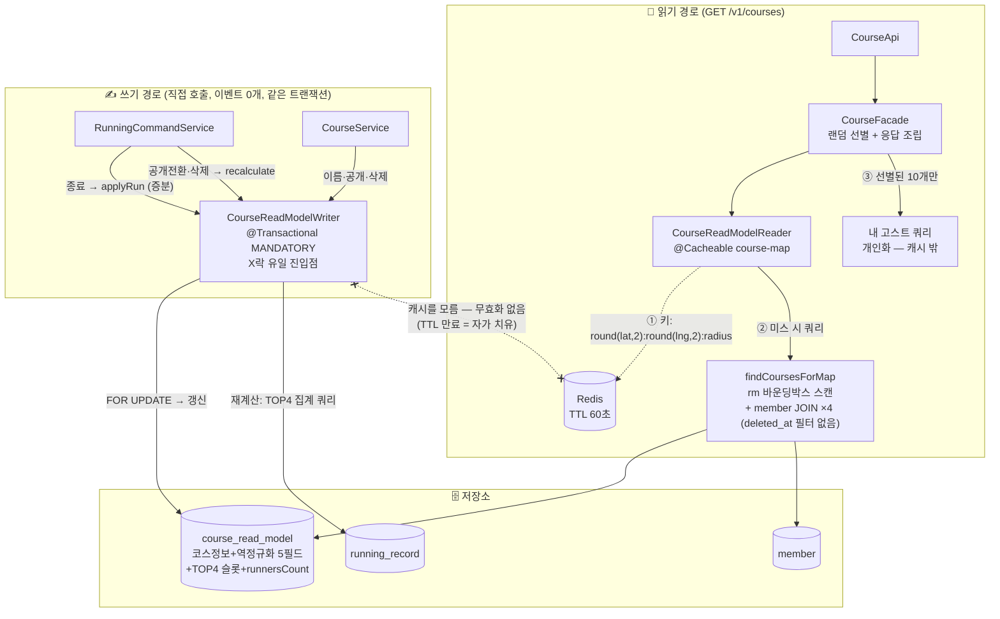
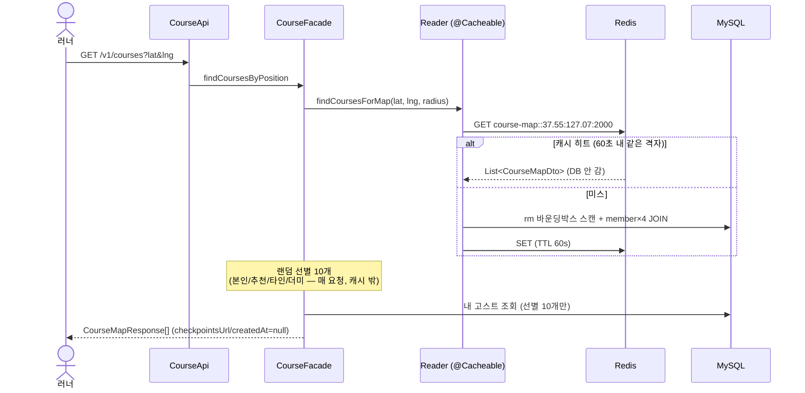
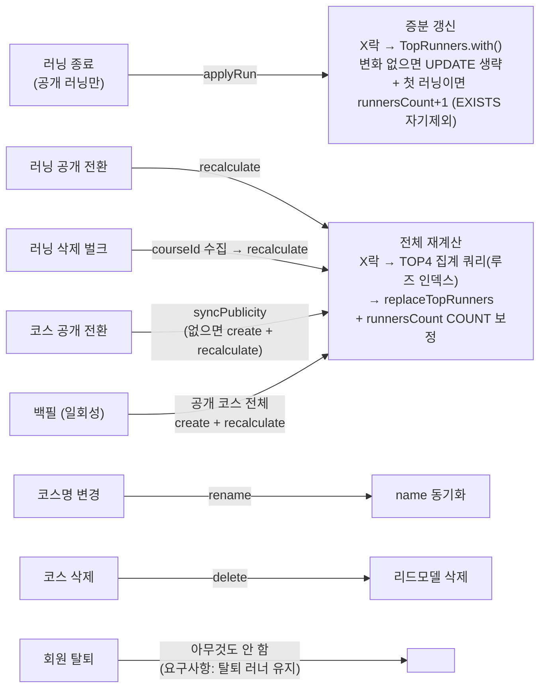

# CourseReadModel 상세 설계

> [02-redesign-options.md](02-redesign-options.md)(방안 A 확정), [03-structure-a-vs-b.md](03-structure-a-vs-b.md)의 후속.
> 문답으로 챕터를 하나씩 확정하며 채운다: **1. 엔티티 → 2. 캐시 → 3. 핵심 플로우·컴포넌트 → 4. 구현 계획**
>
> **[2026-08 이후 클래스 개명]** 이 문서의 클래스명은 작성 시점 기준이다. 이후 쓰기 경계 분리와 Reader/Writer 계층화로
> `CourseService` → `CourseWriter`(쓰기) + `CourseReader`(조회), `RunningCreationWriter` → `RunningWriter`(수정·삭제 트랜잭션 흡수),
> `RunningQueryService` → `RunningReader`, `CourseSubscriptionService` → `CourseSubscriptionWriter`(코스 주인 구독 조율까지 흡수)로 재편됐다.
> 설계: [`../../../design/reader-writer-layering.md`](../../../design/reader-writer-layering.md)

## 확정 전제 요약

- TOP4 = 메인 화면 뷰 데이터 (랭킹 도메인 아님, N=4 고정)
- 강한 일관성: 러닝 종료/공개전환/삭제, 코스 변경이 같은 트랜잭션에서 반영
- 탈퇴 러너는 메인화면 유지 (정정 없음, 조회 시 deleted_at 필터 제거)
- 동기화는 `CourseReadModelWriter` 직접 호출 (이벤트 0개)
- checkpointsUrl/createdAt은 응답에서 null 유지 (역정규화 안 함)

**구현 착수 시 확정된 정책 (2026-08-04, Q1~Q4)**:
- **Q1**: 일시정지(hasPaused=true) 러닝은 TOP4·러너수 집계에서 **제외** — 재계산·증분 동일 적용 (기존 정책 유지)
- **Q2**: **공개 러닝만** `applyRun` — 비공개 러닝 무조건 반영하던 기존 증분 경로의 불일치 버그 정정
- **Q3**: runnersCount 증분의 첫 러닝 판정은 **러닝 저장 후 EXISTS(자기 자신 제외)** — 호출 순서 무관하게 견고
- **Q4**: 코스 공개 전환 시 리드모델 신규 생성은 **create + 전체 재계산(recalculate) 통일** — 주인 TOP1만 채우던 현행 대체, 백필과 코드 공유

---

## 0. 전체 아키텍처 & 플로우

### 0-1. 전체 구조도 — 읽기 / 쓰기 / 캐시 한 장에



핵심 성질 3가지:
1. **쓰기와 캐시의 완전 분리** — Writer는 Redis의 존재를 모른다. 스테일 상한 = TTL 60초, DB(리드모델)는 항상 즉시 정정
2. **X락은 Writer 안에서만** — 동시성 규율이 컴포넌트 경계로 강제됨
3. **순위 규칙은 TopRunners VO에만** — 엔티티는 매핑+변경감지, Writer는 락+조율

### 0-2. 지도 조회 플로우 (캐시 히트/미스)



### 0-3. 쓰기 플로우 — 트리거별 한눈에



증분(`applyRun`)과 재계산(`recalculate`)의 관계: **증분은 빠른 근사, 재계산은 진실의 원천.** 증분이 못 다루는 모든 변화(삭제·비공개·드리프트)는 재계산이 COUNT/집계로 덮어써 보정한다.

### 0-4. 컴포넌트별 핵심 로직 요약 (구현 상태 포함)

| # | 컴포넌트 | 핵심 로직 (이것만 알면 됨) | 상태 |
|---|---|---|---|
| A | `TopRunners` + `RankSlot` (VO) | `with()` = 본인 슬롯 제거→추가→정렬→4개 자르기. `qualifies()` 빠른 탈락(본인 기록 우선 비교 — 구현 중 순서 버그 발견·수정). 불변 record, equals로 변경 감지 | ✅ PR-1 |
| B | `CourseReadModel` (엔티티) | `@Embedded RankSlot`×4(기존 컬럼명 유지) + `@Embedded CourseProfile`+thumbnailUrl 역정규화. `applyRun`=VO 위임+변경 없으면 필드 안 건드림(UPDATE 생략), `replaceTopRunners`=재계산 반영. 시프트/스와프 200줄 삭제 | ✅ PR-1 |
| C | `CourseReadModelRepository` (쿼리) | 재계산 3종: TOP4 집계(member별 MIN, 루즈 인덱스), COUNT(DISTINCT), EXISTS(자기 제외). 공통 필터 `is_public ∧ ¬deleted ∧ ¬has_paused` | ✅ PR-1 |
| D | 영속성 매핑 검증 | @Embedded null 슬롯 왕복, ownerUuid null 저장 — 매핑이 깨지면 전부 무너지므로 통합 테스트로 고정 | ✅ PR-1 |
| E | `CourseReadModelWriter` | 유일한 쓰기 진입점. MANDATORY(트랜잭션 없으면 예외), X락 내재화, applyRun/recalculate/rename/syncPublicity/delete | ✅ PR-1 |
| F | `RunningCommandService` 연결 | 종료→applyRun, 공개전환·삭제→recalculate 직접 호출. `ReadModelSyncListener` 삭제(이중 반영 방지) | ✅ PR-1 |
| G | `CourseService` 이관 | 리드모델 조작 전부 Writer로 위임, readModelRepository 직접 의존 제거 | ✅ PR-1 |
| H | E2E 회귀 | 쓰기 경로 전체 시나리오 + 전체 테스트 그린 | ✅ PR-1 |
| — | `CourseReadModelReader` + Spring Cache | @Cacheable(course-map, TTL 60s), 반올림 키, 기본 요청만 캐싱 | 📋 PR-2 |
| — | 조회 전환 + 백필 | findCoursesForMap 확장 → CourseApi 교체, 구경로 @Deprecated, 백필 러너 | 📋 PR-2 |

---

## 1. 엔티티 설계 ✅

### 1-1. 설계 원칙

1. **순위 조작은 불변 VO(`TopRunners`)에 위임** — 엔티티는 컬럼 매핑과 변경 감지만 담당
2. **컬럼 쌍은 `@Embeddable`로 묶는다** — 평평한 8필드 제거. 코드베이스 선례: `Device.appVersion`(@Embedded SemanticVersion + @AttributeOverride)
3. **기존 VO 재사용** — 역정규화 4컬럼은 새 필드가 아니라 `@Embedded CourseProfile` 그대로 (Course와 동일한 컬럼명 자동 획득)
4. 변화가 없으면 필드를 건드리지 않는다 → Hibernate 더티체킹이 UPDATE를 생략

### 1-2. 필드 구성

| 그룹 | 필드 | 타입/매핑 | 비고 |
|---|---|---|---|
| 식별 | id | PK | |
| 코스 참조 | courseId | `bigint` UK | FK 제약 없음 (유지) |
| 코스 정보 | name | varchar | 코스명 변경 시 동기화 (신규 경로) |
| 〃 | ownerUuid | varchar(36) **nullable로 완화** | OFFICIAL/더미 코스는 소유자 없음 — 기존 `nullable=false`와 `create()` null 주입 충돌 해소 |
| 〃 | routeUrl | text | 유지 |
| 〃 | **courseProfile** | **`@Embedded CourseProfile`** | 신규 — distance_km, elevation_average/gain/loss_m 4컬럼. Course와 동일 VO 재사용 |
| 〃 | **thumbnailUrl** | text, 신규 | CourseDataUrls 중 지도 응답에 필요한 것만 |
| 조회 키 | startLat, startLng | double | `idx_is_public_location(is_public, start_lat, start_lng)` 유지 |
| 상태 | isPublic | boolean | 유지 |
| 〃 | source | varchar(20) enum | 유지 |
| TOP4 | **top1 ~ top4** | **`@Embedded RankSlot` ×4** | 컬럼명은 기존 8컬럼 그대로 `@AttributeOverride` |
| 집계 | runnersCount | bigint | 갱신 정책은 1-5 |

DDL 변화: `ALTER TABLE course_read_model ADD COLUMN` — distance_km, elevation_average_m, elevation_gain_m, elevation_loss_m, thumbnail_url (5개) + `MODIFY owner_uuid NULL`. 기존 컬럼/인덱스 변경 없음.

### 1-3. RankSlot — @Embeddable 컬럼 쌍

```java
@Embeddable
@Getter @NoArgsConstructor(access = PROTECTED) @EqualsAndHashCode
public class RankSlot {
    private Long memberId;
    private Integer timeSeconds;
}
```

```java
// CourseReadModel 내부
@Embedded @AttributeOverrides({
    @AttributeOverride(name = "memberId",    column = @Column(name = "top1_member_id")),
    @AttributeOverride(name = "timeSeconds", column = @Column(name = "top1_time_seconds"))})
private RankSlot top1;
// top2, top3, top4 동일 패턴
```

> 주의: 4개 슬롯이 모두 null 필드일 때 Hibernate가 embeddable 자체를 null로 하이드레이션하는 동작(빈 슬롯 = null)을 그대로 활용한다.

### 1-4. TopRunners — 순위 로직을 가진 불변 VO

불변식: **기록 오름차순 정렬 · 최대 4개 · 멤버 중복 없음**. DB 무관 순수 객체 → 단위 테스트 대상.

```java
public record TopRunners(List<RankSlot> slots) {

    public static final int MAX_RANK = 4;

    public TopRunners { slots = List.copyOf(slots); }   // 방어적 복사

    /** 새 기록을 반영한 새 인스턴스 반환. 변화 없으면 this */
    public TopRunners with(Long memberId, int timeSeconds) {
        if (!qualifies(memberId, timeSeconds)) return this;      // 빠른 탈락
        List<RankSlot> next = new ArrayList<>(slots);
        next.removeIf(s -> Objects.equals(s.getMemberId(), memberId));
        next.add(new RankSlot(memberId, timeSeconds));
        next.sort(comparing(RankSlot::getTimeSeconds));
        return new TopRunners(next.subList(0, min(next.size(), MAX_RANK)));
    }

    /** 대부분의 러닝은 여기서 끝난다 — 리스트 조작 없이 탈락 판정.
     *  주의: 본인 슬롯 확인이 size 검사보다 먼저여야 함 (슬롯 미충족 상태에서
     *  기존 멤버의 느린 기록이 빠른 기록을 덮어쓰는 버그 방지 — 구현 시 발견·수정됨) */
    private boolean qualifies(Long memberId, int timeSeconds) {
        RankSlot myBestSlot = findByMember(memberId);
        if (myBestSlot != null) return timeSeconds < myBestSlot.getTimeSeconds();
        if (slots.size() < MAX_RANK) return true;
        return timeSeconds < slots.get(slots.size() - 1).getTimeSeconds();  // Java 17 (getLast 불가)
    }
}
```

### 1-5. 엔티티 공개 API

```java
public class CourseReadModel extends BaseTimeEntity {

    /** 러닝 종료: 증분 갱신. TOP4 변화 시에만 true (변화 없으면 필드 미변경 → UPDATE 생략) */
    public boolean applyRun(Long memberId, int timeSeconds) {
        TopRunners current = topRunners();
        TopRunners updated = current.with(memberId, timeSeconds);
        if (updated.equals(current)) return false;
        applyTopRunners(updated);
        return true;
    }

    /** 재계산 결과 일괄 반영 (러닝 삭제/공개전환/백필) */
    public void replaceTopRunners(TopRunners recalculated) { applyTopRunners(recalculated); }

    public void updateRunnersCount(long count) { ... }
    public void rename(String name) { ... }              // 신규 — 코스명 동기화
    public void makePublic() / makePrivate() { ... }
    public static CourseReadModel create(Course course) { ... }  // 역정규화 필드까지 전체 채움

    // private: topRunners() ← top1~4 수집 / applyTopRunners() ← 순서대로 대입
}
```

**삭제되는 것**: `insertIfBetter` 시프트/스와프 200줄(`shiftDown`, `swap`, `updateExistingRunner`, `isInTop4`), 8-인자 `replaceTop4`, `containsMember`(호출처 없음), `updateRouteUrl`(호출처 없음 확인 후).

### 1-6. runnersCount 갱신 정책 — ✅ 결정 (2026-08-04 문답): 증분 + 재계산 시 보정

- **증분(채택)**: 러닝 종료 시 "이 멤버의 이 코스 첫 public 러닝인가?"를 EXISTS로 확인 → 첫 러닝일 때만 +1. 집계 쿼리가 인덱스 룩업 하나로 대체.
- 드리프트 방어: **재계산 경로(`recalculate`)에서는 항상 COUNT로 재집계**하므로, 러닝 삭제/공개전환/백필 시점마다 정확한 값으로 보정된다.
- 주의: EXISTS 판정은 "지금 저장하려는 러닝 제외" 기준이어야 함 — 리스너가 아닌 직접 호출이므로 러닝 INSERT 전에 판정하거나, 판정 쿼리에서 해당 running id 제외.

### 1-7. 테스트 계획

- `TopRunnersTest` (순수 단위): 빈 슬롯 삽입 / 중간 삽입 밀어내기 / 본인 기록 갱신(상승·하락) / 4위 미달 탈락 / 동률 처리(기존 순위 유지 = strict `<`) / 불변성
- `CourseReadModelTest` (기존 재작성): applyRun 변경감지, replaceTopRunners, create(Course) 역정규화 필드 매핑
- 매핑 검증: @Embedded null 슬롯 하이드레이션 (`IntegrationTestSupport` 저장/조회 왕복)

---

## 2. 캐시 설계 (옵션 비교 — 결정 대기)

### 2-0. 전제: 무엇을 캐싱하는가

리드모델 전환 후 요청당 DB 작업은 두 가지뿐이다:

1. `findCoursesForMap` — rm 바운딩박스 레인지 스캔 + member PK 조인 ×4 (**캐싱 후보**)
2. 내 고스트 조회 — viewer 개인화 데이터 (**캐싱 불가** — 사용자×코스 조합이라 적중률 없음)

난점: 요청 파라미터 (lat, lng)가 **연속값** — 사용자마다 미세하게 달라 그대로는 캐시 키가 성립하지 않는다. 캐시 단위를 어떻게 이산화(quantize)하느냐가 설계의 본질.

참고(정직한 관찰): PR #148 부하 테스트에서 리드모델만으로 DB CPU 27%, 에러율 0%를 달성했고 **병목은 앱 서버 CPU로 이동**했다. 캐시는 DB 여유분을 더 벌지만 직렬화/역직렬화로 앱 CPU는 오히려 소모한다. 캐시의 목적을 "DB 보호"로 명확히 하고, 앱 CPU 병목은 스케일아웃 영역임을 인지할 것.

### 2-1. 옵션 비교

#### 옵션 ① 그리드(타일) 단위 캐시 — 지역을 이산화

지도를 고정 크기 타일(예: 0.02° ≈ 2.2km)로 나누고, **타일별 코스 카드 리스트**를 캐싱.

```
키: course:map:{latIdx}:{lngIdx}      값: List<CourseMapDto> (해당 타일 내 공개 코스)
읽기: bbox → 커버하는 타일 계산 → MGET → 합집합 → bbox 정밀 필터 → 랜덤 선별
무효화: 코스 시작점 → 소속 타일 1개 결정적 → 쓰기 시 해당 타일 DEL
```

| 장점 | 단점 |
|---|---|
| 같은 지역 사용자끼리 캐시 공유 — **실질 적중률 발생** | 구현 복잡: 타일 커버 계산, 합집합, 정밀 필터 |
| 무효화가 결정적 (코스 위치 → 타일 1개) → **즉시 evict 가능** | 반경 20km 요청은 타일 ~400개 — 대반경은 캐시 우회 필요 |
| 키 공간 유한 (서비스 지역 타일 수) | Spring Cache 추상화(@Cacheable)와 안 맞음 — MGET/부분 미스는 수동 구현 |

#### 옵션 ② 결과셋 캐시 — 요청을 이산화

좌표를 반올림(예: 소수 2자리 ≈ 1.1km)한 값 + 반경으로 키를 만들어 **쿼리 결과 전체**를 캐싱. `@Cacheable` 한 줄로 구현 가능.

```
키: course:map:{round(lat,2)}:{round(lng,2)}:{radius}      값: List<CourseMapDto>
```

| 장점 | 단점 |
|---|---|
| **@Cacheable 어노테이션 한 줄** — Spring Cache 도입 목적에 가장 부합 | 무효화 불가능 — 어떤 키가 이 코스를 포함하는지 역산 불가 → **TTL 만료에만 의존** |
| 랜덤 선별 이전의 원본 리스트를 캐싱하므로 응답 다양성 유지 | 반올림 경계에서 인접 사용자가 다른 키 → 적중률 손실 |
| | TTL 동안 스테일 노출 — **강한 일관성 요구와 충돌 지점** |

#### 옵션 ③ 코스 단위 캐시 — 현행 방식 계승

코스별 카드 데이터를 courseId 키로 캐싱 (현행 `course:{id}`와 같은 단위).

| 장점 | 단점 |
|---|---|
| 무효화 결정적 (courseId) → 즉시 evict | **바운딩박스 스캔(주 쿼리)은 여전히 매번 DB 실행** — 절약분이 member 조인뿐 |
| | 리드모델 전환 후에는 절약분이 미미 — 구 아키텍처(코스당 2N 쿼리)에서나 유효했던 단위 |

#### 옵션 ④ 캐시 없이 시작 — 리드모델 성능 실측 후 도입

리드모델 단독으로 부하 목표(1000VU)를 이미 달성했다면, 캐시는 계측 후 필요 시 추가.

| 장점 | 단점 |
|---|---|
| 스테일/무효화 문제 자체가 없음, 복잡도 0 | "Spring Cache 도입"이라는 이번 워크스트림 목표 미달성 |
| 실측 기반 의사결정 | 트래픽 성장 시 재작업 |

### 2-2. ✅ 확정 (2026-08-04 문답): 옵션 ② 결과셋 캐시 + TTL 60초

> **재검토 기록 (2026-08-04)**: 반올림 키의 히트율 한계(핫스팟 한정, 경계 분절, 인접 키 간 ~90% 중복 저장)를 인지한 상태로 ② 유지 확정. **regionId/타일(①) 전환은 추후 별도 사이클**에서 진행 — 그때 FE(클라이언트의 지역 단위 요청) 연동까지 함께 변경 검토. 전환 트리거: 캐시 히트율이 유의미(>30%)한데 DB CPU 재상승, 또는 스테일 관련 실사용 문제 발생 시.
>
> 🔄 **대체됨 (2026-08-04, 캐시키 재설계 사이클)**: 위 "추후 사이클"이 실제 진행되어 이 섹션의 반올림 키 설계(키 형식·60초 TTL·무효화 없음·기본 요청 condition)는 **역사 기록**이다. 최종 설계는 [../cache/05-cache-key-design.md](../cache/05-cache-key-design.md) — 키=regionId, 값=대표좌표 기준 고정 2km, TTL 600초, 완주·러닝 공개 전환 시 AFTER_COMMIT 이빅트, 경로 분기는 Facade의 `useRegionCache`(regionId 존재 ∧ radiusM≤3000).

| 항목 | 결정 |
|---|---|
| 방식 | `@Cacheable` — `findCoursesForMap` 결과(`List<CourseMapDto>`) 캐싱 |
| 캐시 이름 | `course-map` |
| 키 | `round(lat,2) : round(lng,2) : radiusM` — 소수 2자리(≈1.1km 셀)로 이산화 |
| TTL | **60초** — 데이터 변경 후 최대 60초 스테일 허용 (지도 미리보기 특성상 수용, 사용자 결정) |
| 무효화 | **없음 (TTL 만료만)** — Writer는 캐시의 존재를 모름. 쓰기 경로와 캐시가 완전 분리되는 것이 이 방안의 구조적 장점 |
| 캐싱 범위 | **기본 요청만** (`sort=DISTANCE` + 필터 없음) — 비기본 파라미터 요청은 `condition`으로 캐시 우회 (클라 미사용이라 드묾) |
| 직렬화 | 현행 `GenericJackson2JsonRedisSerializer` (RedisCacheManager 캐시별 TTL 구성) |
| 랜덤 선별 | **캐시 뒤에서 매 요청 수행** — 원본 리스트를 캐싱하므로 사용자별 선별 다양성 유지 |
| 내 고스트 | 캐시 밖 (개인화 — 매 요청 DB, 선별된 10개 코스만) |

**정합성 주의점 (문서화용)**:
1. 스테일 시나리오: 러닝 삭제 → DB 리드모델 즉시 정정 → 그러나 이미 캐시된 결과를 받는 사용자는 최대 60초간 옛 TOP4를 봄. 수용된 트레이드오프.
2. 반올림 오차: bbox를 **반올림된 중심 기준**으로 계산해 같은 키의 사용자는 동일 결과를 받도록 결정적으로 처리. 사용자 실제 위치와 최대 ~780m 어긋난 bbox가 되지만 반경 2km 미리보기에서 허용.
3. 기존 수동 캐시(`CourseCacheRepository`, `CourseCacheEventListener`, `course:{id}` 키)는 조회 전환 시 @Deprecated → 제거 수순.

## 3. 핵심 플로우 · 컴포넌트 설계 (초안 — 논의 중)

### 3-1. 컴포넌트 구성

```
course.application
├─ CourseReadModelWriter      # 쓰기 진입점 일원화. X락은 여기서만
├─ CourseReadModelReader      # 지도 조회 유즈케이스 (@Cacheable 지점)
└─ CourseFacade               # 조립: Reader 결과 + 랜덤 선별 + 내 고스트 + 응답 매핑
course.dao
└─ CourseReadModelRepository  # findByCourseIdForUpdate / findCoursesForMap(확장) / 재계산 쿼리
```

#### CourseReadModelWriter (모든 메서드: 호출자 트랜잭션 참여 `@Transactional(MANDATORY)` 검토)

```java
void applyRun(Running running);
    // 저장된 러닝을 그대로 받음 — 집계 대상 판정(공개∧비일시정지∧코스 소속 — Q1·Q2)을 Writer가 내재화.
    //   호출자 계약은 "저장 직후 넘길 것" 하나만 (EXISTS 자기 제외가 running.getId() 사용 — Q3)
    // X락 → rm.applyRun() → 첫 공개 러닝이면 runnersCount+1
    // rm 없으면 스킵 (비공개 코스 — 공개 전환 시 생성됨)
void recalculate(Collection<Long> courseIds);
    // 코스별: X락 → 재계산 쿼리(TOP4 + COUNT) → rm.replaceTopRunners() + updateRunnersCount()
void rename(Long courseId, String name);
void syncPublicity(Long courseId, boolean isPublic);   // 생성 or makePublic/Private (기존 CourseService 로직 이관)
void delete(Long courseId);
```

- `@Transactional(MANDATORY)`: 쓰기가 반드시 호출자(러닝 저장 등) 트랜잭션 안에서 실행됨을 강제 — 트랜잭션 없이 호출하면 예외. "조용히 안 탐" 함정의 반대 성질.

#### CourseReadModelReader

```java
@Cacheable(cacheNames = "course-map",
           key = "T(...).cacheKey(#lat, #lng, #radiusM)",
           condition = "#isDefaultRequest")
List<CourseMapDto> findCoursesForMap(double lat, double lng, int radiusM);
    // 반올림 중심 → bbox 계산 → findCoursesForMap 쿼리 (rm + member×4, deleted_at 필터 없음)
```

### 3-2. 유즈케이스별 흐름

| 유즈케이스 | 흐름 |
|---|---|
| **지도 조회** | `CourseApi` → `CourseFacade.findCoursesByPosition` → Reader(캐시/DB) → 랜덤 선별(10) → 내 고스트 조회(10개만) → `CourseMapResponse` 조립 (checkpointsUrl/createdAt는 null) |
| **러닝 종료** | `RunningCommandService` (러닝 저장 TX 내) → `writer.applyRun()` |
| **러닝 공개 전환** | `RunningCommandService.updateRunningPublicStatus` → `writer.recalculate([courseId])` |
| **러닝 삭제** | `RunningCommandService.deleteRunnings` → 삭제 러닝의 courseId 수집 → `writer.recalculate(courseIds)` |
| **코스명 변경** | `CourseService.updateCourse` → `writer.rename()` |
| **코스 공개/비공개** | `CourseService.updateCourse` → `writer.syncPublicity()` (기존 syncReadModelPublicity 이관) |
| **코스 삭제** | `CourseService.deleteCourse` → `writer.delete()` |
| **백필** | 일회성 러너: 전체 공개 코스 → `writer.recalculate()` 재사용 (+ rm 없는 코스는 생성) |
| **회원 탈퇴** | 아무것도 안 함 (요구사항: 탈퇴 러너 유지) |

### 3-3. 재계산 쿼리 (Writer 내부)

```sql
SELECT r.member_id, MIN(r.duration_sec) AS best
FROM running_record r
WHERE r.is_public = TRUE AND r.deleted = FALSE AND r.has_paused = FALSE  -- Q1: 일시정지 제외
  AND r.course_id = :courseId
GROUP BY r.member_id
ORDER BY best ASC
LIMIT 4        -- idx_record_course 활용 (아래 주의)
-- runnersCount = 같은 조건 COUNT(DISTINCT member_id) (재계산 시 보정)
```

> ⚠️ **인덱스 주의**: `idx_record_course(is_public, deleted, course_id, member_id, duration_sec)`에는 `has_paused`가 **포함되어 있지 않다**. 따라서 이 쿼리는 인덱스 완전 커버링/루즈 스캔이 아니라, 인덱스 구간 스캔 후 `has_paused` 필터에 테이블 접근(또는 인덱스 조건 후 필터)이 필요하다. 코스당 러닝 수가 작아 실부하는 미미하지만, 대량 코스에서 재계산이 느려지면 `has_paused`를 포함한 인덱스로 교체를 검토하고 **`EXPLAIN ANALYZE`로 실행 계획을 실측 후 판단**할 것.

### 3-4. 조회 쿼리 확장 (`findCoursesForMap`)

기존 네이티브 쿼리에 역정규화 컬럼 추가: `distance_km, elevation_average_m, elevation_gain_m, elevation_loss_m, thumbnail_url`. member 조인에서 `deleted_at IS NULL` 조건 **제거** (탈퇴 러너 유지). `CourseMapDto`에 대응 필드 추가, `toResponse()`에서 checkpointsUrl/createdAt만 null.

### 3-5. ✅ 확정 (2026-08-04 문답)

- **Writer 트랜잭션**: `@Transactional(propagation = MANDATORY)` — 호출자 트랜잭션 없으면 예외. 원자성을 런타임에 강제
- **전환 방식**: **바로 교체** — dev 검증 후 `CourseApi`가 신규 경로 호출, 구경로(`findCoursesByPositionCached` + 수동 캐시)는 @Deprecated 후 후속 PR에서 제거. 롤백은 재배포

## 4. 구현 계획

### PR 분할 (각각 /split-pr로 커밋 분리)

**PR-1: 쓰기 측 — 엔티티 재설계 + Writer + 즉시 정정 경로**
1. `RankSlot` @Embeddable + `TopRunners` VO + 단위 테스트
2. `CourseReadModel` 재설계 (Embedded 전환, 역정규화 필드, 신규 API, 시프트/스와프 로직 삭제)
3. `CourseReadModelWriter` (MANDATORY, X락 내재화) + 재계산 쿼리
4. 호출부 연결: `RunningCommandService`(종료/공개전환/삭제), `CourseService`(이름/공개/삭제 이관)
5. `ReadModelSyncListener` 삭제, 기존 테스트 재작성

**PR-2: 읽기 측 — 조회 전환 + Spring Cache + 백필 + 구경로 정리**
1. `findCoursesForMap` 쿼리 확장 (역정규화 컬럼, deleted_at 필터 제거) + `CourseMapDto` 확장
2. `CourseReadModelReader` + RedisCacheManager 구성 (`course-map`, TTL 60s) + `@Cacheable`
3. `CourseFacade.findCoursesByPosition` 완성 (내 고스트 10개, 응답 조립) → `CourseApi` 교체
4. 백필 러너: `course.read-model.backfill=true` 프로퍼티 시 기동 후 1회 실행 (공개 코스 전체 — rm 없으면 생성, `recalculate` 재사용)
5. 구경로 @Deprecated (`findCoursesByPositionCached`, `CourseCacheRepository`, `CourseCacheEventListener`) — 제거는 안정화 후 후속 PR

### 검증

- **파리티 테스트**: 통합 테스트에서 동일 데이터로 구경로 vs 신경로 응답 비교 (checkpointsUrl/createdAt null 차이만 허용)
- TopRunners 단위 테스트 + Writer 동시성/재계산 통합 테스트 + @Embedded null 슬롯 왕복 테스트
- dev 배포 후 실기기 확인 → prod

### 운영 주의

- prod DDL: `ALTER TABLE course_read_model ADD COLUMN ...` 5개 + `MODIFY owner_uuid NULL` — prod의 ddl-auto 설정(외부 주입)이 create가 아니라면 **수동 DDL 선적용 필요**. 배포 전 확인
  - 스크립트: [`ddl/pr1.sql`](./ddl/pr1.sql) (적용 순서·롤백 DDL 주석 포함). **PR-1 코드 배포 이전**에 적용한다.
  - prod의 `spring.jpa.hibernate.ddl-auto` 실제 값은 저장소에 `application-prod.yml`이 없어 **코드로 확인 불가(외부 주입) — 배포 담당자가 확인해 이 줄에 기록할 것**. 다만 값이 `update`여도 Hibernate는 컬럼 추가만 하고 기존 컬럼 정의를 바꾸지 않으므로 `MODIFY owner_uuid NULL`은 **어느 값이든 수동 적용이 필요**하다.
  - 미적용 시 영향: 리드모델 읽기/쓰기 전 경로가 `Unknown column` 예외 → `CourseReadModelWriter`의 `MANDATORY` 전파로 러닝 종료(`createRun`)·러닝 삭제·코스 공개 전환까지 롤백
- 백필은 PR-2 배포 직후 1회 (프로퍼티 켜서 재기동 → 완료 로그 확인 → 프로퍼티 제거)

## 4. 구현 계획 (논의 예정)

> - [ ] 커밋/PR 분할, 백필 실행 절차, 검증 방법
