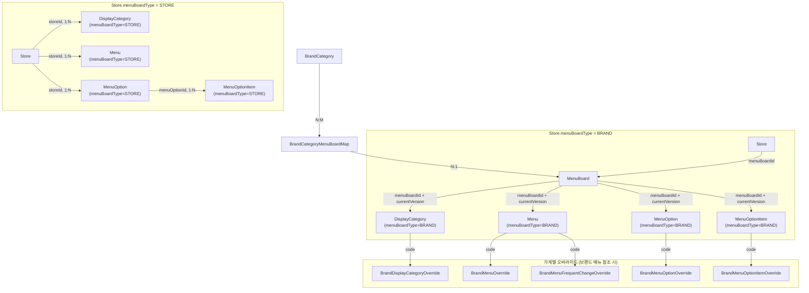

# 브랜드 메뉴 시스템 구현 계획

> 요구사항 문서: [brand-menu-system-requirements.md](brand-menu-system-requirements.md)

---

## 1. 전체 구조 개요



---

## 2. 핵심 엔티티 설계

### 2.1 설계 원칙

기존 `MenuEntity`, `DisplayCategoryEntity`, `MenuOptionEntity`에 `menuBoardType`, `menuBoardId`, `menuBoardVersion`, `code` 필드를 추가하여 Store/Brand 메뉴를 구분.

- `menuBoardType = STORE`: 기존 가게 메뉴 (storeId=필수)
- `menuBoardType = BRAND`: 브랜드 메뉴 (menuBoardId=필수, menuBoardVersion=필수, code=필수, storeId = null)

---

### 2.2 MenuBoard (메뉴판)

브랜드가 소유하는 메뉴판의 최상위 엔티티.

| 필드 | 타입 | 설명 |
|-----|------|------|
| id | Long | PK |
| uuid | UUID | 메뉴판 고유 식별자 |
| name | String | 메뉴판 이름 (대형 브랜드의 경우 여러 메뉴판 구분용) |
| status | Enum | 상태 (ACTIVE, INACTIVE 등) |
| isDefault | Boolean | 기본 메뉴판 여부 (기본값: false) |
| currentVersion | Int | 현재 활성 버전 번호 (기본값: 1) |
| createdAt | ZonedDateTime | 생성일시 |
| updatedAt | ZonedDateTime | 수정일시 |
| deletedAt | ZonedDateTime? | 삭제일시 (Soft Delete) |

**관계**
- BrandCategory : MenuBoard = N : M (BrandCategoryMenuBoardMap을 통해 연결)
    - 현재 상황에서 매핑 테이블을 쓰지만 1:N 관계임.
- BrandCategory당 isDefault=true인 메뉴판은 최대 1개

**버전 관리**
- `currentVersion`은 현재 라이브 상태의 메뉴 버전을 나타냄
- 메뉴 발행(Publish) 시 `currentVersion`이 증가
- Draft는 항상 존재하며, 별도 플래그 없이 Draft 테이블로 관리

---

### 2.3 BrandCategoryMenuBoardMap (브랜드카테고리-메뉴판 매핑)

브랜드 카테고리와 메뉴판의 N:M 관계를 관리하는 매핑 엔티티.

| 필드 | 타입 | 설명 |
|-----|------|------|
| id | Long | PK |
| brandCategoryId | Long | FK → BrandCategory |
| menuBoardId | Long | FK → MenuBoard |
| createdAt | ZonedDateTime | 생성일시 |
| deletedAt | ZonedDateTime? | 삭제일시 (Soft Delete) |

**특징**
- 하나의 BrandCategory가 여러 MenuBoard를 가질 수 있음
- Finder에서 `findByBrandCategoryId` 인터페이스 유지, 내부에서 매핑 테이블 조회
- **Soft Delete 지원**: 삭제되더라도 어느 브랜드의 메뉴판이었는지 이력이 남음

---

### 2.4 StoreEntity 필드 추가

| 필드 | 타입 | 설명 |
|-----|------|------|
| menuBoardType | Enum | `BRAND` 또는 `STORE` |
| menuBoardId | Long? | FK → MenuBoard (menuBoardType=BRAND일 때 필수) |

**동작**
- `menuBoardType = BRAND`: menuBoardId로 MenuBoard 참조 → MenuBoard.currentVersion과 함께 BrandMenu들 조회
- `menuBoardType = STORE`: storeId로 직접 StoreMenu들 조회

---

### 2.5 MenuEntity 필드 추가

| 필드               | 타입 | 설명 |
|------------------|------|------|
| menuBoardType    | MenuBoardType | `BRAND` 또는 `STORE` (기본값: STORE) |
| menuBoardId      | Long? | FK → MenuBoard (menuBoardType=BRAND일 때 필수) |
| menuBoardVersion | Int? | 메뉴판 버전 (menuBoardType=BRAND일 때 필수) |
| storeId          | Long? | FK → Store (menuBoardType=STORE일 때 필수, nullable) |
| code             | String? | 메뉴 식별 코드 (menuBoardType=BRAND일 때 필수) |

**분기 조건**

| menuBoardType | menuBoardId | menuBoardVersion | storeId | code |
|---------------|-------------|---------|---------|------|
| BRAND | 필수 | 필수 | null | 필수 |
| STORE | null | null | 필수 | null (optional) |

> **Note**: 전시 순서는 `DisplayCategoryMenuMapEntity`에서 관리.

---

### 2.6 DisplayCategoryEntity 필드 추가

| 필드 | 타입 | 설명 |
|-----|------|------|
| menuBoardType | MenuBoardType | `BRAND` 또는 `STORE` (기본값: STORE) |
| menuBoardId | Long? | FK → MenuBoard (menuBoardType=BRAND일 때 필수) |
| menuBoardVersion | Int? | 메뉴판 버전 (menuBoardType=BRAND일 때 필수) |
| storeId | Long? | FK → Store (menuBoardType=STORE일 때 필수, nullable) |
| code | String? | 카테고리 식별 코드 (menuBoardType=BRAND일 때 필수) |

---

### 2.7 MenuOptionEntity 필드 추가

| 필드 | 타입 | 설명 |
|-----|------|------|
| menuBoardType | MenuBoardType | `BRAND` 또는 `STORE` (기본값: STORE) |
| menuBoardId | Long? | FK → MenuBoard (menuBoardType=BRAND일 때 필수) |
| menuBoardVersion | Int? | 메뉴판 버전 (menuBoardType=BRAND일 때 필수) |
| storeId | Long? | FK → Store (menuBoardType=STORE일 때 필수, nullable) |
| code | String? | 옵션 식별 코드 (menuBoardType=BRAND일 때 필수) |

---

### 2.8 MenuOptionItemEntity 필드 추가

| 필드 | 타입 | 설명 |
|-----|------|------|
| menuBoardType | MenuBoardType | `BRAND` 또는 `STORE` (기본값: STORE) |
| menuBoardId | Long? | FK → MenuBoard (menuBoardType=BRAND일 때 필수) |
| menuBoardVersion | Int? | 메뉴판 버전 (menuBoardType=BRAND일 때 필수) |
| code | String? | 옵션아이템 식별 코드 (menuBoardType=BRAND일 때 필수) |

**분기 조건**

| menuBoardType | menuBoardId | menuBoardVersion | code |
|---------------|-------------|---------|------|
| BRAND | 필수 | 필수 | 필수 |
| STORE | null | null | null (optional) |

---

## 3. 가게별 오버라이드 엔티티

브랜드 메뉴판을 참조하는 가게(menuBoardType=BRAND)에서 사용.

### 3.1 BrandMenuOverride (가게별 상태 오버라이드)

| 필드 | 타입 | 설명 |
|-----|------|------|
| id | Long | PK |
| storeId | Long | FK → Store |
| menuCode | String | 메뉴 식별 코드 (Menu.code 참조) |
| status | MenuStatus | 기존 MenuStatus enum 사용 |
| updatedAt | ZonedDateTime | 수정일시 |

**특징**
- 브랜드 메뉴판의 구조는 변경하지 않고 상태만 오버라이드
- menuCode를 통해 Menu(menuBoardType=BRAND)와 연결

---

### 3.2 BrandDisplayCategoryOverride (가게별 카테고리 상태 오버라이드)

| 필드 | 타입 | 설명 |
|-----|------|------|
| id | Long | PK |
| storeId | Long | FK → Store |
| categoryCode | String | 카테고리 식별 코드 (DisplayCategory.code 참조) |
| status | DisplayCategoryStatus | 기존 DisplayCategoryStatus enum 사용 |
| updatedAt | ZonedDateTime | 수정일시 |

**특징**
- 브랜드 카테고리의 표시 상태를 가게별로 오버라이드
- categoryCode를 통해 DisplayCategory(menuBoardType=BRAND)와 연결

---

### 3.3 BrandMenuOptionOverride (가게별 옵션 상태 오버라이드)

| 필드 | 타입 | 설명 |
|-----|------|------|
| id | Long | PK |
| storeId | Long | FK → Store |
| optionCode | String | 옵션 식별 코드 (MenuOption.code 참조) |
| status | MenuStatus | 기존 MenuStatus enum 사용 |
| updatedAt | ZonedDateTime | 수정일시 |

**특징**
- 브랜드 옵션의 상태를 가게별로 오버라이드
- optionCode를 통해 MenuOption(menuBoardType=BRAND)와 연결

---

### 3.4 BrandMenuOptionItemOverride (가게별 옵션 아이템 상태 오버라이드)

| 필드 | 타입 | 설명 |
|-----|------|------|
| id | Long | PK |
| storeId | Long | FK → Store |
| optionItemCode | String | 옵션아이템 식별 코드 (MenuOptionItem.code 참조) |
| status | MenuOptionItemStatus | 기존 MenuOptionItemStatus enum 사용 |
| updatedAt | ZonedDateTime | 수정일시 |

**특징**
- 브랜드 옵션 아이템의 상태를 가게별로 오버라이드
- optionItemCode를 통해 MenuOptionItem(menuBoardType=BRAND)와 연결

---

### 3.5 BrandMenuFrequentChangeOverride (가게별 자주 변경되는 항목)

| 필드             | 타입 | 설명                      |
|----------------|------|-------------------------|
| id             | Long | PK                      |
| storeId        | Long | FK → Store              |
| menuCode       | String | 메뉴 식별 코드 (Menu.code 참조) |
| orderCount     | Int | 주문수                     |
| stockQuantity? | Int | 구매가능 재고 수량              |
| updatedAt      | ZonedDateTime | 수정일시                    |

**특징**
- 브랜드 메뉴판 참조 시에도 가게별 주문/재고 등 자주 변경되는 항목은 독립 관리
- menuCode를 통해 Menu(menuBoardType=BRAND)와 연결

---

## 4. Repository 구조

### 4.1 MenuBoardRepository

```kotlin
interface MenuBoardRepository : JpaRepository<MenuBoardEntity, Long> {
    fun findByUuid(uuid: UUID): MenuBoardEntity?
}
```

### 4.2 BrandCategoryMenuBoardMapRepository

```kotlin
interface BrandCategoryMenuBoardMapRepository : JpaRepository<BrandCategoryMenuBoardMapEntity, Long> {
    fun findAllByBrandCategoryId(brandCategoryId: Long): List<BrandCategoryMenuBoardMapEntity>
    fun findByBrandCategoryIdAndMenuBoardId(brandCategoryId: Long, menuBoardId: Long): BrandCategoryMenuBoardMapEntity?
}
```

### 4.3 기존 Repository 확장

기존 Repository에 Brand 조회 메서드 추가. **브랜드 메뉴 조회 시 반드시 `menuBoardId`와 `menuBoardVersion`을 함께 사용.**

**MenuRepository**
```kotlin
interface MenuRepository : JpaRepository<MenuEntity, Long> {
    fun findByStoreId(storeId: Long): List<MenuEntity>

    // 브랜드 메뉴 조회: menuBoardId + menuBoardVersion 조건 필수
    fun findByMenuBoardIdAndMenuBoardVersion(menuBoardId: Long, menuBoardVersion: Int): List<MenuEntity>
}
```

**DisplayCategoryRepository**
```kotlin
interface DisplayCategoryRepository : JpaRepository<DisplayCategoryEntity, Long> {
    fun findByStoreId(storeId: Long): List<DisplayCategoryEntity>

    // 브랜드 카테고리 조회: menuBoardId + menuBoardVersion 조건 필수
    fun findByMenuBoardIdAndMenuBoardVersion(menuBoardId: Long, menuBoardVersion: Int): List<DisplayCategoryEntity>
    fun findByMenuBoardIdAndMenuBoardVersionOrderByDisplayOrder(menuBoardId: Long, menuBoardVersion: Int): List<DisplayCategoryEntity>
}
```

**MenuOptionRepository**
```kotlin
interface MenuOptionRepository : JpaRepository<MenuOptionEntity, Long> {
    fun findByStoreId(storeId: Long): List<MenuOptionEntity>

    // 브랜드 옵션 조회: menuBoardId + menuBoardVersion 조건 필수
    fun findByMenuBoardIdAndMenuBoardVersion(menuBoardId: Long, menuBoardVersion: Int): List<MenuOptionEntity>
    fun findByMenuBoardIdAndMenuBoardVersionOrderByDisplayOrder(menuBoardId: Long, menuBoardVersion: Int): List<MenuOptionEntity>
}
```

**MenuOptionItemRepository**
```kotlin
interface MenuOptionItemRepository : JpaRepository<MenuOptionItemEntity, Long> {
    fun findAllByMenuOptionId(menuOptionId: Long): List<MenuOptionItemEntity>

    // 브랜드 옵션 아이템 조회: menuBoardId + menuBoardVersion 조건 필수
    fun findByMenuBoardIdAndMenuBoardVersion(menuBoardId: Long, menuBoardVersion: Int): List<MenuOptionItemEntity>
    fun findByMenuBoardIdAndMenuBoardVersionOrderByDisplayOrder(menuBoardId: Long, menuBoardVersion: Int): List<MenuOptionItemEntity>
}
```

---

## 5. Finder 분리

Store.menuBoardType에 따른 조회 로직 분리.

### 5.1 Store Finder

```kotlin
// storemenu/domain/StoreMenuFinder.kt
class StoreMenuFinder(
    private val menuRepository: MenuRepository,
    private val menuStockFinder: MenuStockFinder,
) {
    fun findAllByStoreId(storeId: Long): List<StoreMenu>
}

// storemenu/domain/StoreDisplayCategoryFinder.kt
class StoreDisplayCategoryFinder(
    private val displayCategoryRepository: DisplayCategoryRepository,
) {
    fun findAllByStoreId(storeId: Long): List<StoreDisplayCategory>
}

// storemenu/domain/StoreMenuOptionFinder.kt
class StoreMenuOptionFinder(
    private val menuOptionRepository: MenuOptionRepository,
) {
    fun findAllByStoreId(storeId: Long): List<StoreMenuOption>
}

// storemenu/domain/StoreMenuOptionItemFinder.kt
class StoreMenuOptionItemFinder(
    private val menuOptionItemRepository: MenuOptionItemRepository,
) {
    fun findAllByMenuOptionId(menuOptionId: Long): List<StoreMenuOptionItem>
    fun findAllByMenuOptionIds(menuOptionIds: List<Long>): List<StoreMenuOptionItem>
}
```

### 5.2 Brand Finder

**중요**: 브랜드 메뉴 조회 시 반드시 `menuBoardId`와 `menuBoardVersion`을 함께 사용해야 함.

```kotlin
// brandmenu/domain/MenuBoardFinder.kt
class MenuBoardFinder(
    private val menuBoardRepository: MenuBoardRepository,
    private val brandCategoryMenuBoardMapRepository: BrandCategoryMenuBoardMapRepository,
) {
    fun findById(id: Long): MenuBoard
    fun findByIdOrNull(id: Long): MenuBoard?

    // 매핑 테이블을 통해 조회 (인터페이스 유지)
    fun findAllByBrandCategoryId(brandCategoryId: Long): List<MenuBoard> {
        val maps = brandCategoryMenuBoardMapRepository.findAllByBrandCategoryId(brandCategoryId)
        return maps.mapNotNull { findByIdOrNull(it.menuBoardId) }
    }

    fun findDefaultByBrandCategoryId(brandCategoryId: Long): MenuBoard?
}

// brandmenu/domain/BrandMenuFinder.kt
class BrandMenuFinder(
    private val menuRepository: MenuRepository,
    private val brandMenuOverrideRepository: BrandMenuOverrideRepository,
    private val brandMenuFrequentChangeOverrideRepository: BrandMenuFrequentChangeOverrideRepository,
) {
    // menuBoardId + menuBoardVersion 조합으로 조회
    fun findByMenuBoardIdAndMenuBoardVersion(menuBoardId: Long, menuBoardVersion: Int): List<BrandMenu> {
        return menuRepository.findByMenuBoardIdAndMenuBoardVersion(menuBoardId, menuBoardVersion)
            .map { it.toBrandMenu() }
    }

    fun findWithOverride(menuBoardId: Long, menuBoardVersion: Int, storeId: Long): List<BrandMenu> {
        val menus = findByMenuBoardIdAndMenuBoardVersion(menuBoardId, menuBoardVersion)
        val overrides = brandMenuOverrideRepository.findByStoreId(storeId)
        val orderCounts = brandMenuFrequentChangeOverrideRepository.findByStoreId(storeId)
        // 오버라이드 적용 로직
    }
}

// brandmenu/domain/BrandDisplayCategoryFinder.kt
class BrandDisplayCategoryFinder(
    private val displayCategoryRepository: DisplayCategoryRepository,
    private val brandDisplayCategoryOverrideRepository: BrandDisplayCategoryOverrideRepository,
) {
    fun findByMenuBoardIdAndMenuBoardVersion(menuBoardId: Long, menuBoardVersion: Int): List<BrandDisplayCategory>
    fun findWithOverride(menuBoardId: Long, menuBoardVersion: Int, storeId: Long): List<BrandDisplayCategory>
}

// brandmenu/domain/BrandMenuOptionFinder.kt
class BrandMenuOptionFinder(
    private val menuOptionRepository: MenuOptionRepository,
    private val brandMenuOptionOverrideRepository: BrandMenuOptionOverrideRepository,
) {
    fun findByMenuBoardIdAndMenuBoardVersion(menuBoardId: Long, menuBoardVersion: Int): List<BrandMenuOption>
    fun findWithOverride(menuBoardId: Long, menuBoardVersion: Int, storeId: Long): List<BrandMenuOption>
}

// brandmenu/domain/BrandMenuOptionItemFinder.kt
class BrandMenuOptionItemFinder(
    private val menuOptionItemRepository: MenuOptionItemRepository,
    private val brandMenuOptionItemOverrideRepository: BrandMenuOptionItemOverrideRepository,
) {
    fun findByMenuBoardIdAndMenuBoardVersion(menuBoardId: Long, menuBoardVersion: Int): List<BrandMenuOptionItem>
    fun findWithOverride(menuBoardId: Long, menuBoardVersion: Int, storeId: Long): List<BrandMenuOptionItem>
}
```

### 5.3 Main Finder에서의 분기

```kotlin
// menu/application/service/MenuFinder.kt
fun findAllByStore(store: Store, includeImages: Boolean = true): List<Menu> {
    return when (store.menuBoardType) {
        MenuBoardType.STORE -> storeMenuFinder.findAllByStore(store, includeImages)
        MenuBoardType.BRAND -> brandMenuFinder.findAllByStore(store, includeImages)
    }
}

// FIXME 이 로직은 brandMenuFinder 내부로 이동 필요
private fun findAllByBrandMenuBoard(store: Store, includeImages: Boolean): List<Menu> {
    // 1. Store에서 menuBoardId 가져오기
    val menuBoardId = store.menuBoardId ?: throw IllegalStateException("menuBoardId is required for BRAND type")

    // 2. MenuBoard 조회하여 currentVersion 가져오기
    val menuBoard = menuBoardFinder.findById(menuBoardId)
    val currentVersion = menuBoard.currentVersion

    // 3. menuBoardId + currentVersion으로 메뉴 조회
    val brandMenus = brandMenuFinder.findWithOverride(menuBoardId, currentVersion, store.id)

    return brandMenus.map { it.toMenu(...) }
}
```

---

## 6. 메뉴 코드 (code) 체계

브랜드 메뉴판에서 가게별 상태/자주 변경되는 항목을 연결하기 위한 식별자.

### 6.1 설계 원칙

- 브랜드 메뉴판 내에서 유일한 코드
- BrandMenuOverride, BrandMenuFrequentChangeOverride에서 참조
- menuBoardType=BRAND인 경우 필수
- **name과 무관한 불변 식별자** (name 변경 시에도 Override 매핑 유지)

### 6.2 Code 생성 전략

1. **브랜드 코드 우선**: API 요청 시 code가 제공되면 그대로 사용
2. **자동 생성**: code가 없으면 시스템이 자동 생성

### 6.3 자동 생성 Code 체계

**형식**: `{brandCode}-{entityType}-{sequence}`

| 구성요소 | 설명 | 예시 |
|---------|------|------|
| brandCode | BrandCategory.brandCode 필드 | `STARBUCKS` |
| entityType | 엔티티 타입 약어 | `MENU`, `DC`, `OPT`, `OPTITEM` |
| sequence | 해당 메뉴판 내 엔티티별 증가 번호 (3자리 패딩) | `001`, `002`, ... |

**Entity Type별 예시**:

| Entity Type | Prefix | 예시 |
|-------------|--------|------|
| Menu | MENU | `STARBUCKS-MENU-001` |
| DisplayCategory | DC | `STARBUCKS-DC-001` |
| MenuOption | OPT | `STARBUCKS-OPT-001` |
| MenuOptionItem | OPTITEM | `STARBUCKS-OPTITEM-001` |

**brandCode 출처**:
- `BrandCategory.brandCode` 필드 사용
- BrandCategory → BrandCategoryMenuBoardMap → MenuBoard 관계를 통해 조회

### 6.4 Code Generator 구현 예시

```kotlin
@Component
class BrandMenuCodeGenerator(
    private val menuRepository: MenuRepository,
    private val displayCategoryRepository: DisplayCategoryRepository,
    private val menuOptionRepository: MenuOptionRepository,
    private val menuOptionItemRepository: MenuOptionItemRepository,
) {
    fun generateMenuCode(menuBoardId: Long, version: Int, brandCode: String): String {
        val maxSeq = findMaxSequence(menuBoardId, version, "MENU")
        return "${brandCode}-MENU-${(maxSeq + 1).toString().padStart(3, '0')}"
    }

    fun generateDisplayCategoryCode(menuBoardId: Long, version: Int, brandCode: String): String {
        val maxSeq = findMaxSequence(menuBoardId, version, "DC")
        return "${brandCode}-DC-${(maxSeq + 1).toString().padStart(3, '0')}"
    }

    fun generateMenuOptionCode(menuBoardId: Long, version: Int, brandCode: String): String {
        val maxSeq = findMaxSequence(menuBoardId, version, "OPT")
        return "${brandCode}-OPT-${(maxSeq + 1).toString().padStart(3, '0')}"
    }

    fun generateMenuOptionItemCode(menuBoardId: Long, version: Int, brandCode: String): String {
        val maxSeq = findMaxSequence(menuBoardId, version, "OPTITEM")
        return "${brandCode}-OPTITEM-${(maxSeq + 1).toString().padStart(3, '0')}"
    }

    private fun findMaxSequence(menuBoardId: Long, version: Int, entityType: String): Int {
        // Repository에서 해당 menuBoardId + version의 code들을 조회하여
        // 가장 큰 sequence 번호를 반환
        // 예: "STARBUCKS-MENU-003" → 3
    }
}
```

### 6.5 적용 대상

| 엔티티 | code 필드 |
|--------|----------|
| Menu | 필수 (menuBoardType=BRAND) |
| DisplayCategory | 필수 (menuBoardType=BRAND) |
| MenuOption | 필수 (menuBoardType=BRAND) |
| MenuOptionItem | 필수 (menuBoardType=BRAND) |

---

## 7. 타입별 데이터 흐름 요약

### 7.1 Store.menuBoardType = STORE

```
Store
  └──(storeId)──> DisplayCategory (menuBoardType=STORE)
  └──(storeId)──> Menu (menuBoardType=STORE)
  └──(storeId)──> MenuOption (menuBoardType=STORE)
  └──(storeId)──> MenuOptionItem (menuBoardType=STORE)

- 상태 변경: Menu.status, MenuOption.status, MenuOptionItem.status 직접 수정
- 주문수 관리: Menu.orderCount 직접 수정
```

### 7.2 Store.menuBoardType = BRAND

```
Store
  └──(menuBoardId)──> MenuBoard
                          │
                          ├── currentVersion 확인
                          │
                          └──(WHERE menuBoardId = ? AND menuBoardVersion = ?)
                                  └──> DisplayCategory (menuBoardType=BRAND)
                                  └──> Menu (menuBoardType=BRAND)
                                  └──> MenuOption (menuBoardType=BRAND)
                                  └──> MenuOptionItem (menuBoardType=BRAND)

- 상태 변경:
  - BrandMenuOverride (storeId + menuCode)
  - BrandDisplayCategoryOverride (storeId + categoryCode)
  - BrandMenuOptionOverride (storeId + optionCode)
  - BrandMenuOptionItemOverride (storeId + optionItemCode)
- 자주 변경되는 항목 관리: BrandMenuFrequentChangeOverride (storeId + menuCode)
```

---

## 8. 주요 플로우

### 8.1 브랜드 메뉴 조회 (고객)

```
1. Store 조회 → menuBoardType 확인
2. if menuBoardType = BRAND:
   a. Store.menuBoardId로 MenuBoard 조회
   b. MenuBoard.currentVersion 확인
   c. BrandMenuFinder로 메뉴 조회 (WHERE menuBoardId = ? AND menuBoardVersion = ?)
   d. BrandMenuOverride로 가게별 상태 오버라이드 적용
   e. BrandMenuFrequentChangeOverride로 가게별 자주 변경되는 항목 적용
3. if menuBoardType = STORE:
   a. StoreMenuFinder로 메뉴 조회 (WHERE storeId = ?)
```

### 8.2 가게별 품절 처리 (점주)

```
1. Store 조회 → menuBoardType 확인
2. if menuBoardType = BRAND:
   a. BrandMenuOverride upsert (storeId, menuCode, status=SOLD_OUT)
   b. 브랜드 메뉴판 및 다른 가게에는 영향 없음
3. if menuBoardType = STORE:
   a. Menu.status = SOLD_OUT 직접 변경
```

### 8.3 메뉴판 전환 (브랜드 → 가게)

```
1. Store.menuBoardType = STORE로 변경
2. Store.menuBoardId = null로 변경
```

### 8.4 메뉴판 전환 (가게 → 브랜드)

```
1. Store.menuBoardType = BRAND로 변경
2. Store.menuBoardId = 대상 MenuBoard ID로 설정
3. BrandMenuOverride 초기화 (또는 기존 상태 마이그레이션)
```

### 8.5 브랜드 메뉴 발행 (Publish)

```
1. Draft 데이터 검증
2. MenuBoard.currentVersion 증가 (예: 1 → 2)
3. Draft 데이터를 Live 테이블에 복사 (새 버전으로)
   - 모든 엔티티에 menuBoardVersion = 새 버전 번호 설정
4. 이전 버전 데이터는 유지 (이력 관리용)
```

---

## 9. menuBoardType 필드

Menu, DisplayCategory, MenuOption이 Store 소유인지 Brand 소유인지 식별하기 위한 필드.

### 9.1 MenuBoardType Enum

```kotlin
// pickup-common/src/main/kotlin/com/karrot/pickup/common/enums/MenuBoardType.kt
enum class MenuBoardType {
    STORE,  // 가게 자체 메뉴
    BRAND,  // 브랜드 메뉴판 메뉴
}
```

### 9.2 적용된 DTO

| DTO | 추가된 필드 | 설정 값 |
|-----|------------|--------|
| Menu | `menuBoardType: MenuBoardType` | STORE 또는 BRAND |
| Menu | `menuBoardId: Long?` | Brand일 때만 값 |
| Menu | `menuBoardVersion: Int?` | Brand일 때만 값 |
| Menu | `brandMenuCode: String?` | Brand일 때만 값 |
| DisplayCategory | `menuBoardType: MenuBoardType` | STORE 또는 BRAND |
| DisplayCategory | `menuBoardVersion: Int?` | Brand일 때만 값 |
| MenuOption | `menuBoardType: MenuBoardType` | STORE 또는 BRAND |
| MenuOption | `menuBoardVersion: Int?` | Brand일 때만 값 |
| MenuOptionItem | `menuBoardType: MenuBoardType` | STORE 또는 BRAND |
| MenuOptionItem | `menuBoardVersion: Int?` | Brand일 때만 값 |

### 9.3 사용 예시

```kotlin
when (menu.menuBoardType) {
    MenuBoardType.STORE -> handleStoreMenu(menu)
    MenuBoardType.BRAND -> {
        val boardId = menu.menuBoardId!!
        val menuBoardVersion = menu.menuBoardVersion!!
        handleBrandMenu(menu, boardId, menuBoardVersion)
    }
}
```

### 9.4 menuBoardType 설정 위치

| 변환 메서드 | menuBoardType 값 |
|------------|-----------------|
| StoreMenu.toMenu() | `MenuBoardType.STORE` |
| BrandMenu.toMenu() | `MenuBoardType.BRAND` |
| StoreDisplayCategory.toDisplayCategory() | `MenuBoardType.STORE` |
| BrandDisplayCategory.toDisplayCategory() | `MenuBoardType.BRAND` |
| StoreMenuOption.toMenuOption() | `MenuBoardType.STORE` |
| BrandMenuOption.toMenuOption() | `MenuBoardType.BRAND` |

---

## 10. DTO 계층 구조

### 10.1 Store 메뉴 DTO

```
MenuEntity → StoreMenu → Menu (toMenu, menuBoardType=STORE)
DisplayCategoryEntity → StoreDisplayCategory → DisplayCategory (menuBoardType=STORE)
MenuOptionEntity → StoreMenuOption → MenuOption (menuBoardType=STORE)
```

| DTO | 위치 | 주요 필드 |
|-----|------|----------|
| StoreMenu | `menu/application/port/dto/` | id, storeId, name, price, status, ... |
| StoreDisplayCategory | `menu/application/port/dto/` | id, storeId, name, status, displayOrder |
| StoreMenuOption | `menu/application/port/dto/` | id, storeId, name, status, isRequired, ... |

### 10.2 Brand 메뉴 DTO

```
MenuEntity (menuBoardType=BRAND) → BrandMenu + BrandMenuOverride → BrandMenu → Menu (menuBoardType=BRAND)
```

| DTO | 위치 | 주요 필드 |
|-----|------|----------|
| BrandMenu | `brandmenu/dto/` | id, menuBoardId, menuBoardVersion, code, name, price, status |
| BrandDisplayCategory | `brandmenu/dto/` | id, menuBoardId, menuBoardVersion, code, name, status, displayOrder |
| BrandDisplayCategoryWithOverride | `brandmenu/dto/` | category, overriddenStatus |
| BrandMenuOption | `brandmenu/dto/` | id, menuBoardId, menuBoardVersion, code, name, status |
| BrandMenuOptionItem | `brandmenu/dto/` | id, menuBoardId, menuBoardVersion, code, name, price, status |

---

## 11. Override Finder

가게별 오버라이드 데이터 조회를 위한 Finder 클래스.

| Finder | 조회 대상 | 주요 메서드 |
|--------|----------|------------|
| BrandMenuOverrideFinder | BrandMenuOverride | `findByStoreId(storeId)` |
| BrandDisplayCategoryOverrideFinder | BrandDisplayCategoryOverride | `findByStoreId(storeId)` |
| BrandMenuOptionOverrideFinder | BrandMenuOptionOverride | `findByStoreId(storeId)` |
| BrandMenuOptionItemOverrideFinder | BrandMenuOptionItemOverride | `findByStoreId(storeId)` |

---

## 12. Cart storeId 추가

브랜드 메뉴의 경우 menuId만으로 storeId를 조회할 수 없으므로, 장바구니에 storeId를 직접 저장.

### 12.1 DDL 변경

```sql
ALTER TABLE carts ADD COLUMN store_id bigint NOT NULL AFTER local_profile_id;
ALTER TABLE carts ADD INDEX ix_storeid (store_id);
```

### 12.2 Entity/DTO 변경

| 클래스 | 변경 내용 |
|--------|----------|
| CartItemEntity | `storeId: Long` 필드 추가 |
| CartItem | `storeId: Long` 필드 추가 |
| CartItem.new() | `storeId` 파라미터 추가 |

---


## 13. 파일 구조

```
pickup-common/src/main/kotlin/com/karrot/pickup/common/enums/
├── MenuBoardType.kt                  # STORE, BRAND enum

pickup-storage/src/main/kotlin/com/karrot/pickup/storage/jpa/
├── entity/
│   ├── menu/
│   │   ├── MenuEntity.kt             # menuBoardType, menuBoardId, menuBoardVersion, code 필드
│   │   ├── DisplayCategoryEntity.kt  # menuBoardType, menuBoardId, menuBoardVersion, code 필드
│   │   ├── MenuOptionEntity.kt       # menuBoardType, menuBoardId, menuBoardVersion, code 필드
│   │   └── MenuOptionItemEntity.kt   # menuBoardType, menuBoardId, menuBoardVersion, code 필드
│   └── brandmenu/
│       ├── MenuBoardEntity.kt
│       ├── BrandCategoryMenuBoardMapEntity.kt  # SoftDeletableEntity 상속
│       ├── BrandMenuOverrideEntity.kt
│       ├── BrandDisplayCategoryOverrideEntity.kt
│       ├── BrandMenuOptionOverrideEntity.kt
│       ├── BrandMenuOptionItemOverrideEntity.kt
│       └── BrandMenuFrequentChangeOverrideEntity.kt
└── repository/
    ├── menu/
    │   ├── MenuRepository.kt             # findByMenuBoardIdAndMenuBoardVersion
    │   ├── DisplayCategoryRepository.kt  # findByMenuBoardIdAndMenuBoardVersion
    │   └── MenuOptionRepository.kt       # findByMenuBoardIdAndMenuBoardVersion
    └── brandmenu/
        ├── MenuBoardRepository.kt
        ├── BrandCategoryMenuBoardMapRepository.kt
        ├── BrandMenuOverrideRepository.kt
        ├── BrandDisplayCategoryOverrideRepository.kt
        ├── BrandMenuOptionOverrideRepository.kt
        ├── BrandMenuOptionItemOverrideRepository.kt
        └── BrandMenuFrequentChangeOverrideRepository.kt

pickup-core/src/main/kotlin/com/karrot/pickup/pickupcore/
├── brandmenu/
│   ├── dto/
│   │   ├── MenuBoard.kt
│   │   ├── BrandMenu.kt                    # BrandMenu, BrandMenuWithOverride
│   │   ├── BrandDisplayCategory.kt         # BrandDisplayCategory, BrandDisplayCategoryWithOverride
│   │   ├── BrandMenuOption.kt              # BrandMenuOption, BrandMenuOptionWithOverride
│   │   ├── BrandMenuOptionItem.kt          # BrandMenuOptionItem, BrandMenuOptionItemWithOverride
│   │   ├── BrandMenuOverride.kt
│   │   ├── BrandDisplayCategoryOverride.kt
│   │   ├── BrandMenuOptionOverride.kt
│   │   ├── BrandMenuOptionItemOverride.kt
│   │   └── BrandMenuFrequentChangeOverride.kt
│   └── (Finder/Writer 파일들)
│       ├── MenuBoardFinder.kt              # BrandCategoryMenuBoardMapRepository 사용
│       ├── BrandMenuFinder.kt              # findByMenuBoardIdAndMenuBoardVersion
│       ├── BrandDisplayCategoryFinder.kt   # findByMenuBoardIdAndMenuBoardVersion
│       ├── BrandMenuOptionFinder.kt        # findByMenuBoardIdAndMenuBoardVersion
│       ├── BrandMenuOptionItemFinder.kt    # findByMenuBoardIdAndMenuBoardVersion
│       ├── BrandMenuOverrideFinder.kt
│       ├── BrandDisplayCategoryOverrideFinder.kt
│       ├── BrandMenuOptionOverrideFinder.kt
│       ├── BrandMenuOptionItemOverrideFinder.kt
│       ├── MenuBoardWriter.kt
│       ├── BrandCategoryMenuBoardMapWriter.kt
│       ├── BrandMenuWriter.kt
│       ├── BrandDisplayCategoryWriter.kt
│       ├── BrandMenuOptionWriter.kt
│       ├── BrandMenuOverrideWriter.kt
│       ├── BrandDisplayCategoryOverrideWriter.kt
│       ├── BrandMenuOptionOverrideWriter.kt
│       └── BrandMenuOptionItemOverrideWriter.kt
├── storemenu/
│   └── domain/
│       ├── StoreMenuFinder.kt
│       ├── StoreDisplayCategoryFinder.kt
│       ├── StoreMenuOptionFinder.kt
│       └── StoreMenuOptionItemFinder.kt
├── menu/
│   └── application/
│       ├── port/dto/
│       │   ├── Menu.kt                    # menuBoardType, menuBoardId, menuBoardVersion, brandMenuCode
│       │   ├── DisplayCategory.kt         # menuBoardType, menuBoardVersion
│       │   ├── MenuOption.kt              # menuBoardType, menuBoardVersion
│       │   ├── MenuOptionItem.kt          # menuBoardType, menuBoardVersion
│       │   ├── StoreMenu.kt
│       │   ├── StoreDisplayCategory.kt
│       │   ├── StoreMenuOption.kt
│       │   └── StoreMenuOptionItem.kt
│       └── service/
│           ├── MenuFinder.kt              # when 분기
│           ├── DisplayCategoryFinder.kt   # when 분기
│           └── MenuOptionFinder.kt        # when 분기
└── cart/
    └── application/service/
        ├── CartItem.kt                    # storeId 필드
        ├── CartItemFinder.kt
        └── CartItemWriter.kt
```

---

## 14. Writer 구조

### 14.1 설계 원칙

- 기존 `MenuWriter`, `DisplayCategoryWriter`, `MenuOptionWriter`는 Store 메뉴판 전용으로 유지
- Brand 관련 Writer는 별도 생성 (`brandmenu/` 패키지)
- Override Writer는 가게별 오버라이드 관리 전용

---

### 14.2 Brand Entity Writer (본사 Admin용)

```kotlin
@Component
@Transactional
class BrandMenuWriter(
    private val menuRepository: MenuRepository,
) {
    fun create(command: CreateBrandMenuCommand): Long
    fun update(id: Long, command: UpdateBrandMenuCommand)
    fun updateStatus(id: Long, status: MenuStatus)
    fun delete(id: Long)
}

data class CreateBrandMenuCommand(
    val menuBoardId: Long,
    val menuBoardVersion: Int,
    val code: String,
    val name: String,
    val price: Long,
    val description: String?,
    val status: MenuStatus = MenuStatus.OPEN,
)
```

---

### 14.3 Brand Override Writer (점주용)

```kotlin
@Component
@Transactional
class BrandMenuOverrideWriter(
    private val brandMenuOverrideRepository: BrandMenuOverrideRepository,
) {
    fun upsert(storeId: Long, menuCode: String, status: MenuStatus)
    fun delete(storeId: Long, menuCode: String)
    fun deleteAllByStoreId(storeId: Long)
}
```

---

### 14.4 사용 시나리오별 Writer 매핑

| 시나리오 | 사용자 | Writer |
|---------|--------|--------|
| Store 메뉴 생성/수정 | 점주/Admin | `MenuWriter` (기존) |
| Brand 메뉴판 생성 | 본사 Admin | `MenuBoardWriter` |
| Brand-BrandCategory 매핑 | 본사 Admin | `BrandCategoryMenuBoardMapWriter` |
| Brand 메뉴 추가 | 본사 Admin | `BrandMenuWriter` |
| Brand 카테고리 추가 | 본사 Admin | `BrandDisplayCategoryWriter` |
| Brand 옵션 추가 | 본사 Admin | `BrandMenuOptionWriter` |
| Brand 메뉴 품절 처리 | 점주 | `BrandMenuOverrideWriter` |
| Brand 카테고리 숨김 | 점주 | `BrandDisplayCategoryOverrideWriter` |
| Brand 옵션 품절 처리 | 점주 | `BrandMenuOptionOverrideWriter` |
| Brand 옵션 아이템 품절 | 점주 | `BrandMenuOptionItemOverrideWriter` |
| 브랜드 탈퇴 시 정리 | 시스템 | `*OverrideWriter.deleteAllByStoreId()` |

---

### 15.1 테스트 패턴

```kotlin
// Repository mock 방식
val menuRepository = mockk<MenuRepository>()
val sut = BrandMenuFinder(menuRepository, ...)

every { menuRepository.findByMenuBoardIdAndMenuBoardVersion(1L, 1) } returns listOf(entity)
val result = sut.findByMenuBoardIdAndMenuBoardVersion(1L, 1)

result shouldHaveSize 1
result[0].name shouldBe "테스트 메뉴"
```


## 17. DB 마이그레이션

### 17.1 기존 테이블 필드 추가

**파일**: `pickup-storage/db-migrations/brand_menu_entity_fields.sql`

```sql
-- menus 테이블
ALTER TABLE `menus` ADD COLUMN `menu_board_type` varchar(10) NOT NULL DEFAULT 'STORE';
ALTER TABLE `menus` ADD COLUMN `menu_board_id` bigint DEFAULT NULL;
ALTER TABLE `menus` ADD COLUMN `menu_board_version` int DEFAULT NULL;
ALTER TABLE `menus` ADD COLUMN `code` varchar(50) DEFAULT NULL;
ALTER TABLE `menus` ADD INDEX `ix_menu_board_id_version` (`menu_board_id`, `menu_board_version`);
ALTER TABLE `menus` MODIFY COLUMN `store_id` bigint DEFAULT NULL;

-- display_categories 테이블
ALTER TABLE `display_categories` ADD COLUMN `menu_board_type` varchar(10) NOT NULL DEFAULT 'STORE';
ALTER TABLE `display_categories` ADD COLUMN `menu_board_id` bigint DEFAULT NULL;
ALTER TABLE `display_categories` ADD COLUMN `menu_board_version` int DEFAULT NULL;
ALTER TABLE `display_categories` ADD COLUMN `code` varchar(50) DEFAULT NULL;
ALTER TABLE `display_categories` ADD INDEX `ix_menu_board_id_version` (`menu_board_id`, `menu_board_version`);
ALTER TABLE `display_categories` MODIFY COLUMN `store_id` bigint DEFAULT NULL;

-- menu_option_groups 테이블 (MenuOptionEntity)
ALTER TABLE `menu_option_groups` ADD COLUMN `menu_board_type` varchar(10) NOT NULL DEFAULT 'STORE';
ALTER TABLE `menu_option_groups` ADD COLUMN `menu_board_id` bigint DEFAULT NULL;
ALTER TABLE `menu_option_groups` ADD COLUMN `menu_board_version` int DEFAULT NULL;
ALTER TABLE `menu_option_groups` ADD COLUMN `code` varchar(50) DEFAULT NULL;
ALTER TABLE `menu_option_groups` ADD INDEX `ix_menu_board_id_version` (`menu_board_id`, `menu_board_version`);
ALTER TABLE `menu_option_groups` MODIFY COLUMN `store_id` bigint DEFAULT NULL;

-- menu_options 테이블 (MenuOptionItemEntity)
ALTER TABLE `menu_options` ADD COLUMN `menu_board_type` varchar(10) NOT NULL DEFAULT 'STORE';
ALTER TABLE `menu_options` ADD COLUMN `menu_board_id` bigint DEFAULT NULL;
ALTER TABLE `menu_options` ADD COLUMN `menu_board_version` int DEFAULT NULL;
ALTER TABLE `menu_options` ADD COLUMN `code` varchar(50) DEFAULT NULL;
ALTER TABLE `menu_options` ADD INDEX `ix_menu_options_menu_board_id_version` (`menu_board_id`, `menu_board_version`);
```

### 17.2 신규 테이블

```sql
-- menu_boards 테이블
CREATE TABLE `menu_boards` (
    `id` bigint NOT NULL AUTO_INCREMENT,
    `uuid` char(36) NOT NULL,
    `name` varchar(100) NOT NULL,
    `status` varchar(20) NOT NULL DEFAULT 'INACTIVE',
    `is_default` tinyint NOT NULL DEFAULT 0,
    `current_version` int NOT NULL DEFAULT 1 COMMENT '현재 활성 버전 번호',
    `created_at` datetime(3) NOT NULL DEFAULT CURRENT_TIMESTAMP(3),
    `updated_at` datetime(3) NOT NULL DEFAULT CURRENT_TIMESTAMP(3) ON UPDATE CURRENT_TIMESTAMP(3),
    `deleted_at` datetime(3) DEFAULT NULL,
    PRIMARY KEY (`id`),
    UNIQUE KEY `uk_uuid` (`uuid`)
) ENGINE=InnoDB;

-- brand_category_menu_board_maps 테이블 (Soft Delete 지원)
CREATE TABLE `brand_category_menu_board_maps` (
    `id` bigint NOT NULL AUTO_INCREMENT,
    `brand_category_id` bigint NOT NULL,
    `menu_board_id` bigint NOT NULL,
    `created_at` datetime(3) NOT NULL DEFAULT CURRENT_TIMESTAMP(3),
    `deleted_at` datetime(3) DEFAULT NULL COMMENT '삭제일시 (이력 보존용)',
    PRIMARY KEY (`id`),
    UNIQUE KEY `uk_brand_category_menu_board` (`brand_category_id`, `menu_board_id`),
    KEY `ix_menu_board_id` (`menu_board_id`)
) ENGINE=InnoDB;
```

---
